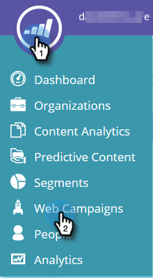

# Esportare i dati della campagna web {#export-web-campaign-data}

Segui questi semplici passaggi per esportare i dati della campagna web.

1. Passa a **[!UICONTROL Web Campaigns]**.

   

1. Fai clic sull’icona Esporta CSV in alto a destra della pagina.

   

1. Apri o salva il file.

   

1. Visualizza il file per esaminare statistiche utili.

   
