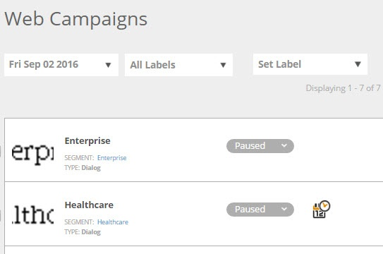

# Filtrare campagne web {#filter-web-campaigns}

Dopo aver creato centinaia di [!DNL Web Personalization] campagne, è molto utile poter utilizzare i filtri per visualizzare solo quelle a cui sei interessato.

1. Passa a **[!UICONTROL Web Campaigns]**.

   

1. Nella pagina [!UICONTROL Web Campaigns], fare clic su **[!UICONTROL Filter]**.

   

1. Selezionare la casella di controllo relativa allo stato e/o al tipo di campagna per cui si desidera filtrare, ad esempio **[!UICONTROL Paused]** o **[!UICONTROL Dialog]**. Fai clic su **[!UICONTROL Apply]**.

   

   >[!TIP]
   >
   >Utilizza la casella di controllo **[!UICONTROL Select All]** per scegliere tutte le caselle di controllo o il collegamento **[!UICONTROL Clear]** per deselezionarle.

1. Ora vengono visualizzate solo le campagne che corrispondono al filtro.

   

   Un pezzo di torta!
