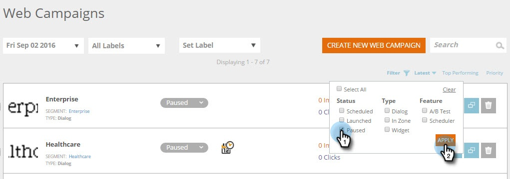

# Filtrare campagne web {#filter-web-campaigns}

Dopo aver creato centinaia di campagne di personalizzazione web, è molto utile poter utilizzare i filtri per visualizzare solo quelli che ti interessano.

1. Vai a **Campagne web**.

   

1. Nella pagina Campagne Web fare clic su **Filtro**.

   

1. Seleziona la casella di controllo per lo stato e/o il tipo di campagna a cui desideri applicare il filtro, ad esempio **In pausa** o **Finestra**. Fai clic su **Applica**.

   

   >[!TIP]
   >
   >Utilizza la **Seleziona tutto** casella di controllo per scegliere tutto o **Cancella** collegamento per deselezionare tutte le caselle di controllo.

1. Ora vengono visualizzate solo le campagne che corrispondono al filtro.

   

   Pezzo di torta!
