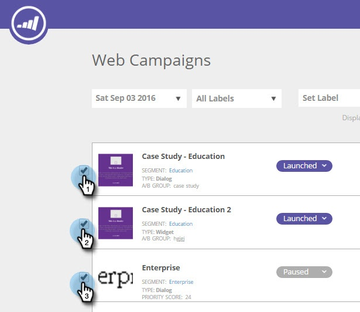

# Etichettare le campagne web {#label-your-web-campaigns}

Hai così tante campagne che lo scorrimento sta diventando complicato? Utilizza le etichette per assegnare tag alle campagne, in modo da poterle ordinare e trovare rapidamente.

## Aggiungere un’etichetta a una campagna web {#add-a-label-to-a-web-campaign}

1. Accedi a Personalizzazione web e vai all’area Campagne web.

   

   >[!NOTE]
   >
   >Per trovare più facilmente la campagna desiderata, utilizza [funzione filtro](/help/marketo/product-docs/web-personalization/working-with-web-campaigns/filter-web-campaigns.md).

1. Seleziona le campagne a cui vuoi assegnare un tag con un’etichetta.

   

1. Inserisci il nome dell’etichetta desiderato e fai clic su Crea nuovo.

   >[!TIP]
   >
   >Se l’etichetta esiste già, selezionala e non crearne una nuova.

   

Fantastico! Ora sai come creare etichette e assegnarle alle campagne.

## Filtra per etichette esistenti {#filter-by-existing-labels}

1. Nell’elenco a discesa delle etichette, seleziona l’etichetta da utilizzare come filtro.

   

1. Ora vengono visualizzate solo le campagne associate all’etichetta selezionata.

   

>[!MORELIKETHIS]
>
>[Etichettare un segmento](/help/marketo/product-docs/web-personalization/using-web-segments/label-your-segment.md)
