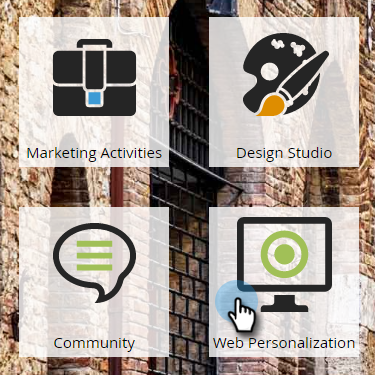

# Avviare/mettere in pausa una campagna web {#launch-pause-a-web-campaign}

Una campagna web è una reazione personalizzata associata a un segmento specifico e può essere una [finestra di dialogo](/help/marketo/product-docs/web-personalization/working-with-web-campaigns/create-a-new-dialog-web-campaign.md) sul tuo sito web, [in sostituzione della zona](/help/marketo/product-docs/web-personalization/working-with-web-campaigns/create-a-new-in-zone-web-campaign.md), una funzione di widget o un avviso e-mail.

È possibile avviare o mettere in pausa una campagna web in due modi dalla pagina Campagne web o dalla pagina Imposta campagne web.

1. Fai clic su **Personalizzazione web**.

   

1. Vai a **Campagne web**.

   

1. Se la campagna viene avviata, fai clic su **Avviato** per modificare lo stato della campagna in **In pausa**, per mettere in pausa la campagna.

   

1. Se la campagna viene sospesa, fai clic su **In pausa** per modificare lo stato della campagna in **Avviato**. Verrà attivata e avviata la campagna.

   

   >[!NOTE]
   >
   >Puoi anche modificare lo stato della campagna nella pagina Imposta campagna .

1. Nella campagna, fai clic su **Modifica**.

   

1. Fai clic su **Salva** per salvare e mettere in pausa la campagna. Fai clic su **Launch** per avviare e attivare la campagna.

   

>[!MORELIKETHIS]
>
>* [Creare una campagna di dialogo](/help/marketo/product-docs/web-personalization/working-with-web-campaigns/create-a-new-dialog-web-campaign.md)
>* [Creare una RTP in una campagna di zona](/help/marketo/product-docs/web-personalization/working-with-web-campaigns/create-a-new-in-zone-web-campaign.md)
>* [Creare una campagna Widget RTP](/help/marketo/product-docs/web-personalization/working-with-web-campaigns/create-a-new-widget-web-campaign.md)

