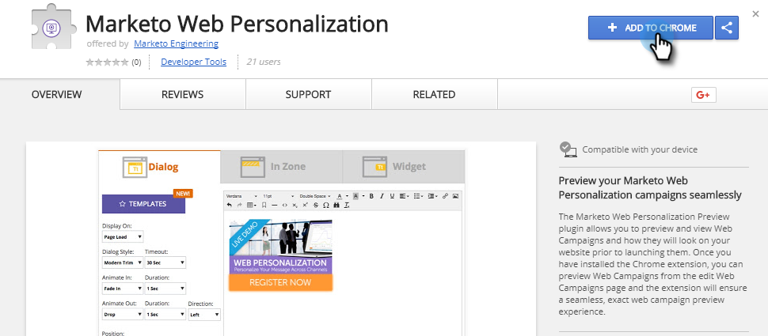
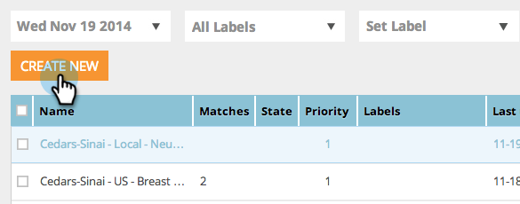

# Anteprima e test di una campagna web {#preview-and-test-a-web-campaign}

Questo articolo mostra diversi modi per visualizzare in anteprima una campagna web e anche come testarla utilizzando un segmento sandbox live sul tuo sito web.

>[!NOTE]
>
>L’anteprima mostra solo l’aspetto della campagna sul sito scelto. I collegamenti e i widget non funzioneranno in modo da evitare clic o visualizzazioni errati nell’analisi.

## Anteprima di una campagna Web nella pagina di creazione {#preview-a-web-campaign-on-the-creation-page}

1. Vai a **Campagne web**.

   

1. Fai clic su **Crea nuova campagna web** o sull&#39;icona per modificare una campagna esistente.

   

1. In Anteprima sul sito, aggiungi l’URL della pagina e fai clic su **Anteprima**. Viene visualizzata una nuova finestra/scheda con l’anteprima della campagna.

   

   >[!TIP]
   >
   >Fai clic su **Condividi** per aprire un messaggio e-mail con un URL fisso dell&#39;anteprima della campagna.

   >[!NOTE]
   >
   >Puoi anche installare un plug-in per browser (Chrome[Chrome](https://chrome.google.com/webstore/detail/marketo-web-personalizati/ldiddonjplchallbngbccbfdfeldohkj) o [Firefox](https://rtp-static.marketo.com/rtp/libs/mwp-0.0.0.8.xpi)) per una migliore esperienza nell’anteprima della campagna. Vedi la sezione seguente.

## Visualizzare l&#39;anteprima di una campagna Web nella pagina di creazione utilizzando il plug-in del browser {#preview-a-web-campaign-on-the-creation-page-using-the-browser-plug-in}

1. Segui i passaggi 1 e 2 della sezione precedente.

1. Fai clic sul collegamento al plug-in del browser (in questo caso usiamo Chrome).

   

1. Viene visualizzata una nuova finestra/scheda. Fai clic su **Aggiungi a Chrome**.

   

1. Fai clic su **Aggiungi estensione**.

   

1. Torna a Marketo. Aggiungi l&#39;URL della pagina e fai clic su **Anteprima**.

   

1. Viene visualizzata una nuova finestra/scheda che consente di visualizzare un’anteprima dell’aspetto della campagna su un desktop, un telefono o un tablet.

   

## Anteprima di una campagna Web nella pagina Campagne web {#preview-a-web-campaign-on-the-web-campaigns-page}

1. Osservando l&#39;elenco delle campagne web, è sufficiente scegliere una campagna e fare clic sull&#39;icona **Anteprima**.

   

   Facile!

## Visualizzare un&#39;anteprima di una campagna Web sul sito Web {#preview-a-web-campaign-on-your-website}

Crea un segmento e una campagna sandbox.

1. Vai a **Segmenti**.

   

1. Fare clic su **Crea nuovo**.

   

1. Denomina il segmento.

1. In Comportamento, trascina Includi pagine nell’area di lavoro. Aggiungi il valore *sandbox=1*. Fai clic su **Salva e definisci campagna**.

   

1. Nella pagina Imposta campagna web , modifica il segmento di Target nel segmento sandbox selezionandolo dall’elenco.

   

1. Completa il contenuto creativo della campagna e fai clic su **Launch**.

   

1. Vai al tuo sito web, aggiungi il parametro URL &quot;?sandbox=1&quot; alla fine dell&#39;URL. Esempio: `www.marketo.com?sandbox=1`.

1. Vedi la reazione della campagna sul tuo sito web.

>[!NOTE]
>
>Le campagne reagiscono una sola volta durante una sessione del visitatore. Per visualizzare nuovamente la campagna, cancella i cookie del browser.

>[!NOTE]
>
>Non è possibile visualizzare in anteprima le campagne di reindirizzamento. L&#39;unico modo per testarli è utilizzando un segmento sandbox (che esegue il targeting per pagine specifiche - *sandbox=redirect*)
