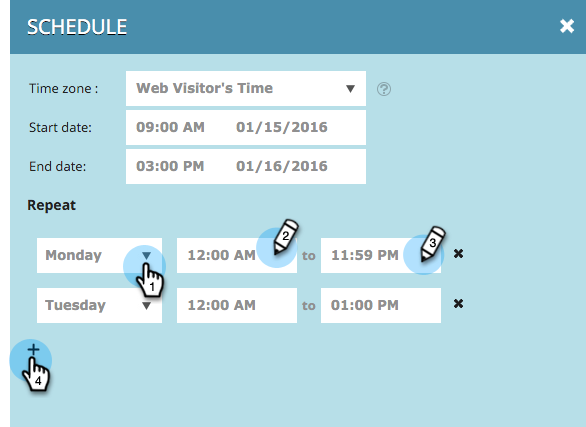

# Pianificazione di una campagna Web {#schedule-a-web-campaign}

Se siete a conoscenza di quando eseguire la campagna Web, potete programmarla in anticipo. È facile impostare date di inizio e fine, ripetizioni e più giorni.

Potete pianificare la campagna Web in base all&#39;ora del visitatore Web o a un fuso orario selezionato.

>[!NOTE]
>
>**Esempio**
>
>La pianificazione delle date di inizio e di fine è ottima per un evento programmato, ad esempio un webinar, che viene eseguito per un periodo specifico. Le ripetizioni sono perfette per un&#39;offerta speciale che si svolge ogni settimana solo in un giorno particolare.

1. Vai a **Campagne Web**.

   

   >[!NOTE]
   >
   >Per trovare più facilmente la campagna desiderata, utilizzate la [funzione filtro](/help/marketo/product-docs/web-personalization/working-with-web-campaigns/filter-web-campaigns.md).

1. Aprite il menu Stato campagna e selezionate **Pianificazione**.

   

1. Nella finestra di dialogo Pianifica ricorrenza, selezionate il fuso orario per la campagna

   

   >[!TIP]
   >
   >L&#39;impostazione predefinita esegue le campagne nel fuso orario del visitatore Web.

1. Selezionare una data e un&#39;ora di inizio e una data e ora di fine.

   

   >[!NOTE]
   >
   >Puoi selezionare la data e l’ora dal menu a discesa e dal calendario oppure inserirli manualmente. I tempi sono di 12 ore AM/PM.

1. Per impostazione predefinita, la campagna viene eseguita ogni giorno tra la data di inizio e la data di fine. Se desiderate eseguire la campagna solo in giorni specifici o in orari specifici, utilizzate le impostazioni **Repeat**. Selezionate il giorno e l’ora di inizio e fine per visualizzare la campagna. Utilizzate il segno più + per aggiungere altri giorni.

   

1. Fare clic su **Schedule**.

   

1. Lo stato della campagna nella pagina Campagne diventa **Pianificato** e viene visualizzata l&#39;icona orologio/calendario. Fate clic su questa icona per modificare la pianificazione della campagna.

   

   >[!NOTE]
   >
   >Lo stato della campagna rimane **Pianificato** anche quando la campagna viene eseguita durante gli orari pianificati selezionati. Una volta trascorsa la data di fine pianificata, lo stato della campagna diventa **Paused**.
