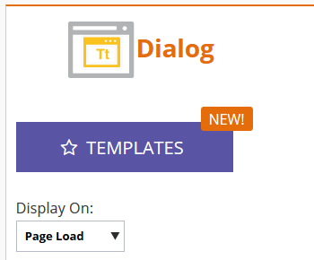
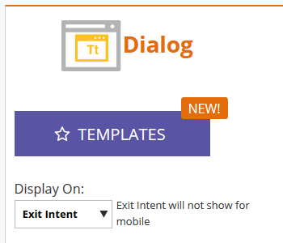

# Impostare la modalità di visualizzazione della campagna web {#set-how-your-web-campaign-displays}

Esistono diversi metodi da utilizzare per determinare quando e come verrà visualizzata la campagna web.

## Caricamento pagina {#page-load}

Selezionata per impostazione predefinita, questa opzione visualizza semplicemente la campagna al caricamento della pagina.

## Ritardo {#delay}

Specifica un ritardo (in secondi totali) per la reazione delle campagne web sul tuo sito web.

1. Fai clic sul menu a discesa **[!UICONTROL Display On]** e seleziona **[!UICONTROL Delay]**.

   

1. Fare clic sull&#39;elenco a discesa **[!UICONTROL Wait]** e selezionare la quantità di tempo desiderata.

   

## Scorri {#scroll}

1. Fai clic sul menu a discesa **[!UICONTROL Display On]** e seleziona **[!UICONTROL Scroll]**.

   

1. Fai clic sull&#39;elenco a discesa **[!UICONTROL When]** e seleziona quando visualizzare la campagna web.

   

<table>
 <tbody>
  <tr>
   <td><strong>[!UICONTROL Below fold]</strong></td>
   <td>Visualizza la campagna quando il visitatore scorre sotto la piega. La campagna scompare quando il visitatore scorre indietro sopra la piega.</td>
  </tr>
  <tr>
   <td><strong>[!UICONTROL Percent]</strong></td>
   <td>Visualizza la campagna quando il visitatore scorre fino alla percentuale predeterminata della pagina.</td>
  </tr>
  <tr>
   <td><strong>[!UICONTROL Pixel]</strong></td>
   <td>
Visualizza la campagna quando il visitatore scorre fino al pixel superiore predefinito sulla pagina.
</td>
  </tr>
 </tbody>
</table>

## Intento di uscita {#exit-intent}

L’intento di uscita visualizza la campagna web all’uscita del cursore del mouse dal browser.

1. Fai clic sul menu a discesa **[!UICONTROL Display On]** e seleziona **[!UICONTROL Exit Intent]**.

   

1. Viene visualizzato un messaggio per ricordarti che [!UICONTROL Exit Intent] non è compatibile con Mobile.

   

>[!TIP]
>
>Vuoi vedere come appariranno gli effetti prescelti in anticipo? Estrarre i file tramite una [anteprima campagna Web](/help/marketo/product-docs/web-personalization/working-with-web-campaigns/preview-and-test-a-web-campaign.md).
