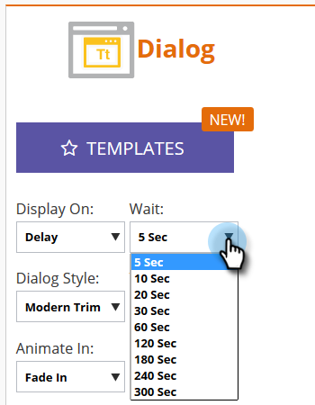
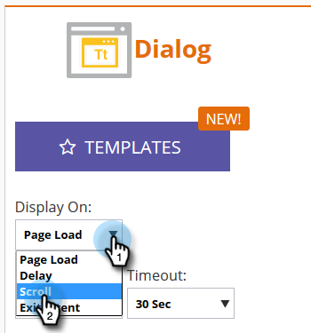

# Imposta Come Viene Visualizzata La Campagna Web {#set-how-your-web-campaign-displays}

Esistono diversi metodi da utilizzare quando si tratta di quando/come viene visualizzata la campagna web.

## Caricamento pagina {#page-load}

Selezionata per impostazione predefinita, questa opzione visualizza semplicemente la campagna al caricamento della pagina.

## Ritardo {#delay}

Specifica un ritardo (in secondi totali) per consentire alle campagne web di reagire sul tuo sito web.

1. Fai clic sul pulsante **Visualizza su** a discesa e seleziona **Ritardo**.

   

1. Fai clic sul pulsante **Wait** e seleziona il tempo desiderato.

   

## Scorri {#scroll}

1. Fai clic sul pulsante **Visualizza su** a discesa e seleziona **Scorri**.

   

1. Fai clic sul pulsante **Quando** e seleziona quando visualizzare la campagna Web.

   

<table> 
 <tbody> 
  <tr> 
   <td><strong>Sotto piega</strong></td> 
   <td>Visualizza la campagna quando il visitatore scorre sotto la piega. La campagna scompare quando il visitatore scorre indietro sopra la piega.</td> 
  </tr> 
  <tr> 
   <td><strong>Percentuale</strong></td> 
   <td>Visualizza la campagna quando il visitatore scorre fino a una percentuale predeterminata della pagina.</td> 
  </tr> 
  <tr> 
   <td><strong>Pixel</strong></td> 
   <td>
Visualizza la campagna quando il visitatore scorre fino al pixel superiore predesignato sulla pagina.
</td> 
  </tr> 
 </tbody> 
</table>

## Intento di uscita {#exit-intent}

L’intento di uscita visualizzerà la campagna web quando il cursore del mouse esce dal browser.

1. Fai clic sul pulsante **Visualizza su** a discesa e seleziona **Intento di uscita**.

   

1. Viene visualizzato un messaggio che ricorda che l&#39;intento di uscita non è compatibile con il dispositivo mobile.

   

>[!TIP]
>
>Vuoi vedere come i tuoi effetti scelti saranno in anticipo? Puoi controllarli tramite un’ [Anteprima campagna web](/help/marketo/product-docs/web-personalization/working-with-web-campaigns/preview-and-test-a-web-campaign.md).
