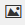

# Utilizzo dell&#39;editor Rich Text per la personalizzazione Web {#using-the-web-personalization-rich-text-editor}

L&#39;editor Rich Text Personalizzazione Web disponibile nella pagina Imposta campagne consente la formattazione del testo, il collegamento e l&#39;inserimento di immagini. Include opzioni di formattazione simili ai normali processori di testo.

Le icone importanti nell’editor Rich Text includono:

<table> 
 <tbody> 
  <tr> 
   <td colspan="1"></td> 
   <td colspan="1"><strong>Modifica origine HTML</strong></td> 
   <td colspan="1">Consente di visualizzare il codice sorgente HTML</td> 
  </tr> 
  <tr> 
   <td colspan="1"></td> 
   <td colspan="1">
<strong>Inserisci/Modifica immagine</strong> 
</td> 
   <td colspan="1">Inserisce un URL immagine per le immagini grafiche da visualizzare nell’editor</td> 
  </tr> 
  <tr> 
   <td colspan="1"></td> 
   <td colspan="1"><strong>Inserisci immagine da Design Studio</strong></td> 
   <td colspan="1"><em>Dopo aver </em> fatto clic sull'icona  <strong>Inserisci/Modifica </strong> immagine, selezionate le immagini da Marketo Design Studio</td> 
  </tr> 
  <tr> 
   <td colspan="1"></td> 
   <td colspan="1">
<strong>Inserisci/Modifica collegamento</strong> 
</td> 
   <td colspan="1">Utilizzare per aggiungere collegamenti ipertestuali a testo o immagini</td> 
  </tr> 
  <tr> 
   <td colspan="1"></td> 
   <td colspan="1"><strong>Inserisci/Modifica token</strong></td> 
   <td colspan="1">Utilizzate i token società o persona per personalizzare la campagna Web</td> 
  </tr> 
 </tbody> 
</table>

>[!NOTE]
>
>I token Web utilizzano [i dati delle persone](/help/marketo/product-docs/web-personalization/using-web-segments/manage-person-data.md) dal database Marketo gestito in Web Personalization in Impostazioni account > Database. Se il token Web è un nuovo campo di database non ancora disponibile in Impostazioni account > Database, verrà aggiunto automaticamente e l&#39;attivazione richiederà fino a 24 ore.

>[!MORELIKETHIS]
>
>[Utilizzo dell’editor Rich Text](/help/marketo/product-docs/email-marketing/general/understanding-the-email-editor/using-the-rich-text-editor.md)
