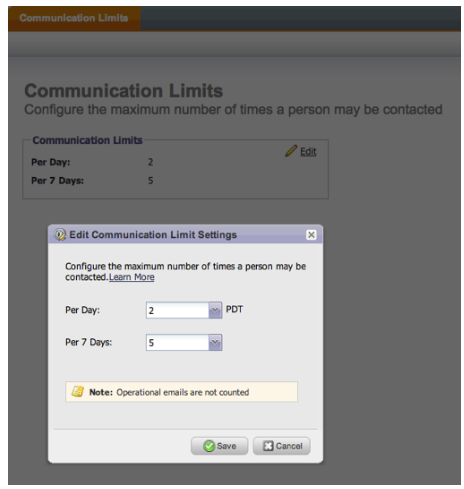

# Note sulla versione: Luglio 2013 {#release-notes-july}

Le seguenti funzionalità sono incluse nella release di luglio pianificata per venerdì 26 luglio.

## Widget contenuto con esaurimento nel dashboard {#exhausted-content-widget-on-the-dashboard}

Fornisce informazioni su quando i lead scaricheranno il contenuto all&#39;interno del flusso. Il sistema fornirà informazioni sul numero di lead che stanno per raggiungere il contenuto esaurito o sul periodo di esaurimento dei lead.

## Limiti di comunicazione {#communication-limits}

Vuoi smettere di inviare i lead via e-mail? Ora è facile limitare automaticamente la frequenza a ogni individuo. È sufficiente impostare un limite di comunicazione giornaliero e settimanale, e il sistema farà il resto. Disponibile in Select, Enterprise e con il pacchetto Add-On per i clienti Standard.

## Interfaccia utente Cobalt {#cobalt-user-interface}

Nei prossimi mesi, noterete più del nostro nuovo tema che si estende in diverse parti dell&#39;applicazione. Nessuna funzionalità verrà spostata o rimossa.

## Colonna data del membro del programma {#program-member-date-column}

Visualizzate e ordinate la griglia dei membri in base alla data di aggiunta del lead.

## Modifiche al controllo ortografia in WYSIWYG Editor {#changes-to-spell-check-in-wysiwyg-editor}

Il servizio utilizzato dall&#39;editor WYSIWYG per il controllo ortografia è stato interrotto. Abbiamo rimosso il pulsante Controllo ortografia dall&#39;editor finché non viene rilevata una sostituzione.
