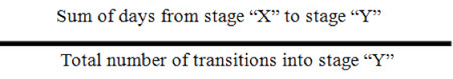
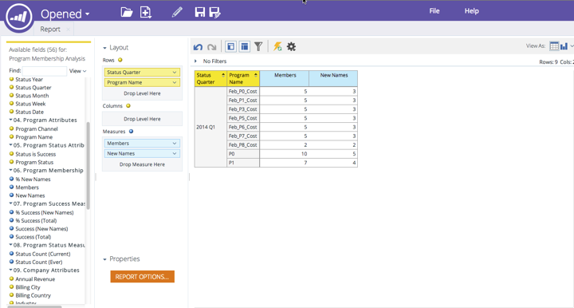

# Note sulla versione: Dicembre 2014 {#release-notes-december}

Le seguenti funzionalità sono incluse nella release di dicembre 2014. Per informazioni sulla disponibilità delle funzionalità, consulta la versione di Marketo Edition. Dopo il rilascio, accertatevi di tornare indietro per trovare i collegamenti agli articoli dettagliati per ogni funzione!

## Rapporti sull&#39;analisi delle vendite {#sales-insight-reports}

Il [Sales Insight Email Performance Report](/help/marketo/product-docs/marketo-sales-insight/msi-for-salesforce/features/performance-reports/sales-insight-email-performance-report.md) consente di visualizzare le metriche delle e-mail per e-mail e rappresentante commerciale. Supporta le e-mail inviate tramite Salesforce, Microsoft Dynamics, il plug-in per Outlook e il plug-in Gmail.

## Pubblico personalizzato Facebook {#facebook-custom-audiences}

Dopo che l&#39;amministratore di Marketo ha aggiunto [Facebook tramite Admin > Launchpoint](/help/marketo/product-docs/demand-generation/ad-network-integrations/add-facebook-custom-audiences-as-a-launchpoint-service.md), puoi creare, aggiornare o [sostituire facilmente un pubblico personalizzato di Facebook con lead da un elenco statico o smart list di Marketo](/help/marketo/product-docs/demand-generation/facebook/create-a-custom-audience-in-facebook.md). Cercate la nuova icona Facebook nella parte inferiore della griglia lead di qualsiasi elenco statico o smart.

## Clonazione Migliorata Tra Aree Di Lavoro {#improved-cloning-across-workspaces}

[La duplicazione di un ](/help/marketo/product-docs/core-marketo-concepts/programs/working-with-programs/clone-a-program.md) programma in un&#39;altra area di lavoro non è mai stata così semplice! Quando fate clic su clone, selezionate l’area di lavoro di destinazione. Basta clonare in una cartella e poi spostare la cartella!

>[!NOTE]
>
>Al momento, questa nuova funzione di duplicazione è disponibile solo per i programmi.

## Elenco avanzato di riferimento {#reference-smart-list}

[Quando si crea un elenco avanzato o un flusso di lavoro, è possibile fare ](/help/marketo/product-docs/core-marketo-concepts/smart-lists-and-static-lists/using-smart-lists/reference-a-list-or-smart-list-across-workspaces.md) riferimento agli elenchi avanzati condivisi con un’altra area di lavoro.

## Miglioramenti all&#39;importazione di elenchi {#list-import-improvements}

[Importa ](/help/marketo/getting-started/quick-wins/import-a-list-of-people.md) file codificati in UTF-16, Shift-JIS o EUC-JP. Continuiamo a supportare i file codificati UTF-8.

## Tracciamento dei collegamenti negli script e-mail {#link-tracking-in-email-scripting}

I collegamenti all&#39;interno degli script e-mail verranno ora tracciati e disponibili nel rapporto Prestazioni collegamenti e-mail.

## Impostazione codifica token {#token-encoding-setting}

Abbiamo introdotto una nuova funzione di sicurezza per la codifica automatica dei token HTML, che verrà attivata per impostazione predefinita a marzo 2015. Fino a quel momento, attiva questa funzionalità in Gestione campi per testare il comportamento in anticipo. Tutti i token lead e aziendali verranno codificati quando vengono inseriti nelle e-mail o nelle pagine di destinazione. Le opzioni saranno disponibili anche per i singoli campi.

## Nuove chiamate API ReST {#new-rest-api-calls}

Tre nuove chiamate per l&#39;API Lead &amp; Activity ReST:

・ Ottenere le partizioni principali

・ Associa lead

・ Unisci lead

I dettagli completi saranno disponibili dopo il rilascio all&#39;indirizzo [developers.marketo.com](https://developers.marketo.com/)

## Munchkin Javascript: miglioramenti della compatibilità{#munchkin-javascript-compatibility-enhancements}

Munchkin ha apportato diversi piccoli miglioramenti per garantire che continui a caricarsi rapidamente e funzioni come desiderato nei casi con altri JavaScript sulla pagina.

Lo smantellamento verrà messo in scena a partire da metà dicembre e proseguirà per i prossimi mesi.

## Aspetto aggiornato di Esplora entrate {#revenue-explorer-upgraded-look-and-feel}

## RTP: Modulo elenco account denominato {#rtp-named-account-list-module}

Gestisci e monitora i tuoi account chiave ad alto rendimento nella nuova pagina Account denominati. Caricate nuovi elenchi di account denominati per identificare e indirizzare queste organizzazioni. Il processo è stato automatizzato e offre maggiore controllo e flessibilità per implementare piani di marketing basati sull&#39;account e indirizzare i vostri account chiave su diversi canali (web e pubblicitari).

## RTP: Effetto di scorrimento per campagne nelle zone {#rtp-sliding-effect-for-in-zone-campaigns}

Abbiamo aggiunto un nuovo effetto di scorrimento per le campagne In Zone per consentire al contenuto personalizzato di inserirsi al momento del caricamento della pagina.

