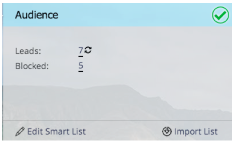

# Note sulla versione: Febbraio 2014 {#release-notes-february}

Le seguenti funzionalità sono incluse nella versione di febbraio 2014. Per informazioni sulla disponibilità delle funzioni, controlla la tua Marketo Edition. Dopo il rilascio, assicurati di tornare a trovare i collegamenti agli articoli dettagliati della Knowledge Base per ogni funzione!

## Punteggio di coinvolgimento come criterio vincente {#engagement-score-as-winning-criteria}

[Utilizza il ](/help/marketo/product-docs/email-marketing/email-programs/email-program-actions/email-test-a-b-test/define-the-a-b-test-winner-criteria.md) punteggio di coinvolgimento per determinare la variante vincente nel test di suddivisione A/B o nel test Champion/Challenger. Il test deve essere eseguito per almeno 24 ore, per ottenere un punteggio di coinvolgimento adeguato.

## Scheda Risultati del programma e-mail {#email-program-results-tab}

[Visualizza i ](/help/marketo/product-docs/email-marketing/email-programs/email-program-data/view-email-program-results.md) risultati e le attività registrate per il programma e-mail.

## Persone/lead bloccati dalla spedizione {#people-leads-blocked-from-mailing}

[Fai clic sulle persone/lead bloccate dal numero di ](/help/marketo/product-docs/email-marketing/email-programs/managing-people-in-email-programs/define-an-audience-with-a-smart-list.md) posta per vedere chi non riceverà l’e-mail a causa dell’annullamento dell’abbonamento, della blacklist, dell’indirizzo e-mail non valido o vuoto o della sospensione del marketing.

## Esporta dati programma e-mail {#export-email-program-data}

[Esporta le metriche e-mail in Excel](/help/marketo/product-docs/email-marketing/email-programs/email-program-data/export-email-program-dashboard-to-excel.md), inclusi i dati della variante del test AB.

## Punteggio di coinvolgimento nel report sulle prestazioni del flusso di lavoro di coinvolgimento {#engagement-score-in-engagement-stream-performance-report}

Abbiamo aggiunto il punteggio di coinvolgimento al [rapporto sulle prestazioni del flusso di coinvolgimento](/help/marketo/product-docs/email-marketing/drip-nurturing/reports-and-notifications/engagement-stream-performance-report.md) per aiutarti a vedere quanto è efficace il contenuto del tuo programma di coinvolgimento.

## Dettagli del programma in Analisi e-mail {#program-details-in-email-analysis}

[Ora puoi raggruppare le metriche e-mail in base a Nome programma, Canale e Tag](/help/marketo/product-docs/reporting/revenue-cycle-analytics/email-analysis/build-an-email-analysis-report-that-shows-program-information.md). Il nome del programma viene aggiunto al campo Nome e-mail quando l’e-mail è una risorsa locale del programma. Il nuovo campo Nome programma mostra il nome del programma della campagna intelligente che ha inviato l’e-mail. Questo potrebbe essere diverso dal programma nel campo Email Name (Nome e-mail) se l’e-mail è una risorsa locale di un programma diverso.

## Aggiornamento di Click Link Filters e Trigger {#update-to-clicks-link-filters-and-trigger}

Sono stati aggiornati i seguenti nomi di filtro e trigger:

* Clic Collega clic Collegamento a pagina web
* Clic su Collega a collegamento selezionato sulla pagina Web
* Collegamento non selezionato su non selezionato sulla pagina Web

## Miglioramenti di Forms 2.0 {#forms-enhancements}

A partire da questa versione, Forms 2.0 ha ricevuto diversi aggiornamenti sulla &quot;qualità della vita&quot;. Oltre ad abilitare il profiling progressivo sui moduli incorporati, sono state apportate modifiche al flusso di lavoro e all’interfaccia utente che semplificheranno l’utilizzo delle funzionalità più avanzate nell’editor, [incluse le regole di visibilità](/help/marketo/product-docs/demand-generation/forms/form-fields/dynamically-toggle-visibility-of-a-form-field.md), le pagine di ringraziamento avanzate e i campi nascosti.

