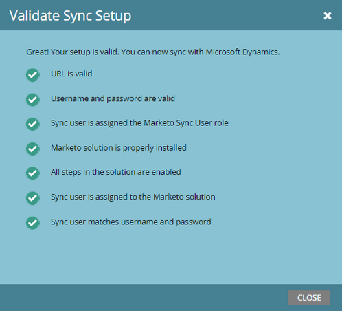

# Note sulla versione: Autunno 2015 {#release-notes-fall}

Le seguenti funzionalità sono incluse nella versione autunnale del 15. Per informazioni sulla disponibilità delle funzionalità, consulta la versione di Marketo Edition.

## Iscriviti a un Smart List {#subscribe-to-a-smart-list}

[Iscriviti a un Smart List](../../product-docs/reporting/basic-reporting/report-subscriptions/subscribe-to-a-smart-list.md)

La sottoscrizione a Smart List consente agli addetti al marketing di esportare un elenco smart ed inviarlo via e-mail agli interessati che non utilizzano Marketo, ad esempio, Sales o Telemarketing teams.

L&#39;esportazione può essere programmata su base giornaliera, settimanale o mensile, può avere una data di consegna finale e può essere personalizzata per condividere un numero limitato di colonne.


È possibile creare più sottoscrizioni in un elenco smart. È previsto un limite di 100 abbonamenti con lead 100.000 per iscrizione, per aree di lavoro e per istanza Marketo.


## Oggetti personalizzati Marketo {#marketo-custom-objects}

[Oggetti personalizzati Marketo](https://docs.marketo.com/display/docs/marketo+custom+objects)

Creare facilmente oggetti personalizzati dall&#39;interfaccia utente di amministrazione. Al momento siamo in grado di creare un oggetto personalizzato 1:N in Marketo e di collegarlo a un lead o a una società.

>[!NOTE]
>
>Gli oggetti personalizzati Marketo non sono disponibili per Spark.


## Marketo Insights for Google Chrome {#marketo-insights-for-google-chrome}

[Marketo Insights for Google Chrome](../../product-docs/marketo-sales-insight/msi-chrome-plugin/using-marketo-insights-for-google-chrome.md)

Siamo entusiasti di annunciare il rilascio di un aggiornamento al nostro Google Mail Sales Insight estensione! Visualizzarlo in [Chrome Store](https://nation.marketo.com/external-link.jspa?url=https://chrome.google.com/webstore/detail/marketo-insights-for-goog/jjkfbhajlmoeegbjgjipliamplidmbjb).

Questo aggiornamento include molte nuove funzionalità:

* Prima di impegnarsi, i venditori possono visualizzare informazioni rilevanti sui loro potenziali clienti direttamente in Google Mail, inclusi titoli di lavoro, profili su Twitter, informazioni aziendali, foto e altro ancora.
* I venditori possono vedere in tempo reale con quali potenziali clienti potenziali accedono ai contenuti attraverso canali diversi, come ad esempio e-mail aperte o cliccate, eventi online o di persona frequentati, pagine Web visitate, eBook scaricati e molto altro ancora.
* Le e-mail inviate tramite Google Mail vengono registrate in Marketo e in tempo reale. Questo consente ai venditori di vedere quando i potenziali clienti stanno guardando le loro e-mail in modo che possano seguire il problema al momento giusto. Marketing Sales Insight for Google Mail consente inoltre ai venditori di utilizzare facilmente i modelli creati dal marketing per inviare bellissimi inviti, offerte e altri tipi di contenuto.


## Coinvolgimento di Marketing Mobile - Token, Invia esempio e Anteprima {#marketo-mobile-engagement-tokens-send-sample-preview}

* [Token](../../product-docs/mobile-marketing/push-notifications/configure-mobile-push-notification.md)
* [Invia esempio](../../product-docs/mobile-marketing/push-notifications/send-a-push-notification-sample.md)
* [Anteprima](../../product-docs/mobile-marketing/push-notifications/preview-a-push-notification.md)

Personalizzare facilmente le notifiche push con [token](https://docs.marketo.com/pages/viewpage.action?pageId=7512454).


Potete anche [preview](../../product-docs/mobile-marketing/push-notifications/preview-a-push-notification.md) o inviare una notifica push [sample](../../product-docs/mobile-marketing/push-notifications/send-a-push-notification-sample.md) prima di distribuirla ai clienti.


## Campagne intelligenti nei momenti {#smart-campaigns-in-moments}

[Campagne intelligenti nei momenti](../../product-docs/core-marketo-concepts/mobile-apps/marketo-moments/understanding-moments/understanding-smart-campaign-cards.md)

Le statistiche sulle e-mail inviate tramite le campagne intelligenti sono ora disponibili nei Momenti. Altre funzionalità di questo aggiornamento includono:

* Passate il dito per chiuderlo. Hai troppe schede nel tuo flusso? Ora puoi allontanarli!
* Inviare un esempio direttamente dalla schermata di anteprima
* Dettagli elenco avanzato aggiunti alle schede Programma e-mail
* È stato aggiunto il supporto per lo stato Interrotto per i programmi e-mail


## RTP - Content Analytics e Recommendations {#rtp-content-analytics-and-recommendations}

[Content ](../../product-docs/web-personalization/understanding-web-personalization/understanding-content-analytics.md) Analytics e Recommendations

L&#39;analisi dei contenuti RTP mostra le prestazioni delle risorse di contenuto Web grazie a visite Web regolari e alle visite generate dal motore di raccomandazione dei contenuti di RTP.

* Scoprite quale contenuto offre le prestazioni migliori e offre il maggior numero di lead
* Incrementare il consumo di contenuti abilitando il contenuto nel motore di contenuti predittivi di RTP per raccomandare automaticamente i contenuti migliori ai visitatori giusti
* Approfondisci tutte le risorse di contenuto per visualizzare metriche, grafici e prestazioni più dettagliate

La pagina Risorse di RTP ora è suddivisa in Content Analytics e Content Recommendations.

* **Analisi dei contenuti:** mostra le viste e i lead diretti di tutti i contenuti Web scoperti e definiti, aiutandoti ad analizzare i contenuti con le prestazioni migliori
* **Content Recommendations**: Mostra impression e clic dal contenuto consigliato di RTP e l’attribuzione dei lead associata. Potete inoltre modificare e abilitare le raccomandazioni sul contenuto da questa pagina per le raccomandazioni [bar](https://docs.marketo.com/display/DOCS/Enabling+the+Content+Recommendation+Engine) e [rich media](https://docs.marketo.com/display/DOCS/Enabling+the+Rich+Media+Recommendation+Engine).

* Tutti i dati lead diretti contenuti in queste due pagine sono stati aggiornati retroattivamente dall&#39;inizio dell&#39;anno (1° gennaio 2015).

## RTP - Clona una campagna RTP {#rtp-clone-an-rtp-campaign}

[RTP - Clona una campagna RTP](../../product-docs/web-personalization/working-with-web-campaigns/clone-a-web-campaign.md)

La creazione di una campagna RTP rende più veloce ed efficiente la creazione di campagne Web più personalizzate. Utilizzate la funzione di duplicazione nella pagina della campagna di RTP per copiare le impostazioni della campagna e modificare il contenuto per l’ottimizzazione del test suddiviso, oppure duplicare una campagna con lo stesso contenuto e indirizzarla verso un segmento diverso. Crea campagne in pochi secondi!


## Miglioramenti all&#39;editor Rich Text {#rich-text-editor-improvements}

Stiamo apportando diversi miglioramenti all&#39;editor Rich Text. Dopo il rilascio dell&#39;editor aggiornato a luglio, abbiamo ricevuto un feedback molto positivo e siamo stati in grado di gestire queste modifiche in questo aggiornamento. Ci sarà molto di più nei prossimi mesi. Di seguito è riportato un elenco delle novità introdotte nel 4° trimestre:

* VML è ora supportato nel codice HTML:

   ```
   <v:background xmlns:v="urn:schemas-microsoft-com:vml" fill="t">
   ```

   ```
   <v:fill type="tile" src="<a href="https://i.imgur.com/YJOX1PC.png" rel="nofollow">https://i.imgur.com/YJOX1PC.png</a>" color="#7bceeb"/>
   ```

   ```
   </v:background>
   ```

* È ora possibile inserire qualsiasi elemento in un commento HTML valido (alcune sintassi come quelle riportate di seguito erano state precedentemente eliminate):

   ```
   <!--[if gte mso 9]> 
   ```

   ```
   <![endif]-->
   ```

* Non riempire celle vuote di tabella con `**`

* Pulsante Ingrandisci/Riduci a icona aggiunto all&#39;editor sorgente HTML
* Le proprietà di tabella preesistenti ora vengono identificate e visualizzate nella finestra di dialogo Proprietà tabella
* Entrambe le righe di pulsanti sono ora visualizzate per impostazione predefinita.
* L&#39;editor ora accetta qualsiasi elemento (anche elementi obsoleti o non standard):

   ```
   <myCustomElement>Hello World!</myCustomElement>
   ```

* L&#39;editor ora accetta qualsiasi attributo (anche attributi obsoleti o non standard):

   ```
   <myCustomElement myCustomAttribute="foo">Hello World!</myCustomElement>
   ```

   ```
   <td background="someImage.png"> 
   ```

## Microsoft Dynamics - Convalida sincronizzazione {#microsoft-dynamics-validate-sync}

[Microsoft Dynamics - Convalida sincronizzazione](../../product-docs/crm-sync/microsoft-dynamics-sync/sync-setup/validate-microsoft-dynamics-sync.md)

Questo nuovo strumento di amministrazione esegue una serie di controlli per verificare se le configurazioni di sincronizzazione sono state impostate correttamente.



## Aggiungi campi alla sincronizzazione oggetti personalizzata CRM {#add-fields-to-crm-custom-object-sync}

Aggiungi facilmente nuovi campi agli oggetti personalizzati sincronizzati da Salesforce e Dynamics. È ora possibile aggiungere nuovi campi alla sincronizzazione oggetti personalizzata senza disabilitare e abilitare l&#39;intero oggetto personalizzato.

## Modifiche alle funzioni di sicurezza {#changes-to-security-features}

* I tentativi di password sono limitati a 5. Dopo il quinto tentativo, l&#39;utente verrà bloccato.
* Il timeout sessione inattivo è ora configurabile per la sottoscrizione.


## Supporto IE 11 (e supporto obsoleto per IE 9) {#ie-support-and-deprecating-support-for-ie}

Ora è ufficialmente supportato il browser Microsoft Internet Explorer 11 e viene rimosso il supporto per il browser Microsoft Internet Explorer 9.

## Supporto dell&#39;interfaccia utente Lightning per MSI {#lightning-ui-support-for-msi}

L&#39;ultimo pacchetto MSI sullo scambio di app funziona con le versioni Lightning e Legacy dell&#39;interfaccia utente di Salesforce.

## Nuovo plug-in Dynamics {#new-dynamics-plug-in}

Questo nuovo plug-in esegue diverse azioni in modalità asincrona per migliorare le prestazioni.

## Ricerca per URL della pagina di destinazione in Design Studio {#search-by-url-of-landing-page-in-design-studio}

Nella griglia della pagina di destinazione di Design Studio, è ora possibile effettuare ricerche per URL pagina per trovare le pagine di destinazione. Anche questo è esportabile.
