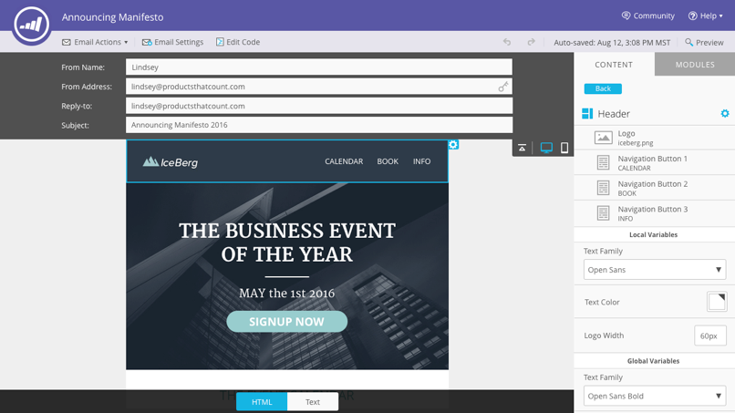

# Note sulla versione: Estate &#39;16 {#release-notes-summer}

Le seguenti funzionalità sono incluse nella release Estate &#39;16. Per informazioni sulla disponibilità delle funzionalità, consulta la versione di Marketo. Fate clic sui collegamenti del titolo per visualizzare articoli dettagliati per ciascuna funzione.

## [Marketing basato su account](https://docs.marketo.com/display/docs/account+based+marketing) {#account-based-marketing}

Marketing basato su account Marketo fornisce tutti gli elementi essenziali in un&#39;unica piattaforma unificata:

* **Target** : individuazione dell&#39;account, corrispondenza lead-to-account ed elenchi di account denominati
* **Coinvolgi** : personalizzazione basata su account, coinvolgimento tra canali e flussi di lavoro specifici per l&#39;account
* **Misura** : approfondimenti a livello di account e elenco, punteggio di coinvolgimento dell&#39;account e impatto pipeline e ricavi

>[!NOTE]
>
>ABM è disponibile come componente aggiuntivo per l&#39;abbonamento a Marketo, quindi contattate il rappresentante commerciale per richiedere l&#39;implementazione.

## [Audit Trail](/help/marketo/product-docs/administration/audit-trail/audit-trail-overview.md) {#audit-trail}

L&#39;audit trail fornisce una cronologia completa delle modifiche apportate all&#39;interno dell&#39;iscrizione Marketo. Creerà responsabilità tra utenti e amministratori, aiuterà a identificare la causa di comportamenti imprevisti e fornirà la sicurezza di sapere chi sta facendo cosa e quando. Queste informazioni saranno disponibili in qualsiasi momento e potranno essere utilizzate per rispondere a domande quali:

* Cos&#39;è successo a questa risorsa o impostazione e chi l&#39;ha aggiornata per ultima?
* Qual è stato l&#39;utente X?
* Chi accede al nostro account?

## [Integrazione di Marketo-Vibes SMS LaunchPoint](/help/marketo/product-docs/mobile-marketing/vibes-sms-messages/create-a-vibes-sms-message.md) {#marketo-vibes-sms-launchpoint-integration}

Crea facilmente messaggi SMS direttamente da Marketo. Personalizza e indirizza il tuo messaggio utilizzando i dati rich Marketo e controllane facilmente le prestazioni utilizzando il dashboard dei messaggi SMS.

>[!NOTE]
>
>Questa funzione richiede un account Vibes SMS esistente.

## [Miglioramenti a Email 2.0](/help/marketo/product-docs/email-marketing/general/email-editor-2/email-editor-v2-0-overview.md) {#email-enhancements}

**Variabili a livello di modulo**

Precedentemente, tutte le variabili specificate in Modelli e-mail 2.0 erano &quot;globali&quot; nell’ambito. Quando si utilizzano variabili all&#39;interno dei moduli, ciò non è sempre auspicabile se si prevede di utilizzare più istanze del modulo. Con questa versione, le variabili ora possono essere specificate come &quot;livello modulo&quot;, il che consente di indicare che l&#39;utente deve essere in grado di impostare valori univoci per ciascun modulo in cui sono utilizzate.

**Aggiornamenti sintassi**

* Ora potete utilizzare &quot;mktoAddByDefault&quot; sui moduli specificati in Modelli e-mail 2.0 per indicare quali moduli devono essere visualizzati nelle nuove e-mail per impostazione predefinita. Questo è molto più conveniente se si sta creando un modello e-mail con un gran numero di moduli.
* Sugli elementi immagine, ora potete specificare se le proprietà &quot;height&quot; e &quot;width&quot; dell&#39;elemento HTML sottostante devono essere bloccate o modificate dall&#39;utente finale. `` mktoLockImgSize=&quot;true&quot; blocca l’altezza/larghezza (anche se l’immagine viene modificata). Analogamente, mktoLockImgStyle=&quot;true&quot; causerà il blocco della proprietà &quot;style&quot;.

**Ricerca codice**

Utilizzate la nuova funzionalità di ricerca per trovare e sostituire in modo efficiente il contenuto all’interno del codice e-mail. Questa funzionalità è disponibile anche nell’editor modelli e-mail.

**Supporto token negli elementi immagine**

I token possono ora essere utilizzati nell&#39;area &quot;URL esterno&quot; dell&#39;esperienza di inserimento immagine! Se avete specificato delle immagini con `{{my.tokens}}`, ora potete fare riferimento a questi token all&#39;interno di Editor e-mail 2.0. L’immagine apparirà comunque interrotta nel quadro di Email Editor 2.0. Tuttavia, prima di inviare l’e-mail visualizzerete il rendering all’interno di Preview e Send Sample.

## Più domini marchio {#multiple-branding-domains}

Sono finiti i giorni in cui i collegamenti di tracciamento delle e-mail potevano essere contrassegnati solo con un singolo dominio di marchio. Ora puoi aggiungere più domini di branding per ispirare la fiducia dei consumatori, creare un look più semplice per concentrarti sul marchio, migliorare la recapito delle e-mail e scegliere, in base alle e-mail, quale dominio di branding utilizzare per i collegamenti di tracciamento delle e-mail.

## [Token programma](/help/marketo/product-docs/demand-generation/landing-pages/personalizing-landing-pages/tokens-overview.md) {#program-tokens}

È stato creato un nuovo tipo di token per i programmi. Ora puoi eseguire il rendering di Nome programma, Descrizione e ID nelle risorse e nei passaggi di flusso delle campagne intelligenti.

## [Enterprise Key](/help/marketo/product-docs/marketo-sales-insight/msi-outlook-plugin/authorize-the-marketo-outlook-plugin.md) {#enterprise-key}

Chiedere a ogni persona del team di vendita di installare il nostro plug-in Sales Insight per Outlook può essere noioso. Abbiamo introdotto un nuovo modo per installare il plugin per Outlook in remoto utilizzando una chiave enterprise. Invia al tuo team IT la tua chiave unica trovata nella sezione Marketing Sales Insight dell&#39;Admin e lascia che faccia il resto.

## [Campagne di personalizzazione Web](/help/marketo/product-docs/web-personalization/working-with-web-campaigns/create-a-new-dialog-web-campaign.md) {#web-personalization-campaigns}

Specificate un ritardo per la reazione delle campagne Web sul sito Web.

## [Content Analytics ed Recommendations Export](/help/marketo/product-docs/web-personalization/understanding-web-personalization/understanding-content-analytics.md) {#content-analytics-and-recommendations-export}

Visualizzare l&#39;analisi del contenuto e i dati delle raccomandazioni offline.

## [Supporto API per Email Editor 2.0](https://developers.marketo.com/documentation/asset-api/) {#api-support-for-email-editor}

Le API delle risorse preesistenti, precedentemente compatibili solo con e-mail e modelli v1.0, ora sono abilitate per le risorse e-mail v2.0.

## [Sito per sviluppatori Marketo](https://developers.marketo.com/) {#marketo-developers-site}

Nuovo e migliorato!

## [Impostazioni privacy](/help/marketo/product-docs/administration/settings/understanding-privacy-settings.md) {#privacy-settings}

Gli addetti al marketing possono utilizzare le impostazioni di privacy per decidere se monitorare i visitatori utilizzando le funzioni di Munchkin e di personalizzazione Web. Il livello di tracciamento è controllato mediante l’impostazione Non tenere traccia del browser, un cookie di rinuncia o un IP non specifico. Questi metodi possono influenzare il valore e la funzionalità di Marketo in aree specifiche, ma se l’esperto di marketing non cambia nulla, la funzionalità di Marketo rimane la stessa.

Questa funzione verrà rilasciata gradualmente ai clienti in un periodo di sei settimane. Se ne avete bisogno immediatamente, contattate il supporto di Marketo.
