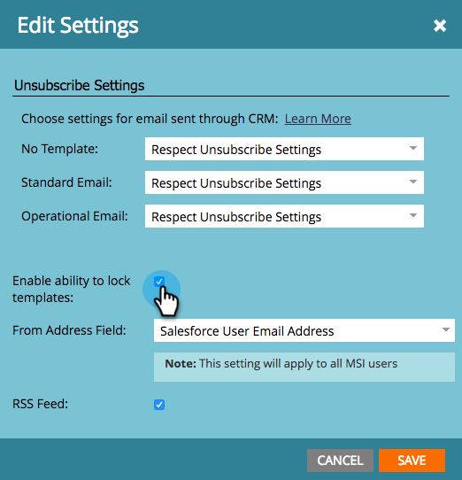

# Note sulla versione: Estate &#39;17 {#release-notes-summer}

Le seguenti funzionalità sono incluse nella release Estate &#39;17. Per informazioni sulla disponibilità delle funzionalità, consulta la versione di Marketo.

Fate clic sui collegamenti del titolo per visualizzare articoli dettagliati per ciascuna funzione. Nota: Alcune delle funzioni incluse in questa versione non hanno articoli associati. Se un argomento include più sottotitoli, i collegamenti vengono inseriti in tale area.

## [Fasi di conversione offline aggiuntivi di Facebook](/help/marketo/product-docs/demand-generation/facebook/set-up-facebook-offline-conversions.md) {#additional-facebook-offline-conversion-stages}

Scegli fino a 7 fasi aggiuntive di conversione offline per mappare le tue fasi del ciclo di vita di Marketo (oltre le 3 disponibili oggi). Ottimizzate la vostra spesa pubblicitaria su Facebook in base alle conversioni nel vostro percorso cliente per ottenere un ROI migliore.

## [Blocca modello di analisi vendite](/help/marketo/product-docs/marketo-sales-insight/msi-for-salesforce/features/actions-in-the-msi-panel/send-marketo-email/lock-sales-template.md) {#lock-sales-insight-template}

Assicurati la coerenza di messaggi e contenuti impedendo le modifiche apportate ai modelli di vendita. Questo consente di standardizzare i modelli e di mantenere le comunicazioni professionali.

## Miglioramenti ABM {#abm-enhancements}

**Origine dati per ricerca società giapponese**

Fate corrispondere le persone ai nomi delle società giapponesi nella lingua locale.

**[Integrazione di ABM e LeanData](https://docs.marketo.com/x/pKmt)**

L&#39;integrazione LeanData ora consente la corrispondenza lead-to-account in Marketo. Mantenere allineati marketing e vendite avendo gli stessi lead associati agli account all&#39;interno dei sistemi di vendita e marketing dei record. Le opzioni più flessibili forniscono alle Operazioni di marketing e di vendita maggiore controllo sulle regole di corrispondenza lead-to-account, in modo che possano raggiungere il livello di precisione desiderato.

## Miglioramenti della personalizzazione Web {#web-personalization-enhancements}

**[Miglioramenti nell&#39;anteprima delle campagne](/help/marketo/product-docs/web-personalization/working-with-web-campaigns/preview-and-test-a-web-campaign.md)**

I professionisti del marketing possono ora garantire che le campagne Web abbiano un aspetto ottimale su qualsiasi dispositivo *prima di* di avviarle. Grazie a questi miglioramenti, potrai vedere come verranno eseguite le campagne Web su computer desktop, dispositivi mobili e tablet. Il nuovo plug-in per Chrome offre anche anteprime più coerenti e precise.

**[Miglioramenti delle campagne Widget](/help/marketo/product-docs/web-personalization/working-with-web-campaigns/create-a-new-widget-web-campaign.md)**

Sono ora disponibili nuove opzioni per le campagne Widget, tra cui:

* Attivazione di campagne (ritardo, scorrimento)
* Visualizzazione delle campagne (qualsiasi posizione sullo schermo)
* Modificare la freccia di espansione/riduzione a qualsiasi testo CTA

## ContentAI {#contentai}

**[ContentAI Analytics e suggerimenti](/help/marketo/product-docs/predictive-content/predictive-content-analytics-overview.md)**

Incrementate il ritorno sul marketing dei contenuti con analisi più approfondite e suggerimenti basati sull&#39;intelligenza artificiale per aumentare il coinvolgimento. Le potenti analisi mostrano le prestazioni dei contenuti consigliati, comprese le viste popolari, di tendenza e basate sul pubblico. Vedrete anche suggerimenti per contenuti aggiuntivi da includere.

## Analytics {#analytics}

**Miglioramenti delle informazioni e-mail**

Ottenete ancora di più dalla vostra esperienza e-mail Insights con nuovi metodi per preparare e condividere i dati. Ora puoi scaricare i risultati di Email Insights in Microsoft Excel e PowerPoint per lavorare con i dati esterni a Marketo.

## Supporto per la configurazione dell&#39;identità federata {#federated-identity-configuration-support}

Mantieni l&#39;autenticazione (Active Directory) dietro il firewall locale continuando a utilizzare Microsoft Dynamics CRM nel cloud.
