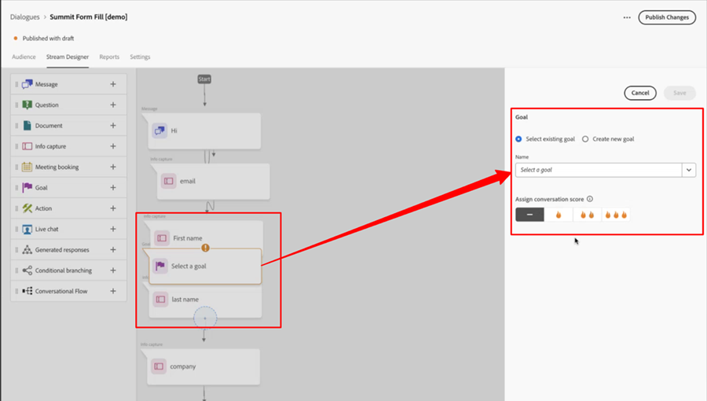

# Note sulla versione di Dynamic Chat {#dynamic-chat-release}

Le versioni di Adobe Dynamic Chat funzionano su un modello di consegna continua che consente un approccio più scalabile all’implementazione delle funzioni. A volte ci sono più versioni in un mese, quindi controlla regolarmente per avere informazioni sempre aggiornate.

La pagina delle note sulla versione standard per Marketo Engage [si trova qui](/help/marketo/release-notes/current.md){target="_blank"}.

## Versione di giugno 2025 {#june-2025-release}

**Data di rilascio: martedì 30 giugno 2025**

### Rinnovo della logica di indirizzamento {#routing-logic-revamp}

La logica di indirizzamento della chat in tempo reale in Dynamic Chat è stata rinnovata per garantire un comportamento di coinvolgimento più intelligente e prevedibile per tutti i tipi di indirizzamento (Account, Personalizzato, Team e Round Robin). La nuova logica semplifica i flussi di indirizzamento e migliora la gestione di fallback quando gli agenti non sono disponibili.

#### Miglioramenti chiave nel comportamento di indirizzamento

* **Fino a due tentativi di coinvolgimento per sessione**

   * Il sistema tenterà di connettersi con non più di due agenti due agenti (al massimo), ma rigorosamente all’interno della regola di indirizzamento principale.

   * Se un agente è disponibile ma non risponde (ad esempio, rifiuta o salta la chat), il sistema tenterà di connettersi a un altro agente dello stesso pool.

   * La logica di fallback (come Round Robin) viene attivata solo se non vengono trovati agenti idonei durante la risoluzione iniziale, per non riprovare dopo un coinvolgimento fallito.

* **Comportamento specifico della regola di indirizzamento**

##### --Indirizzamento account--

Se il dominio e-mail di un visitatore è mappato su un account noto, l’agente mappato ha sempre la priorità.

Se l’agente è disponibile, la chat gli viene indirizzata direttamente.

Se l’agente non è disponibile, il sistema:

* Non fa un tentativo con un altro agente, anche se Round Robin è abilitato come fallback.

* Invece:

   * Mostra il calendario della riunione dell’agente mappato (se attivato).
-oppure-
   * Torna a un messaggio predefinito (caso peggiore).

La regola di indirizzamento a livello di scheda (ad esempio Team, Personalizzato) viene considerata solo se l’instradamento dell’account non è idoneo (nessun dominio o agente corrispondente).

##### —Indirizzamento Personalizzato/Team—

Queste regole possono restituire più agenti idonei.

Se il primo agente disponibile non risponde, il sistema tenterà un altro agente dallo stesso elenco.

Il fallback Round Robin non viene attivato solo perché un agente non risponde.

Se nessuno dei due agenti risponde:

* Il sistema mostra il calendario del primo agente provato (se attivato).
-oppure-
* Mostra il messaggio di fallback predefinito.

##### --Indirizzamento Round Robin--

Quando viene utilizzato come regola di indirizzamento principale, il sistema:

* Tenta di coinvolgere il primo agente disponibile dal pool Round Robin.

* Se il primo agente non risponde, tenta di nuovo con il migliore agente idoneo successivo.

Se Round Robin viene utilizzato come fallback, si attiva solo se non vengono risolti agenti dalla regola primaria.

##### Flusso di esperienza del visitatore

Il sistema verifica se è applicabile l’indirizzamento dell’account.

* In caso positivo e se l’agente è disponibile, si connette immediatamente.

* Se l’agente è non idoneo o non disponibile, passa alla regola di indirizzamento a livello di scheda.

La regola di indirizzamento (Personalizzato, Team, Round Robin) a livello di scheda viene valutata.

* Viene verificata la disponibilità (autorizzazioni, stato) degli agenti idonei.

* Il sistema coinvolge un agente e, se necessario, tenta un secondo agente dalla stessa regola.

* Se il coinvolgimento non ha esito positivo, viene applicata la logica di fallback:

   * Fallback calendario (se attivato),
-oppure-
   * Messaggio predefinito.

Il fallback Round Robin viene considerato solo quando non vengono trovati agenti idonei dalla regola di indirizzamento principale, non quando i singoli agenti non rispondono.

##### Casi d’uso

_**Indirizzamento account**_

<table><thead>
  <tr>
    <th>Tipo</th>
    <th>Esempio</th>
    <th>Risultato</th>
  </tr></thead>
<tbody>
  <tr>
    <td>Ideale</td>
    <td>Il dominio del visitatore è associato a un account; l’agente mappato ha una chat in tempo reale abilitata ed è disponibile</td>
    <td>La chat si connette direttamente all’agente mappato</td>
  </tr>
  <tr>
    <td>Fallback (algoritmo Round Robin)</td>
    <td>L’agente mappato non è disponibile. Il fallback Round Robin è abilitato</td>
    <td>Il sistema seleziona un agente disponibile tramite Round Robin e lo coinvolge </td>
  </tr>
  <tr>
    <td>Nessun agente di fallback</td>
    <td>L’agente mappato non è disponibile, nessun fallback Round Robin; la prenotazione della riunione è abilitata</td>
    <td>Il sistema mostra il calendario dell’agente mappato o visualizza un messaggio di fallback predefinito</td>
  </tr>
</tbody></table>

_**Indirizzamento personalizzato**_

<table><thead>
  <tr>
    <th>Tipo</th>
    <th>Esempio</th>
    <th>Risultato</th>
  </tr></thead>
<tbody>
  <tr>
    <td>Ideale</td>
    <td>La logica personalizzata risolve un elenco di agenti; il primo agente è disponibile e accetta la chat.</td>
    <td>La chat si connette al primo agente.</td>
  </tr>
  <tr>
    <td>Fallback (algoritmo Round Robin)</td>
    <td>La regola personalizzata non risolve alcun agente; il fallback Round Robin è abilitato.</td>
    <td>Il sistema seleziona un agente disponibile tramite Round Robin e lo coinvolge.</td>
  </tr>
  <tr>
    <td>Nessun agente di fallback</td>
    <td>Due agenti sono stati risolti; nessuno dei due accetta la chat e il fallback è impostato sul calendario della riunione.</td>
    <td>Viene visualizzato il calendario del primo agente provato oppure il messaggio di fallback predefinito.</td>
  </tr>
</tbody></table>

_**Instradamento team**_

<table><thead>
  <tr>
    <th>Tipo</th>
    <th>Esempio</th>
    <th>Risultato</th>
  </tr></thead>
<tbody>
  <tr>
    <td>Ideale</td>
    <td>Il team include agenti con chat in tempo reale; il primo agente disponibile accetta la chat.</td>
    <td>La chat si connette a tale agente.</td>
  </tr>
  <tr>
    <td>Fallback (algoritmo Round Robin)</td>
    <td>Nessun agente del team è disponibile e il fallback Round Robin è abilitato.</td>
    <td>Il sistema seleziona e si connette con un agente del pool Round Robin.</td>
  </tr>
  <tr>
    <td>Nessun agente di fallback</td>
    <td>Due agenti sono disponibili, ma nessuno dei due è coinvolto; il fallback del calendario è abilitato.</td>
    <td>Viene visualizzato il calendario dell’agente cercato per primo oppure viene attivato il messaggio di fallback.</td>
  </tr>
</tbody></table>

_**Indirizzamento Round Robin**_

<table><thead>
  <tr>
    <th>Tipo</th>
    <th>Esempio</th>
    <th>Risultato</th>
  </tr></thead>
<tbody>
  <tr>
    <td>Ideale</td>
    <td>Il pool Round Robin ha più agenti; il secondo agente accetta la chat dopo che il primo non lo ha fatto.</td>
    <td>La chat si connette al secondo agente.</td>
  </tr>
  <tr>
    <td>Fallback (algoritmo Round Robin)</td>
    <td>Nessun agente disponibile nel pool Round Robin. Il calendario della riunione è abilitato.</td>
    <td>Il calendario viene visualizzato per il primo agente nell’elenco (se configurato), oppure viene visualizzato il messaggio di fallback.</td>
  </tr>
  <tr>
    <td>Nessun agente di fallback</td>
    <td>Nessun agente disponibile; il fallback è disabilitato.</td>
    <td>Al visitatore viene mostrato un messaggio di fallback statico.</td>
  </tr>
</tbody></table>

### Notifica Pulse {#pulse-notification}

Ogni volta che un visitatore richiede di connettersi con un agente, viene fornita una notifica in-app tramite browser. Ma a volte, gli agenti perdono queste chat.

Con questa versione, l’agente live può ricevere una notifica e-mail, Slack, in-app e su browser quando un nuovo visitatore è interessato a comunicare via chat.

1. Nella home page di Adobe Experience Cloud, fai clic sull’icona Account e seleziona **Preferenze**.

   

1. Scorri verso il basso fino a _Notifiche_ e seleziona la Dynamic Chat desiderata.

   

>[!NOTE]
>
>Il contenuto di una notifica Pulse può essere lo stesso utilizzato per le notifiche in-app del browser.

## Versione di aprile/maggio 2025 {#apr-may-25-release}

### Suono di notifica per messaggio {#message-notification-sound}

Ora puoi abilitare un suono per il visitatore ogni volta che il chatbot viene attivato in una sessione. È possibile scegliere tra più suoni.

### Abilita i messaggi poke su dispositivo mobile {#enable-poke-messages-on-mobile}

“Poke”, che mostra la domanda di apertura accanto all’icona della chat senza che il visitatore debba fare clic su di essa per visualizzarla, è ora un’opzione da abilitare per i visitatori che utilizzano un dispositivo mobile.

### Aggiornamento di fallback predefinito {#default-fallback-update}

Per qualsiasi regola/team personalizzato come scheda di chat in tempo reale, se non sono disponibili agenti (o la chat non può connettersi), verrà eseguito il fallback su Round Robin per gli agenti disponibili (tutti coloro che sono disponibili in quel momento, indipendentemente dalla logica/regola di routing inserita nel flusso).

### Integrazione Demandbase {#demandbase-integration}

Gli utenti Demandbase possono utilizzare gli attributi persona Demandbase per il targeting del dialogo, il branding condizionale e il routing personalizzato in Dynamic Chat.

## Versione di settembre/ottobre 2024 {#sep-oct-release}

### Analisi avanzata delle chat in tempo reale {#enhanced-live-chat-analytics}

Sono stati apportati diversi miglioramenti alla dashboard di analisi, tra cui:

* Numero totale di chat in tempo reale richieste: numero di visitatori che hanno richiesto una “chat con agente”

* Totale chat in tempo reale connesse: numero di visitatori connessi rispetto al totale richiesto per una “chat con agente”

* Totale richieste di chat in tempo reale non effettuate: numero di visitatori non assistiti rispetto al totale richiesto per una “chat con agente”

* Lunghezza media chat in minuti: analizza la “lunghezza media della chat” tra i visitatori e gli agenti

* Tempo medio di risposta agente in secondi: analizza il “tempo medio impiegato” dagli agenti per rispondere alle domande e risposte delle chat in tempo reale

* Dashboard giornaliera: richieste di chat in tempo reale connesse correttamente, richieste di chat in tempo reale non soddisfatte, ordinamento e filtro delle attività di chat in tempo reale recenti

### Punteggio conversazione {#conversation-scoring}

Quantifica i lead in base alla qualità della loro interazione via chat e utilizza tale metrica come attivatore/filtro nelle campagne avanzate Marketo Engage. Utilizza il nuovo attributo _punteggio conversazione_ per le seguenti attività:

* Impegnato con un dialogo
* Impegnato con un flusso conversazionale
* Impegnato con un agente

**Aspetti da considerare:**

* Il valore del punteggio sarà compreso tra 0, 1, 2, 3 (il valore predefinito è null)

* Quando la conversazione viene completata o interrotta, il valore del punteggio non può essere modificato

* Impostazione punteggio:

   * Nella casella in entrata dell’agente: durante una chat in tempo reale, l’agente è in grado di aggiornare o impostare un punteggio per la conversazione, che viene memorizzato nell’attività relativa

   * Nel designer di flusso: nella scheda dell’obiettivo l’utente è in grado di aggiornare o impostare un punteggio per la conversazione

### Nuova logica di creazione del lead {#new-lead-creation-logic}

Se un lead compila un modulo con l’e-mail `abc@test.com` e gli viene assegnato un cookie come xyz, poi compila lo stesso modulo con l’e-mail `def@test.com`, viene creato un nuovo record persona, ma il cookie xyz viene associato alla nuova persona e rimosso dalla persona `abc@test.com`.

Pertanto, quando un visitatore con cookie abc arriva a una pagina e fornisce un ID e-mail come `abc@test.com`:

<table><thead>
  <tr>
    <th>Visitor</th>
    <th>Cookie</th>
    <th>E-mail fornita</th>
    <th>Comportamento previsto</th>
  </tr></thead>
<tbody>
  <tr>
    <td>Anonimo</td>
    <td>abc</td>
    <td>Non esiste nel database</td>
    <td>Creare una nuova persona</td>
  </tr>
  <tr>
    <td>Anonimo</td>
    <td>abc</td>
    <td>Esiste nel database</td>
    <td>Unisci persona</td>
  </tr>
  <tr>
    <td>Anonimo</td>
    <td>xyz</td>
    <td>Esiste nel database</td>
    <td>Unisci persona</td>
  </tr>
  <tr>
    <td>Persona nota</td>
    <td>abc</td>
    <td>Uguale alla persona esistente</td>
    <td>Aggiorna persona</td>
  </tr>
  <tr>
    <td>Persona nota</td>
    <td>abc</td>
    <td>Diverso da persona esistente</td>
    <td>Se esiste già una persona nota, trasferisci il cookie e risolvi tale profilo. Se non esiste alcuna persona con questa e-mail, crea un nuovo record persona e trasferisci il cookie</td>
  </tr>
  <tr>
    <td>Persona nota</td>
    <td>xyz</td>
    <td>Uguale alla persona esistente</td>
    <td>Aggiungi un nuovo cookie alla stessa persona</td>
  </tr>
  <tr>
    <td>Persona nota</td>
    <td>xyz</td>
    <td>Diverso da persona esistente</td>
    <td>questo scenario non è possibile se si tratta di un nuovo cookie considerato per impostazione predefinita come nuovo profilo anonimo</td>
  </tr>
</tbody></table>

### Opzione per ereditare il font {#option-to-inherit-font}

Ora puoi abilitare il chatbot per ereditare direttamente il font dalla pagina web in cui è ospitato, anziché gestire il font del brand in Dynamic Chat. Quando abiliti questa opzione, il chatbot assumerà il font definito sul tag `<body>` della pagina.

### Integrazione Demandbase con Dynamic Chat {#demandbase-integration-with-dynamic-chat}

Gli utenti di Demandbase sono in grado di portare la propria licenza di Demandbase e attivare l’integrazione. Utilizza gli attributi persona Demandbase per il targeting del dialogo, il branding condizionale e il routing personalizzato.

La risoluzione di questi valori di attributo nei confronti di una persona viene eseguita in tempo reale e memorizzata nel rispettivo profilo persona.

### Tempo di caricamento del flusso di conversazione ottimizzato {#optimized-conversation-flow-load-time}

Per migliorare l’esperienza utente, ora viene visualizzato un caricatore shimmer invece di uno spazio vuoto durante il caricamento del flusso conversazionale.

**Prima**

**Dopo**

## Versione di agosto 2024 {#august-release}

**Data di rilascio: sabato 23 agosto 2024**

### Personalizzare la formattazione dei messaggi di conversazione {#custom-format-conversation-messages}

I designer di flussi ora supportano [l’inserimento di HTML](/help/marketo/product-docs/demand-generation/dynamic-chat/automated-chat/stream-designer.md#create-a-stream){target="_blank"} per personalizzare il look and feel delle conversazioni.

### Chatbot scorri verso il basso {#chatbot-scroll-to-bottom}

Nel chatbot è stata aggiunta un’icona per consentire ai visitatori web di passare direttamente all’ultimo messaggio. In questo modo i visitatori possono scorrere il testo per tornare rapidamente alla conversazione.

### Principali notifiche Pulse {#core-pulse-notifications}

Gli utenti ricevono ora una [notifica e-mail](/help/marketo/product-docs/demand-generation/dynamic-chat/live-chat/live-chat-overview.md#failed-action-notifications){target="_blank"} quando la prenotazione di una riunione o la chat in tempo reale non riesce.

### Supporto per più conversazioni {#support-for-multiple-conversations}

Il chatbot ora supporta più conversazioni. I visitatori del sito web possono intrattenere conversazioni diverse su pagine diverse nello stesso momento, con la possibilità di passare da una all’altra.

### Ordinamento predefinito per il contenuto {#default-sorting-for-content}

Per impostazione predefinita, i registri di conversazione, le domande senza risposta e le tabelle di generazione delle domande sono ordinati in base alla data di creazione (dal più recente al più vecchio).

### Risoluzione dei lead in tempo reale {#real-time-lead-resolution}

Nel corso di una conversazione con un lead anonimo dove viene fornito un ID e-mail, si risolve se esiste un record lead noto con tale ID e-mail e questo viene utilizzato per la personalizzazione in tempo reale. Se vengono rilevati più record, questi verranno uniti in tempo reale. Questo comportamento è implementato sia per i dialoghi che per i flussi conversazionali.

### Sincronizzazione dei lead senza cookie da Marketo Engage {#syncing-leads-without-cookies}

In precedenza, quando la sincronizzazione Marketo Engage veniva attivata, Dynamic Chat sincronizzava solo i lead noti con uno o più ID cookie di Marketo Engage. Ora, tutti i lead noti (ID cookie presente o meno) verranno sincronizzati in Dynamic Chat e possono essere utilizzati per la personalizzazione delle conversazioni.

### Trasmettere dati aggiuntivi del visitatore ai flussi conversazionali {#pass-additional-visitor-data}

Se acquisisci le informazioni del visitatore tramite altri canali, come moduli o accesso, ora puoi passare queste informazioni direttamente a Dynamic Chat.

### Dati dedotti aggiornati {#refreshed-inferred-data}

La maggior parte delle conversazioni su un sito web sono con visitatori anonimi. Puoi comunque eseguirne il targeting tramite dati dedotti, che si basano sugli IP dei visitatori. Abbiamo aggiornato il nostro database di IP e dei rispettivi dati dedotti che ora supporta un numero di IP quattro volte superiore.

### È stato aggiunto un suono alla notifica del browser agenti {#sound-added-to-agent-browser-notification}

Quando una chat in tempo reale viene assegnata a un agente, questi riceve una notifica dal browser. Può capitare che l’agente non la veda. È stato aggiunto un [suono di notifica](/help/marketo/product-docs/demand-generation/dynamic-chat/live-chat/live-chat-overview.md#when-a-live-chat-is-routed-to-an-agent){target="_blank"} per evitare che le notifiche non rilevate vengano ignorate.

### Possibilità di aggiornare il profilo del lead durante la chat in tempo reale {#update-lead-profile-during-live-chat}

Durante una chat in tempo reale, gli agenti desiderano acquisire informazioni sul visitatore e aggiornare il rispettivo profilo. È ora disponibile un’opzione per aggiornare i valori degli attributi degli oggetti lead e azienda.

## Versione di giugno 2024 {#june-release}

**Data di rilascio: venerdì 6 giugno 2024**

### Scheda Flusso conversazionale {#conversational-flow-card}

Semplifica più passaggi in un flusso all’interno dei dialoghi sfruttando la scheda Flusso conversazionale.

Esempio: se l’obiettivo è quello di promuovere le registrazioni per il webinar tramite più dialoghi, è necessario ricreare lo stesso flusso in tutti i dialoghi che hanno tale obiettivo. Per aggiornare i dettagli, è necessario modificare ogni singolo dialogo uno alla volta. Non è più così, grazie alla scheda Flusso conversazionale.

Oltre a ridefinire l’utilizzo dei flussi in più dialoghi, puoi utilizzare lo stesso flusso di transizione per l’attivazione attraverso altri canali, come moduli e pagine di destinazione.

### Limiti di utilizzo {#usage-limits}

La pagina Limiti di utilizzo mostra informazioni importanti, ad esempio i dettagli del pacchetto e lo stato del limite di utilizzo.

## Versione di maggio 2024 {#may-release}

**Data di rilascio: giovedì 15 maggio 2024**

### Libreria di risposte preapprovata {#pre-approved-response-library}

[Crea una libreria approvata dal marketing](/help/marketo/product-docs/demand-generation/dynamic-chat/generative-ai/response-library.md){target="_blank"} di domande e risposte generate da IA per configurare in pochi minuti una chat generativa basata su IA.

### Domande senza risposta {#unanswered-questions}

[Utilizza un archivio di domande senza risposta](/help/marketo/product-docs/demand-generation/dynamic-chat/generative-ai/unanswered-questions.md){target="_blank"} di conversazioni precedenti per generare nuove risposte preapprovate mantenendo una libreria di risposte con le informazioni più recenti.

### Riepiloghi di conversazione {#conversation-summaries}

[Offri agli agenti di vendita una sintesi delle conversazioni](/help/marketo/product-docs/demand-generation/dynamic-chat/live-chat/agent-inbox.md#conversation-summary){target="_blank"} con approfondimenti sui principali argomenti di discussione prima delle riunioni per ridurre i tempi di preparazione e fornire agli agenti di vendita informazioni aggiornate.

### Scelte rapide per le vendite GenAI {#genai-sales-shortcuts}

[Fornisci agli agenti chat in tempo reale con metodi più rapidi](/help/marketo/product-docs/demand-generation/dynamic-chat/live-chat/agent-inbox.md#shortcuts){target="_blank"} per accedere alle risposte generate dall’intelligenza artificiale, modificare le risposte generate esistenti e cercare contenuti aggiuntivi da inviare agli acquirenti durante la conversazione.

### Assistente conversazioni {#conversation-assist}

Aiuta gli agenti di vendita a rispondere con precisione durante le conversazioni in tempo reale utilizzando risposte pre-approvate dal team di marketing.

### Stimoli alla conversazione {#conversation-nudges}

Stimola i visitatori del web con una call-to-action per indirizzare le conversazioni verso la conclusione.

## Versione di aprile 2024 {#april-release}

**Data di rilascio: mercoledì 23 aprile 2024**

### Flussi conversazionali ora disponibili per tutti gli utenti {#conversational-flows-available-to-all-users}

Rendi i tuoi moduli e le tue pagine di destinazione più conversazionali e riduci il funnel di vendita consentendo ai lead qualificati di prenotare una riunione o una chat con i venditori subito dopo l’invio di un modulo con Conversational Forms, ora completamente disponibile&#42; per tutti gli utenti Dynamic Chat.

_&#42;Precedentemente disponibile come funzionalità di prova con 100 coinvolgimenti a vita. I coinvolgimenti da flusso conversazionale ora verranno conteggiati per il limite mensile di 250 conversazioni ingaggiate per gli utenti nel pacchetto Select._

### Funzioni di callback {#callback-functions}

Le [funzioni di callback](/help/marketo/product-docs/demand-generation/dynamic-chat/setup-and-configuration/callback-functions.md){target="_blank"} ti consentono di raccogliere eventi di analisi Dynamic Chat in sistemi esterni, come Adobe Analytics o Google Analytics, mentre i visitatori sono coinvolti in conversazioni Dynamic Chat. Per abilitare gli eventi di analisi Dynamic Chat, registra un callback con l’API per l’ascolto degli eventi. Questo ti consente di avere una visione più olistica del coinvolgimento con Dynamic Chat in relazione ad altri dati chiave, come il traffico web.

### Sono state aggiunte condizioni di disponibilità dell’agente in tempo reale al ramo condizionale {#live-agent-availability-conditional-branching}

Oltre ai campi Marketo Engage nativi e personalizzati, ora puoi utilizzare la diramazione condizionale per creare rami in base alla disponibilità dell’agente. Questo è utile se desideri offrire ai visitatori solo l’opzione di parlare con un agente live quando sono disponibili agenti live.

### Condizione Elenco smart aggiunta alla diramazione condizionale {#smart-list-condition}

Con l’aggiunta della nuova condizione Elenco smart di Marketo Engage nella diramazione condizionale, puoi creare diramazioni in base a tipi di pubblico preesistenti già creati in Marketo Engage, anziché definire le condizioni di diramazione del pubblico in Dynamic Chat.

### Diramazione condizionale per flussi conversazionali {#conditional-branching-for-conversational-flows}

All’inizio di quest’anno è stata rilasciata la diramazione condizionale per i dialoghi e ora puoi sfruttare questa possibilità anche nei flussi conversazionali. La diramazione condizionale consente di creare diramazioni nel flusso in base a condizioni diverse.

### Chat in tempo reale per flussi conversazionali {#live-chat-for-conversational-flows}

Nel 2023 è stata rilasciata la funzionalità di chat in tempo reale per Dialoghi e ora puoi aggiungere coinvolgimenti in chat in tempo reale anche ai flussi conversazionali. Se utilizzi i flussi conversazionali con i moduli Marketo Engage, ora puoi consentire ai visitatori qualificati di chattare con un agente in tempo reale immediatamente dopo l’invio del modulo.

### Attività Marketo Engage recenti nella casella in entrata dell’agente {#recent-marketo-engage-activities-in-agent-inbox}

Abbiamo aggiunto le recenti attività di Marketo Engage alla sezione Attività recenti della Casella in entrata dell’agente, in modo che, quando un visitatore del sito richiede di chattare con un agente, l’agente possa vedere rapidamente se il visitatore è stato recentemente coinvolto in una delle seguenti attività di Marketo Engage (ultime 25 attività):

* E-mail aperta
* Pagina web visitata
* Modulo compilato
* Ha avuto un momento interessante

### Stato della connessione al calendario in Gestione agenti {#calendar-connection-status-in-agent-management}

Gli amministratori possono ora vedere facilmente quali agenti con autorizzazioni per la prenotazione di riunioni hanno connesso i loro calendari in Dynamic Chat. In questo modo, puoi assicurarti che l’intero team di vendita sia connesso e pronto ad accettare le convocazioni di riunione da Dynamic Chat.

### Impostazione avviso minimo nella configurazione del calendario dell’agente {#minimum-notice-setting-in-agent-calendar-configuration}

Gli utenti hanno segnalato che i visitatori web prenotavano le riunioni sul calendario con appena 10 minuti di preavviso, per questo è stata introdotta un’impostazione di preavviso minimo nella configurazione del calendario dell’agente e il lead time predefinito su 24 ore.

### È stato aggiornato il comportamento aggiungi/rimuovi utente {#add-remove-user-behavior-updated}

Alcuni utenti hanno segnalato problemi durante l’aggiunta e la rimozione di agenti in Dynamic Chat, per la cui soluzione sono state apportate alcune modifiche.

Quando un utente viene aggiunto ad Admin Console con l’autorizzazione alla prenotazione di chat in tempo reale o riunioni, viene immediatamente visualizzato nell’elenco Gestione agenti e può essere aggiunto a dialoghi, flussi conversazionali, regole di routing e team.

Quando un utente con autorizzazioni per la prenotazione di riunioni o chat in tempo reale viene rimosso da Admin Console, verrà immediatamente rimosso da Dynamic Chat, non sarà più disponibile per la chat in tempo reale o l’instradamento di riunioni e non verrà più conteggiato nei limiti di licenza.

### Migliori prestazioni del rapporto a livello di conversazione {#improved-conversation-level-report-performance}

I rapporti a livello di dialogo individuale e di flusso conversazionale ora sono più performanti e precisi. In precedenza, il caricamento dei rapporti dei dialoghi poteva richiedere diversi secondi e talvolta i dati non erano coerenti con i rapporti sulle prestazioni globali. Ora i rapporti di dialogo individuale vengono caricati in un istante e i dati saranno sempre allineati con i dati di reporting globali.

### Aggiornamenti delle autorizzazioni {#permission-updates}

La struttura delle autorizzazioni e la denominazione in Adobe Admin Console sono state semplificate per rendere la gestione delle autorizzazioni più intuitiva.

* La categoria “Gestione conversazioni” è ora denominata “Conversazioni”
* La categoria “Riunioni” è ora denominata “Attività”
* La categoria “Impostazioni agente” è ora denominata “Agenti”
* La categoria “Impostazioni amministratore” è ora denominata “Configurazione”
* La categoria “Chat in tempo reale” è stata rimossa e tutte le autorizzazioni di chat in tempo reale sono state spostate nella categoria Agenti

### Supporto per i collegamenti ipertestuali nella casella in entrata dell’agente {#support-for-hyperlinks-in-agent-inbox}

Ora, quando gli agenti di chat in tempo reale condividono gli URL con i visitatori nella chat, questi saranno collegamenti ipertestuali su cui i visitatori possono semplicemente fare clic per passare alla pagina, anziché dover copiare e incollare l’URL nel browser.

### Immettere il comportamento chiave aggiornato nella casella in entrata dell’agente {#enter-key-behavior-updated-in-agent-inbox}

È stato cambiato il comportamento del tasto di Invio nella casella in entrata dell’agente: ora premendo il tasto Invio verrà inviato il messaggio e premendo Maiusc+Invio verrà creata un’interruzione di riga.

### Pagina Round Robin rimossa {#round-robin-page-removed}

Nessuna preoccupazione. L’indirizzamento Round Robin è ancora completamente funzionale nello stesso modo di prima. È stata semplicemente rimossa la pagina che mostrava un elenco spesso impreciso degli agenti e del loro ordine nella coda di indirizzamento Round Robin.

Quando è stato rilasciato Dynamic Chat nel 2022, non c’era supporto per la chat in tempo reale, ma solo per la prenotazione di riunioni, e la pagina di indirizzamento Round Robin era progettata pensando solo alla prenotazione di riunioni. Con l’introduzione della chat dal vivo lo scorso anno, la pagina Round Robin è diventata obsoleta in quanto non rifletteva con precisione la natura più complessa dell’indirizzamento Round Robin tra agenti, per consentire sia la prenotazione delle riunioni che le autorizzazioni di chat in tempo reale. Abbiamo esplorato alcune opzioni diverse per risolvere questo problema, ma alla fine abbiamo deciso che rimuovere del tutto la pagina era l’opzione migliore per ridurre al minimo la confusione.

## Versione di febbraio 2024 {#february-release}

**Data di rilascio: venerdì 22 febbraio 2024**

### Pagina Conversazioni {#conversations-page}

La nuova pagina Conversazioni offre un punto di riferimento unico per la visualizzazione delle trascrizioni di tutte le conversazioni (automatizzate e in tempo reale) avvenute per l’istanza, da lead noti e anonimi, fornendo una migliore visibilità sul modo in cui i clienti interagiscono con dialoghi, flussi conversazionali e agenti in tempo reale.

### L’intervallo di date nella dashboard globale è aumentato da 90 giorni a 24 mesi {#date-range-in-global-dashboard}

L’hanno chiesto gli utenti ed è stato realizzato. Ora è possibile visualizzare i dati sul coinvolgimento di Dynamic Chat per un massimo di due anni in tutte le dashboard di analisi.

### Diramazione condizionale nei dialoghi {#conditional-branching-in-dialogues}

La diramazione condizionale consente di creare rami nei flussi del dialogo in base a condizioni diverse. Ora è possibile presentare contenuti diversi a persone diverse nello stesso dialogo in base agli attributi del lead e dell’azienda in Marketo Engage.

## Versione di gennaio 2024 {#january-release}

**Data di rilascio: giovedì 24 gennaio 2024**

### Impostazione di limite simultaneo nella gestione degli agenti per le chat in tempo reale {#Concurrent-live-chat-limit-setting}

Per impostazione predefinita, ogni agente di chat in tempo reale in una istanza può partecipare a un massimo di 5 sessioni di chat in tempo reale alla volta. Nella gestione degli agenti è stata introdotta una nuova impostazione che consente di regolare questo limite da 1 a 10.

