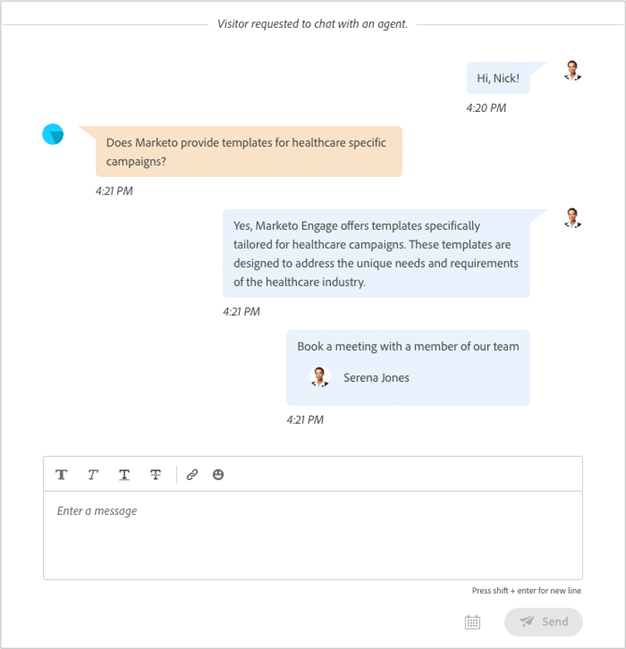

# Note sulla versione di Dynamic Chat {#dynamic-chat-release}

I rilasci di Adobe Dynamic Chat funzionano su un modello di distribuzione continua che consente un approccio più scalabile alla distribuzione delle funzioni. A volte ci sono più versioni in un mese, quindi controlla regolarmente per informazioni sempre aggiornate.

La pagina delle note sulla versione standard per il Marketo Engage [ si trova qui](/help/marketo/release-notes/current.md){target="_blank"}.

## Versione di agosto 2024 {#august-release}

**Data di rilascio: 23 agosto 2024**

### Personalizzare la formattazione dei messaggi di conversazione {#custom-format-conversation-messages}

Le finestre di progettazione di flussi ora supportano [l&#39;inserimento di HTML](/help/marketo/product-docs/demand-generation/dynamic-chat/automated-chat/stream-designer.md#create-a-stream){target="_blank"} per personalizzare l&#39;aspetto delle conversazioni.

### Chatbot scorri verso il basso {#chatbot-scroll-to-bottom}

Nel chatbot è stata aggiunta un’icona per consentire ai visitatori web di passare direttamente all’ultimo messaggio. In questo modo i visitatori possono scorrere il testo per tornare rapidamente alla conversazione.

### Notifiche Core Pulse {#core-pulse-notifications}

Gli utenti ricevono ora una [notifica e-mail](/help/marketo/product-docs/demand-generation/dynamic-chat/live-chat/live-chat-overview.md#failed-action-notifications){target="_blank"} quando la prenotazione di una riunione o la chat in tempo reale non riesce.

### Supporto per più conversazioni {#support-for-multiple-conversations}

Il chatbot ora supporta più conversazioni. I visitatori del sito web possono intrattenere conversazioni diverse su pagine diverse nello stesso momento, con la possibilità di passare da una all’altra.

### Ordinamento predefinito per il contenuto {#default-sorting-for-content}

Per impostazione predefinita, i registri di conversazione, le domande senza risposta e le tabelle di generazione delle domande sono ordinati in base alla data di creazione (dal più recente al più recente).

### Risoluzione dei lead in tempo reale {#real-time-lead-resolution}

Durante una conversazione con un lead anonimo e viene fornito un ID e-mail, risolviamo se esiste un record lead noto con tale ID e-mail e utilizziamo tale record per la personalizzazione in tempo reale. Se vengono rilevati più record, questi verranno uniti in tempo reale. Questo comportamento è implementato sia per le finestre di dialogo che per i flussi conversazionali.

### Sincronizzazione dei lead senza cookie dal Marketo Engage {#syncing-leads-without-cookies}

In precedenza, quando la sincronizzazione del Marketo Engage era attivata, il Dynamic Chat sincronizzava solo i lead noti con uno o più ID cookie del Marketo Engage. Ora, tutti i lead noti (ID cookie presente o meno) verranno sincronizzati nel Dynamic Chat e possono essere utilizzati per la personalizzazione delle conversazioni.

### Trasmettere i dati aggiuntivi del visitatore ai flussi conversazionali {#pass-additional-visitor-data}

Se acquisisci le informazioni del visitatore tramite altri canali, come moduli o accesso, ora puoi passare queste informazioni direttamente al Dynamic Chat.

### Dati dedotti aggiornati {#refreshed-inferred-data}

La maggior parte delle conversazioni su un sito web sono con visitatori anonimi. Puoi comunque eseguirne il targeting tramite dati dedotti, che si basano sugli IP dei visitatori. Abbiamo aggiornato il nostro database di IP e dei rispettivi dati dedotti che ora supporta un numero di IP quattro volte superiore.

### Suono aggiunto alla notifica del browser agenti {#sound-added-to-agent-browser-notification}

Quando una chat in tempo reale viene assegnata a un agente, questi riceve una notifica dal browser. Ma a volte non li vedono. È stato aggiunto un suono di notifica per evitare che le notifiche non completate vengano ignorate.

### Possibilità di aggiornare il profilo del lead durante la chat in diretta {#update-lead-profile-during-live-chat}

Durante una chat in diretta, gli agenti desiderano acquisire informazioni sul visitatore e aggiornare il rispettivo profilo. È ora disponibile un’opzione per aggiornare i valori degli attributi degli oggetti lead e company.

## Versione di giugno 2024 {#june-release}

**Data di rilascio: venerdì 6 giugno 2024**

### Scheda flusso conversazionale {#conversational-flow-card}

Semplifica più passaggi in un flusso all’interno delle finestre di dialogo sfruttando la scheda Flusso conversazionale.

Esempio: se l’obiettivo è quello di promuovere le registrazioni per il webinar tramite più finestre di dialogo, è necessario ricreare lo stesso flusso in tutte le finestre di dialogo che hanno tale obiettivo. Per aggiornare i dettagli, è necessario modificare ogni singola finestra di dialogo una alla volta. Non è più così, grazie alla scheda Conversational Flow.

Oltre a ridefinire l’utilizzo dei flussi in più finestre di dialogo, puoi utilizzare lo stesso flusso di transizione per passare ad altri canali, come moduli e pagine di destinazione.

### Limiti di utilizzo {#usage-limits}

La pagina Limiti di utilizzo mostra informazioni importanti, ad esempio i dettagli del pacchetto e lo stato del limite di utilizzo.

## Versione di maggio 2024 {#may-release}

**Data di rilascio: giovedì 15 maggio 2024**

### Libreria di risposte preapprovata {#pre-approved-response-library}

[Crea una libreria approvata dal marketing](/help/marketo/product-docs/demand-generation/dynamic-chat/generative-ai/response-library.md){target="_blank"} di domande e risposte generate da IA per configurare in pochi minuti una chat generativa basata su IA.

### Domande senza risposta {#unanswered-questions}

[Utilizza un archivio di domande senza risposta](/help/marketo/product-docs/demand-generation/dynamic-chat/generative-ai/unanswered-questions.md){target="_blank"} di conversazioni precedenti per generare nuove risposte preapprovate mantenendo una libreria di risposte con le informazioni più recenti.

### Riepiloghi conversazione {#conversation-summaries}

[Offri agli agenti di vendita una sintesi delle conversazioni](/help/marketo/product-docs/demand-generation/dynamic-chat/live-chat/agent-inbox.md#conversation-summary){target="_blank"} con approfondimenti su argomenti di discussione chiave prima delle riunioni per ridurre i tempi di preparazione e fornire agli agenti di vendita informazioni aggiornate.

### Scelte rapide per le vendite GenAI {#genai-sales-shortcuts}

[Fornisci agli agenti chat in tempo reale metodi più rapidi](/help/marketo/product-docs/demand-generation/dynamic-chat/live-chat/agent-inbox.md#shortcuts){target="_blank"} per accedere alle risposte generate dall&#39;intelligenza artificiale, modificare le risposte generate esistenti e cercare contenuti aggiuntivi da inviare agli acquirenti durante la conversazione.

### Assistente conversazioni {#conversation-assist}

Aiuta gli agenti di vendita a rispondere con precisione durante le conversazioni live utilizzando risposte pre-approvate dal tuo team di marketing.

### Spigoli di conversazione {#conversation-nudges}

Incoraggia i visitatori Web con un invito all’azione per indirizzare le conversazioni alla conclusione.

## Versione di aprile 2024 {#april-release}

**Data di rilascio: mercoledì 23 aprile 2024**

### Flussi conversazionali ora disponibili per tutti gli utenti {#conversational-flows-available-to-all-users}

Rendere i moduli e le pagine di destinazione più conversazionali e ridurre il funnel di vendita consentendo ai lead qualificati di prenotare una riunione o una chat con Sales subito dopo l&#39;invio di un modulo con Conversational Forms, ora completamente disponibile&#42; per tutti gli utenti del Dynamic Chat.

_&#42;Precedentemente disponibile come funzionalità di prova con 100 contratti a vita. Gli impegni di flusso conversazionale ora verranno conteggiati per il limite mensile di 250 conversazioni impegnate per gli utenti nel pacchetto Select._

### Funzioni di callback {#callback-functions}

[Le funzioni di callback](/help/marketo/product-docs/demand-generation/dynamic-chat/setup-and-configuration/callback-functions.md){target="_blank"} ti consentono di raccogliere eventi di analisi del Dynamic Chat in sistemi esterni, come Adobe Analytics o Google Analytics, in quanto i visitatori sono coinvolti in conversazioni di Dynamic Chat. Per abilitare gli eventi di analisi di Dynamic Chat, devi registrare un callback con l’API per ascoltare gli eventi. Questo ti consente di avere una visione più olistica del coinvolgimento del Dynamic Chat in relazione ad altri dati chiave, come il traffico web.

### Sono state aggiunte condizioni di disponibilità dell’agente live al ramo condizionale {#live-agent-availability-conditional-branching}

Oltre ai campi di Marketo Engage nativi e personalizzati, ora puoi utilizzare la diramazione condizionale per creare rami in base alla disponibilità dell’agente. Questo è utile se desideri offrire ai visitatori solo l’opzione di parlare con un agente live quando sono disponibili agenti live.

### Condizione elenco smart aggiunta alla diramazione condizionale {#smart-list-condition}

Con l’aggiunta della nuova condizione Elenco smart di Marketo Engage nell’diramazione condizionale, puoi creare diramazioni in base a tipi di pubblico preesistenti già creati in Marketo Engage, anziché definire le condizioni di diramazione del pubblico in Dynamic Chat.

### Diramazione condizionale per flussi conversazionali {#conditional-branching-for-conversational-flows}

All’inizio di quest’anno è stata rilasciata la diramazione condizionale per i dialoghi e ora puoi sfruttare questa possibilità anche nei flussi conversazionali. La diramazione condizionale consente di creare diramazioni nel flusso in base a condizioni diverse.

### Chat live per flussi conversazionali {#live-chat-for-conversational-flows}

Abbiamo rilasciato la funzionalità di chat in diretta per Dialoghi nel 2023 e ora puoi aggiungere impegni di chat in diretta anche ai flussi conversazionali. Se utilizzi i Flussi conversazionali con i moduli di Marketo Engage, ora puoi consentire ai visitatori qualificati di chattare con un agente live immediatamente dopo l’invio del modulo.

### Attività recenti del Marketo Engage nella casella in entrata dell’agente {#recent-marketo-engage-activities-in-agent-inbox}

Abbiamo aggiunto le attività di Marketo Engage recenti alla sezione Attività recenti della Casella in entrata dell’agente, in modo che quando un visitatore del sito richiede di chattare con un agente, l’agente possa vedere rapidamente se il visitatore è stato recentemente impegnato in una delle seguenti attività di Marketo Engage (ultime 25 attività):

* E-mail aperta
* Pagina Web visitata
* Modulo compilato
* Momento interessante

### Stato della connessione al calendario in Gestione agenti {#calendar-connection-status-in-agent-management}

Gli amministratori possono ora vedere facilmente quali agenti con autorizzazioni per la prenotazione di riunioni hanno connesso i loro calendari nel Dynamic Chat. Ciò consente di garantire la connessione dell&#39;intero team di vendita e di essere pronti ad accettare le convocazioni di riunione dal Dynamic Chat.

### Impostazione avviso minimo nella configurazione del calendario dell&#39;agente {#minimum-notice-setting-in-agent-calendar-configuration}

Gli utenti hanno segnalato che i visitatori web prenotavano le riunioni sul calendario con appena 10 minuti di preavviso, per questo abbiamo introdotto un’impostazione di preavviso minimo nella configurazione del calendario dell’agente e impostato il lead time predefinito su 24 ore.

### Comportamento dell&#39;utente aggiunto/rimosso aggiornato {#add-remove-user-behavior-updated}

Alcuni utenti hanno segnalato problemi durante l’aggiunta e la rimozione di agenti in Dynamic Chat, per cui abbiamo apportato alcune modifiche per risolvere questi problemi.

Quando un utente viene aggiunto all’Admin Console con l’autorizzazione per chat in diretta o prenotazione riunione, viene immediatamente visualizzato nell’elenco Gestione agenti e può essere aggiunto a Finestre di dialogo, Flussi conversazionali, regole di routing e team.

Quando un utente con autorizzazioni per la prenotazione di riunioni o la chat in tempo reale viene rimosso da Admin Console, verrà immediatamente rimosso dal Dynamic Chat, non sarà più disponibile per la chat in tempo reale o l’instradamento di riunioni e non verrà più conteggiato rispetto ai limiti di licenza.

### Migliori prestazioni del rapporto a livello di conversazione {#improved-conversation-level-report-performance}

I rapporti a livello di dialogo individuale e di flusso conversazionale ora sono più performanti e precisi. In precedenza, il caricamento dei rapporti delle finestre di dialogo poteva richiedere diversi secondi e talvolta i dati non erano coerenti con i rapporti sulle prestazioni globali. Ora i singoli rapporti della finestra di dialogo vengono caricati in un istante e i dati saranno sempre allineati con i dati di reporting globali.

### Aggiornamenti delle autorizzazioni {#permission-updates}

Abbiamo ripulito la struttura delle autorizzazioni e la denominazione in Adobe Admin Console per rendere la gestione delle autorizzazioni più intuitiva.

* La categoria &quot;Gestione conversazioni&quot; è ora denominata &quot;Conversazioni&quot;
* La categoria &quot;Riunioni&quot; è ora denominata &quot;Attività&quot;
* La categoria &quot;Impostazioni agente&quot; è ora denominata &quot;Agenti&quot;
* La categoria &quot;Impostazioni amministratore&quot; è ora denominata &quot;Configurazione&quot;
* La categoria &quot;Chat in tempo reale&quot; è stata rimossa e tutte le autorizzazioni di chat in tempo reale sono state spostate nella categoria Agenti

### Supporto per i collegamenti ipertestuali nella casella in entrata dell’agente {#support-for-hyperlinks-in-agent-inbox}

Ora, quando gli agenti di chat live condividono gli URL con i visitatori nella chat, questi saranno collegati ipertestualmente in modo che i visitatori possano semplicemente fare clic su di essi per passare alla pagina, anziché dover copiare e incollare l’URL nel browser.

### Immettete il comportamento chiave aggiornato nella casella in entrata dell&#39;agente {#enter-key-behavior-updated-in-agent-inbox}

È stato cambiato il comportamento del tasto di ritorno nella casella in entrata dell’agente, quindi premendo il tasto Invio o Indietro verrà inviato il messaggio e premendo Maiusc+Invio verrà creata un’interruzione di riga.

### Pagina Round robin rimossa {#round-robin-page-removed}

Non si preoccupi! Round robin routing è ancora completamente funzionale e funziona come sempre. Abbiamo appena rimosso la pagina che mostrava un elenco spesso impreciso di agenti e il loro ordine nella coda di routing round robin.

Quando abbiamo rilasciato il Dynamic Chat nel 2022, non c&#39;era supporto per la chat in diretta, solo la prenotazione di riunioni, e la pagina di routing round robin è stata progettata pensando solo alla prenotazione di riunioni. Con l&#39;introduzione della chat dal vivo lo scorso anno, la pagina round robin è diventata obsoleta in quanto non rifletteva con precisione la natura più complessa del round robin routing tra agenti con sia la prenotazione delle riunioni che le autorizzazioni di chat dal vivo. Abbiamo esplorato alcune opzioni diverse per risolvere questo problema, ma alla fine abbiamo deciso che rimuoverlo del tutto era l’opzione migliore per ridurre al minimo la confusione.

## Versione di febbraio 2024 {#february-release}

**Data di rilascio: venerdì 22 febbraio 2024**

### Pagina Conversazioni {#conversations-page}

La nuova pagina Conversazioni offre un punto di riferimento unico per la visualizzazione delle trascrizioni di tutte le conversazioni (automatizzate e live) avvenute per l’istanza, da lead noti e anonimi, fornendo una migliore visibilità sul modo in cui i clienti interagiscono con dialoghi, flussi conversazionali e agenti live.

### L’intervallo di date nel dashboard globale è aumentato da 90 giorni a 24 mesi {#date-range-in-global-dashboard}

Hai chiesto e abbiamo consegnato. Ora è possibile visualizzare i dati di coinvolgimento del Dynamic Chat fino a due anni in tutte le dashboard di Analytics.

### Diramazione condizionale nelle finestre di dialogo {#conditional-branching-in-dialogues}

La diramazione condizionale consente di creare rami nei flussi della finestra di dialogo in base a condizioni diverse. Ora puoi presentare contenuti diversi a persone diverse nella stessa finestra di dialogo in base agli attributi del lead e dell’azienda nel Marketo Engage.

## Versione di gennaio 2024 {#january-release}

**Data di rilascio: giovedì 24 gennaio 2024**

### Limite simultaneo di chat live nella gestione degli agenti {#Concurrent-live-chat-limit-setting}

Per impostazione predefinita, ogni agente di chat live nella tua istanza può partecipare a un massimo di 5 sessioni di chat live alla volta. Abbiamo introdotto una nuova impostazione nella gestione degli agenti che consente di regolare questo limite da 1 a 10.

