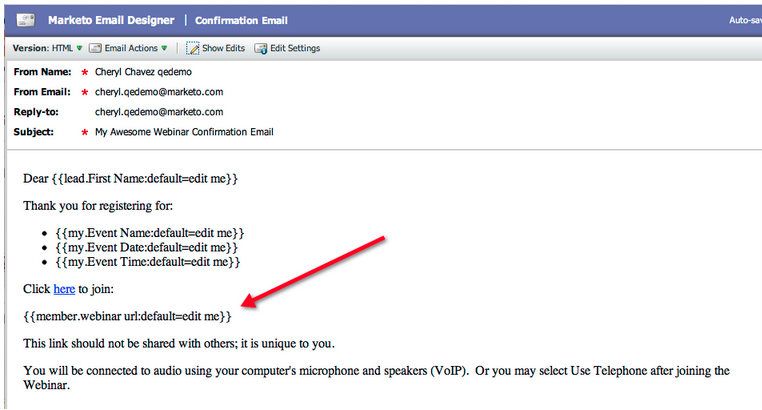

# Note sulla versione: aprile 2012 {#release-notes-april}

## Filtri di segmentazione e attivatori {#segmentation-filters-and-triggers}

Esegui il targeting dello stesso gruppo di lead in modo coerente? In tal caso, utilizza la segmentazione negli elenchi avanzati per il targeting dei lead. Con la segmentazione, l’intero database dei lead viene sempre segmentato e può essere riutilizzato nei programmi per coerenza. I risultati della segmentazione vengono richiamati rapidamente perché non richiedono l’esecuzione dell’elenco avanzato al momento della richiesta.

## Inserire valori esterni nel contenuto delle e-mail e in altri passaggi del flusso tramite funzionalità API espanse {#insert-external-values-into-email-content-and-other-flow-steps-through-expanded-api-capabilities}

* L’API Request Campaign ora consente di inviare valori per I miei token per quella particolare esecuzione della campagna - questo è particolarmente utile per popolare il contenuto delle e-mail tramite l’API
* Le nuove API di caricamento nell’elenco e pianificazione delle campagne supportano quanto sopra per gli elenchi di lead e le campagne batch.

## E-mail di conferma più semplici per [!DNL GoToWebinar] e [!DNL WebEx] (Adobe Connect e [!DNL ON24] disponibili a breve) {#easier-confirmation-emails-for-gotowebinar-and-webex-adobe-connect-and-on-coming-soon}

L’URL di conferma è stato semplificato creando un token membro che visualizza l’URL di conferma della registrazione univoco per ogni lead. Non sarà più necessario creare questo URL utilizzando token diversi. Questa versione è attualmente disponibile per [!DNL GoToWebinar] e [!DNL WebEx] clienti e sarà disponibile per Adobe Connect e [!DNL ON24] nella prossima versione.

## Carica più immagini e file con un solo clic! {#upload-multiple-images-and-files-with-a-single-click}

Risparmia tempo ed è più efficiente quando si importano immagini e file in Marketo. Se si utilizza [!DNL Firefox] o [!DNL Google Chrome], è possibile selezionare più file e caricarli tutti contemporaneamente. Sebbene non vi sia alcun limite al numero di file che è possibile caricare, la dimensione massima per ogni file è di 50 MB.

Nota: al momento questa funzionalità non è supportata in [!DNL Internet Explorer] a causa delle limitazioni del browser.

## Spostare il testo in un messaggio e-mail {#move-text-in-an-email}

Puoi riordinare i blocchi di testo in un messaggio e-mail. Nell’editor di testo seleziona un blocco di testo; quando fai clic sull’icona di modifica, visualizzerai l’opzione per spostare il blocco verso l’alto o verso il basso.

## [!DNL Salesforce] riferimenti rimossi per non [!DNL Salesforce] utenti {#salesforce-references-removed-for-non-salesforce-users}

Se non si sincronizza la sottoscrizione con [!DNL Salesforce], verranno rimosse tutte le cartelle e le azioni di flusso che fanno riferimento a [!DNL Salesforce].

## Marketo Revenue Cycle Analytics {#marketo-revenue-cycle-analytics}

**Fasi gate migliorate nel ciclo dei ricavi Modeler**

Consente agli utenti di definire un ordine per le regole di transizione.

