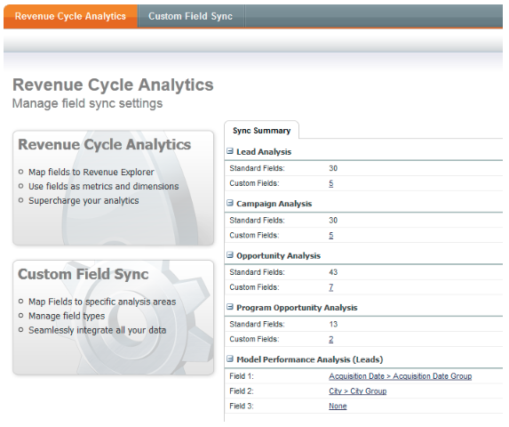
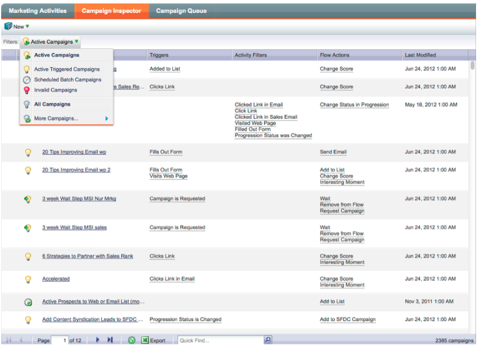

# Note sulla versione: dicembre 2012 {#release-notes-december}

La versione di dicembre include le funzionalità **Inoltra ad amico** funzionalità, così come diverse altre chicche! Le caratteristiche contrassegnate da un asterisco (&#42;) sono disponibili solo in Select Edition e in RCA (Revenue Cycle Analytics).

## Inoltra ad amico {#forward-to-friend}

Abilita la condivisione di contenuti con altri includendo un **Inoltra ad amico** nelle e-mail. L’aggiunta di nuovi filtri e trigger ti aiuterà a identificare i tuoi influencer, identificando gli utenti che hanno inoltrato un’e-mail, nonché quelli che hanno ricevuto le e-mail inoltrate.

Per includere una **Inoltra ad amico** nell’e-mail, aprilo nell’editor e inserisci l’invito `{{system.forwardToFriendLink}}` token.

Utilizza i trigger e i filtri corrispondenti per identificare gli utenti che hanno utilizzato **Inoltra ad amico** e a coloro che hanno ricevuto l&#39;e-mail.

## Autorizzazioni amministratore granulari {#granular-admin-permissions}

La nostra ultima versione offre un maggiore accesso e controllo sui ruoli di amministratore, controllando l’accesso a diverse funzioni nell’area di amministrazione di Marketo per ogni ruolo. Quando crei un nuovo ruolo, puoi assegnare funzioni amministratore specifiche a cui il ruolo può accedere.

>[!NOTE]
>
>Per impostazione predefinita, i ruoli esistenti con l’autorizzazione &quot;Amministratore di accesso&quot; hanno accesso a tutte le funzioni di amministrazione fino a quando e a meno che non vengano modificati.

## Scheda BrightTALK {#brighttalk-adapter}

L&#39;adattatore Marketo BrightTALK consente di acquisire le informazioni sulle presenze da un webcast live o on-demand, direttamente in un evento Marketo.

## Marketo Sales Insight per Microsoft Dynamics {#marketo-sales-insight-for-microsoft-dynamics}

Sales Insight è ora disponibile per i clienti Microsoft Dynamics.

## Sincronizzazione opportunità Dynamics {#dynamics-opportunity-sync}

Sincronizza i dati dell’opportunità tra Marketo e Microsoft Dynamics.

## Rapporto Opportunità Influenzate Dal Marketing&#42; {#marketing-influenced-opportunities-report}

Indica in quale percentuale la pipeline e i ricavi della tua azienda sono stati influenzati dai tuoi programmi di marketing. In entrata **Gestione ricavi**, ora puoi creare rapporti personalizzati con il nuovo punto giallo &quot;Opportunità Influenzate dal Marketing&quot; nell’analisi delle opportunità. È inoltre possibile utilizzare i due rapporti seguenti nella cartella Standard:

* Influenza del marketing sulle opportunità create
* Influenza del marketing sulle opportunità chiuse

## Campi opportunità personalizzati nell’analisi dell’opportunità del programma&#42; {#custom-opportunity-fields-in-program-opportunity-analysis}

Aggiungi campi opportunità personalizzati per arricchire i rapporti Analisi opportunità programma in Esplora entrate.

## Ispettore campagna {#campaign-inspector}

Ti sei mai chiesto quali campagne utilizzano un’azione di flusso specifica, ad esempio Modifica punteggio o Richiedi campagna? O dove viene utilizzato un determinato filtro? Il nuovo Campaign Inspector (disponibile dal Treasure Chest) consente di identificare queste campagne, nonché le campagne attive e le campagne con errori.

Vai a **Amministratore** > **Treasure Chest** per attivare **Ispettore campagna**.

