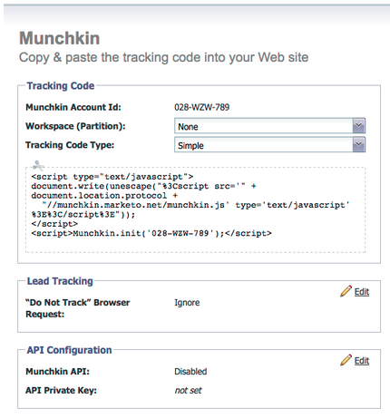

# Note sulla versione: gennaio/febbraio 2012 {#release-notes-jan-feb}

Le seguenti funzioni sono incluse nella versione di gennaio/febbraio. Verifica la disponibilità delle funzioni nella tua edizione di Marketo. Torna indietro dopo il rilascio per collegamenti alla documentazione dettagliata delle funzioni.

## Contenuto dinamico avanzato {#advanced-dynamic-content}

_Disponibile per le versioni Pro ed Enterprise_

Con i contenuti dinamici avanzati puoi creare comunicazioni e-mail coinvolgenti e pagine di destinazione rilevanti per il tuo pubblico, senza dover creare più risorse per lo stesso messaggio. I visualizzatori aggiornati consentono di visualizzare ogni versione univoca in una singola schermata.

## Segmentazione  {#segmentation}

_Disponibile per le versioni Pro ed Enterprise_

La segmentazione è un gruppo di segmenti, ovvero un gruppo mirato di singoli utenti a cui si rivolge il marketing. I segmenti sono definiti da regole guidate da criteri di filtro simili agli elenchi avanzati. I segmenti possono essere basati su dati demografici, ad esempio la qualifica o il settore, oppure su comportamenti come pagine web visitate o collegamenti selezionati.

## Snippet {#snippets}

_Disponibile per le versioni Pro ed Enterprise_

Archivia contenuti avanzati che possono essere utilizzati ripetutamente per creare e-mail e pagine di destinazione statiche o dinamiche.

## PURL {#purls}

_Disponibile per le versioni Pro ed Enterprise_

Utilizzando URL personalizzati (PURL), gli esperti di marketing possono ora creare URL specifici per il contatto, per indirizzare risposte di personalizzazione, misurabilità e incremento in programmi di marketing multi-touch per campagne direct mailing e e-mail.

## Supporto della direttiva UE sulla privacy {#eu-privacy-directive-support}

Le nuove funzioni per rispettare le impostazioni &quot;Do Not Track&quot; del browser includono la possibilità di disabilitare il tracciamento per i lead anonimi; questo rende più semplice il rispetto delle normative UE più severe sul tracciamento della privacy.

## Single Sign-On {#single-sign-on}

Le organizzazioni ora possono supportare l’accesso senza problemi all’applicazione Marketo utilizzando SAML 2.0 per il single sign-on da un portale aziendale.

## Editor di e-mail e pagine di destinazione aggiornati {#updated-email-and-landing-page-editors}

Gli editor di e-mail e pagine di destinazione sono stati riprogettati con un’interfaccia più invitante, una navigazione intuitiva e un’esperienza utente notevolmente migliorata, che include:

HTML affiancata e visualizzazione testo

Nell’editor vengono visualizzati Nome mittente, Da e-mail, Rispondi a (NUOVO) e Oggetto. Tutte le altre impostazioni sono accessibili tramite il pulsante Modifica impostazioni.

## Supporto browser {#browser-support}

* Mozilla Firefox 9.0
* Google Chrome 16
* Microsoft Internet Explorer 8 e 9
* **Nota**: Internet Explorer 7 non è più supportato

## Gestione del programma {#program-management}

La gestione semplificata dei programmi migliora l’usabilità con l’eliminazione dei token e l’eliminazione più semplice dei programmi.

## Annulla iscrizione al rapporto sugli abbonamenti {#unsubscribe-from-subscription-report}

Ora puoi annullare l’abbonamento direttamente dal rapporto.

## Aggiornamenti Munchkin {#munchkin-updates}

Le nuove chiamate Munchkin riducono i tempi di caricamento delle pagine web e forniscono prestazioni più coerenti per gli eventi di collegamento di clic.

## Analisi delle opportunità del programma (solo RCA) {#program-opportunity-analysis-rca-only}

Comprendere il contributo del marketing ai ricavi delle singole opportunità

## Analisi della fase dei ricavi del programma {#program-revenue-stage-analysis}

Approfondisci la velocità di avanzamento del programma comprendendo quali programmi hanno acquisito i movimenti rapidi

