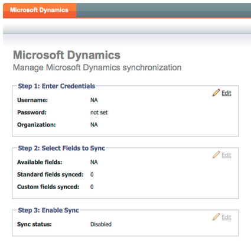

# Note sulla versione: maggio 2012 {#release-notes-may}

## Riprogettazione report prestazioni e-mail {#email-performance-report-redesign}

Nota: si tratta di un rollout graduale, a partire dalla versione di maggio

Abbiamo velocizzato l’esecuzione dei rapporti Prestazioni e-mail e Prestazioni e-mail per le campagne. Abbiamo anche migliorato le definizioni di alcune metriche e consolidato le metriche &quot;Messaggi inviati&quot; e &quot;Lead inviati&quot; in un’unica metrica, &quot;Inviati&quot;. Abbiamo unito &quot;Messaggi consegnati&quot; e &quot;Lead consegnati&quot; in &quot;Consegnati&quot;.

## Miglioramenti del passaggio Attesa {#wait-step-enhancements}

Utilizzando le nuove proprietà Advanced Wait, è possibile configurare il passaggio di attesa in un’azione Flusso di Smart Campaign in modo che l’attesa avvenga entro un giorno specifico della settimana, il giorno lavorativo successivo, una data o un’ora specifica. Questi miglioramenti garantiscono che le e-mail di sviluppo arrivino nella casella in entrata durante l’orario di lavoro!

Figura 1. Specifica il passaggio di attesa per terminare in un giorno lavorativo

## Risorse archiviate nascoste {#archived-assets-hidden}

Le risorse archiviate vengono filtrate automaticamente dalla funzione di suggerimento automatico, dai menu a discesa e dai rapporti, facilitando la ricerca.

Figura 2. Esempio di filtro e-mail archiviato

## Nuova app di archiviazione eventi per iPad {#new-event-check-in-app-for-ipad}

Semplifica il processo di check-in degli eventi utilizzando la nuova app iPad. L’app Event Check-in si sincronizza con il tuo programma Marketo e ti consente di controllare facilmente gli iscritti a un evento, nonché di aggiungere al volo nuovi lead.

Richiede iOS 5.1 o versione successiva; solo iPad.

Figura 3. Home page del check-in degli eventi

Figura 4. Event Check-In: seleziona il tuo evento.

Figura 5. Archiviali

## URL di conferma del webinar avanzato {#enhanced-webinar-confirmation-url}

Ora disponibile per ON24 e Adobe Connect. Includi un collegamento univoco nell’e-mail di conferma per ogni partecipante registrato che utilizza il nuovo `{{member.webinar URL}}` token. I miglioramenti apportati ad Adobe Connect includono anche la possibilità di attivare/disattivare l’e-mail con le informazioni sull’account Adobe, che include l’ID di accesso e la password dell’utente.

Figura 6. Consegna delle persone al tuo webinar

## Anteprima modello {#template-preview}

Cerchi un modello specifico durante la creazione dell’e-mail o della pagina di destinazione, ma non sei sicuro di come sarà? Con la nuova funzionalità di anteprima modello, puoi verificare il modello selezionato prima di salvare una nuova risorsa.

Figura 7. Visualizza l&#39;anteprima del modello scelto

## Precompilazione modulo configurabile {#configurable-form-prefill}

Controlla la precompilazione dei dati del modulo a livello di abbonamento e la sovrascrittura a livello di pagina di destinazione. Senza la precompilazione, puoi assicurarti che il lead fornisca le informazioni più aggiornate.

Figura 8. Configurazione preriempimento modulo in Amministratore

Figura 9. Modificare l’impostazione di precompilazione di un modulo su una pagina di destinazione

## Marketo Treasure Chest {#marketo-treasure-chest}

Accedi alle funzioni sperimentali sviluppate da tecnici Marketo per migliorare la tua esperienza utente. Questa versione include la funzione di annullamento dell’e-mail e la possibilità di inserire commenti e collaborare con altri utenti sulle pagine di destinazione.

\

Figura 10. Funzioni di Manager Treasure Chest in Amministratore

## Integrazione con Microsoft Dynamics® CRM {#microsoft-dynamics-crm-integration}

Sincronizza account, contatti e lead tra Marketo e Microsoft Dynamics CRM Online tramite la nuova integrazione predefinita.

Figura 11. Configurazione di Microsoft Dynamics

## Miglioramenti di Marketo Sales Insight {#marketo-sales-insight-enhancements}

**Opzioni piè di pagina per annullamento iscrizione**

Configura quando e se viene visualizzato il piè di pagina per l’annullamento dell’iscrizione alle e-mail inviate tramite Sales Insight.

Figura 12. Impostazioni di Sales Insight in Admin

## Cartelle per modelli e-mail vendite {#folders-for-sales-email-templates}

Ora puoi organizzare i modelli e-mail condivisi con Marketo Sales Insight in cartelle specifiche, in modo che i rappresentanti commerciali possano trovare più facilmente l’e-mail corretta.

Figura 13. Scegli una cartella per le e-mail

## Accedere ad Opportunity Analyzer da Sales Insight {#access-opportunity-analyzer-from-sales-insight}

Fornisci ai tuoi rappresentanti commerciali informazioni approfondite sulle attività di marketing che stanno determinando il coinvolgimento, utilizzando l’accesso diretto ad Opportunity Analyzer da Marketo Sales Insight. Nota. Richiede la licenza Revenue Cycle Analytics.

## Campo personalizzato per lo stato del contatto {#custom-field-for-contact-status}

Ora puoi mappare un campo personalizzato in Salesforce per compilare il campo Stato per i Contatti nelle visualizzazioni Elementi di maggiore rilevanza, Elementi di maggiore rilevanza del mio team e Personalizza.

Figura 14. Mappare un campo personalizzato ai contatti

Vedi Pagine visitate da lead anonimi

Espandere le pagine visualizzate da un lead anonimo dalla visualizzazione Attività Web anonimo.

Figura 15. Vedi Attività web anonima

## Lead avanzato e Abbonamento contatti {#enhanced-lead-and-contact-subscribe}

Seguire un lead o un contatto in qualsiasi momento utilizzando il nuovo pulsante Sottoscrivi nella pagina dei dettagli del record.
