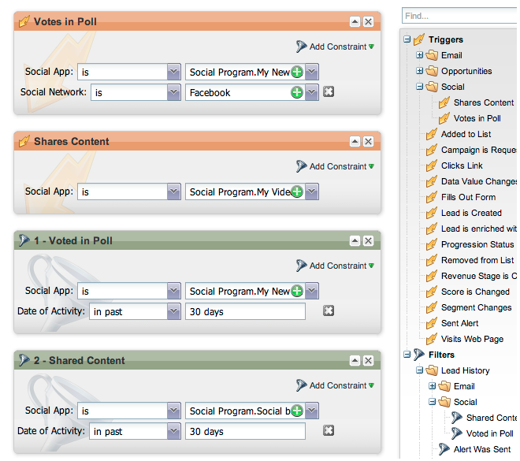

# Note sulla versione: ottobre 2012 {#release-notes-october}

La versione di ottobre include nuove funzionalità più interessanti! Le funzioni social network sono disponibili come componente aggiuntivo o come parte di bundle selezionati.

## Importa programmi e scambio di programmi {#import-programs-and-program-exchange}

Un programma può essere importato da un abbonamento Marketo a un altro. Ad esempio, puoi creare un programma in una sandbox e quindi importarlo nel tuo abbonamento live. È inoltre possibile importare un programma predefinito dalla libreria dei programmi di Marketo.

>[!NOTE]
>
>Solo gli utenti Marketo a cui è stata concessa l&#39;autorizzazione da un utente amministratore di Marketo possono importare programmi.
>
>Contatta il supporto Marketo per collegare un account sandbox al tuo abbonamento live.

## Notifiche {#notifications}

Le notifiche ti mantengono aggiornato sugli eventi di sistema che si verificano nell’abbonamento a Marketo. Ad esempio, il sistema ti invierà automaticamente una notifica quando una campagna non riesce o la sincronizzazione CRM richiede attenzione. Le notifiche sono disponibili nella scheda Il mio Marketo. Inoltre, puoi abbonarti a una notifica in modo da poterla ricevere in tempo reale, nella tua e-mail.

## Sondaggi {#polls}

Crea sondaggi per coinvolgere i tuoi lead nei contenuti. Possono votare per il loro network o film preferito, e poi condividere il sondaggio con gli amici attraverso i loro social network. Puoi raccogliere dati analitici dettagliati sul voto dei tuoi lead.

## Tracciare le attività social {#track-social-activities}

Scopri chi ha condiviso i tuoi contenuti e votato nei tuoi sondaggi creando elenchi avanzati basati su specifiche attività social. Ad esempio, crea una campagna intelligente per incrementare il punteggio dei lead che condividono maggiormente i tuoi contenuti!

## Profili social {#social-profiles}

Ora puoi raccogliere informazioni sui lead quando condividono contenuti o compilano moduli utilizzando i loro profili social. Questo include le maniglie di Facebook, LinkedIn e Twitter, il numero di amici e altro ancora.

## Sottoscrizioni ai report di Gestione ricavi {#revenue-explorer-report-subscriptions}

Crea abbonamenti a rapporti e invia periodicamente rapporti di Revenue Explorer alle principali parti interessate, inclusi gli utenti non Marketo. L’e-mail contiene un’anteprima della tabella o dei grafici dei dati del rapporto e un foglio di calcolo Excel con tutti i dati del rapporto.

>[!NOTE]
>
>Disponibile solo per gli utenti che dispongono di Gestione ricavi acquistando l’analisi del ciclo di ricavi con Enterprise o Select Edition.
