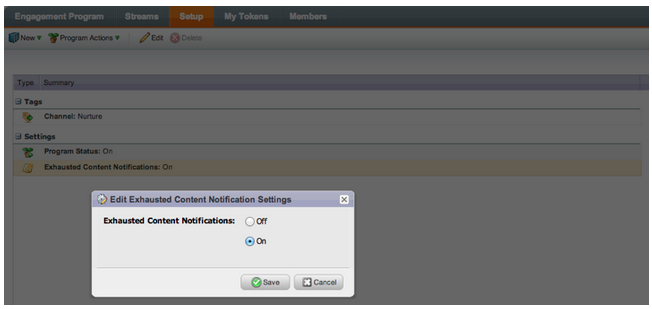
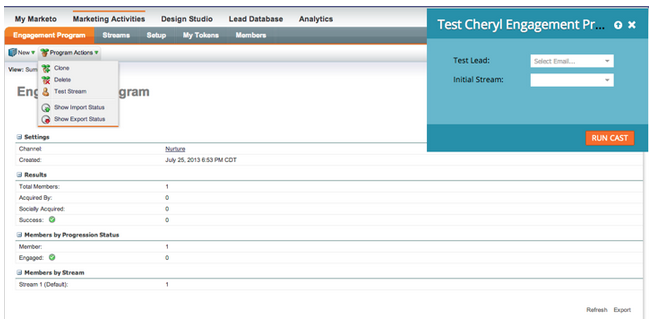

# Note sulla versione: agosto 2013 {#release-notes-august}

Le seguenti funzioni sono incluse nella versione di agosto 2013.

**E-mail di solo testo**

Ora puoi inviare [solo la versione del testo](/help/marketo/product-docs/email-marketing/general/creating-an-email/create-a-text-only-email.md) di un messaggio e-mail. Tieni presente che i collegamenti non saranno decorati quando utilizzi questa opzione.

## Miglioramenti al motore di coinvolgimento dei clienti {#customer-engagement-engine-enhancements}

### Ignora contenuto esaurito {#ignore-exhausted-content}

Configurare il programma di coinvolgimento in [ignora esaurimento](/help/marketo/product-docs/email-marketing/drip-nurturing/using-engagement-programs/disable-and-enable-exhausted-content-notifications.md), inclusa la soppressione di eventuali notifiche.

## Test del flusso di coinvolgimento {#engagement-stream-testing}

Utilizza il [nuova funzione di test](/help/marketo/product-docs/email-marketing/drip-nurturing/engagement-program-streams/test-an-engagement-stream.md) per simulare un cast e testare i contenuti appena aggiunti a uno streaming live.

## Test di invio personalizzato {#personalized-send-test}

Quando invii un test e-mail, puoi selezionare il nome di un lead per personalizzare l’e-mail del test.

## Token di sistema &quot;Visualizza e-mail come pagina web&quot; e &quot;Annulla iscrizione&quot; {#view-email-as-web-page-and-unsubscribe-system-tokens}

Utilizza questi [nuovi token](/help/marketo/product-docs/email-marketing/general/using-tokens/system-tokens-glossary.md) per fornire un maggiore controllo sul loro posizionamento nelle e-mail.

## Pulizia automatica campagna trigger {#automatic-trigger-campaign-cleanup}

Marketo provvederà ora ad inviare periodicamente una notifica [disattivare automaticamente le campagne trigger](/help/marketo/product-docs/core-marketo-concepts/smart-campaigns/using-smart-campaigns/automatic-trigger-campaign-cleanup.md) che non sono stati eseguiti negli ultimi sei mesi.

## Miglioramento di Marketo Financial Management {#marketo-financial-management-enhancement}

### Aggiornamento costo programma  {#program-cost-update}

La sincronizzazione dei costi del programma consente il tracciamento dei costi del programma su più piattaforme.

### Interfaccia utente cobalto {#cobalt-user-interface}

Stiamo continuando il rollout della nostra nuova interfaccia Cobalt. Questo progetto renderà tutto molto attraente in Marketo! L&#39;aggiornamento continuerà per tutto il resto dell&#39;anno.
