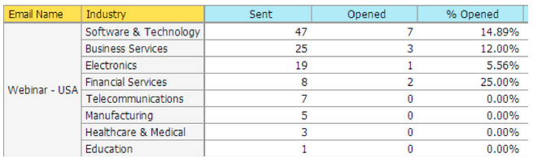

# Note sulla versione: Dicembre 2013 {#release-notes-december}

Le seguenti funzionalità sono incluse nella versione di dicembre.

Dopo il rilascio, assicurati di controllare la scheda Nuova versione nella community per gli articoli dettagliati della Knowledge Base per ogni funzione!

## Programma e-mail {#email-program}

L’invio di un’e-mail non è mai stato così semplice. Utilizza il nuovo [programma di posta elettronica](/help/marketo/product-docs/email-marketing/email-programs/creating-an-email-program/understanding-email-programs.md) per inviare un messaggio e-mail batch, anziché il programma predefinito. Definisci l&#39;elenco smart, l&#39;e-mail, pianificalo e sei disattivato!

Consulta anche il nuovo [Dashboard delle metriche e-mail](/help/marketo/product-docs/email-marketing/email-programs/email-program-data/view-the-email-program-dashboard.md) per visualizzare le prestazioni dell’e-mail.

## Test A/B e-mail {#email-a-b-testing}

Nel nuovo programma e-mail, esegui un [Test A/B](/help/marketo/product-docs/email-marketing/email-programs/email-program-actions/email-test-a-b-test/add-an-a-b-test.md) su una percentuale della popolazione totale di invio e-mail. Scegliere tra 4 diversi tipi di test: Oggetto, Indirizzo mittente, Data/ora e Indirizzo e-mail completo. Puoi anche scegliere di promuovere manualmente il vincitore o lasciare che il sistema lo promuova in base a criteri di vincita predefiniti. Il nuovo programma e-mail, incluso il test A/B, può essere nidificato in Eventi e il programma predefinito per rendere l’invio dell’e-mail così semplice!

## E-mail campione/test di sfida {#email-champion-challenger-testing}

[Test di Champion/Challenger](/help/marketo/product-docs/email-marketing/general/functions-in-the-editor/email-tests-champion-challenger/add-an-email-champion-challenger.md) è simile al test A/B, ma la differenza è che viene utilizzato per le e-mail attivate e non invii automaticamente un vincitore. Questo test ti permette di sfidare un modo consolidato di fare qualcosa, chiamato il Campione, e di testare se è ancora il meglio introducendo un Challenger. Inoltre, i test e-mail Champion/Challenger possono essere utilizzati all&#39;interno dei flussi di programma Engagement.

## Dettagli lead in Analisi e-mail {#lead-details-in-email-analysis}

In Analisi e-mail sono stati introdotti attributi aggiuntivi per lead e società. Ora puoi visualizzare gli stati delle e-mail raggruppati per nuovi attributi quali Settore e Origine lead.

## Adattatore evento BrightTALK avanzato {#enhanced-brighttalk-event-adapter}

Ora è possibile estrarre gli utenti registrati in Marketo dal canale e dall&#39;evento BrightTALK. Puoi utilizzare queste informazioni per informare altre campagne di marketing!
