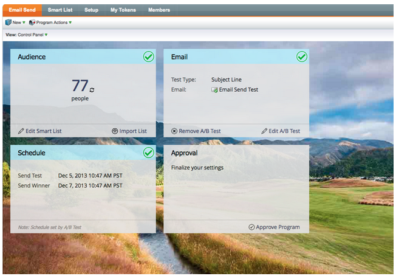

# Note sulla versione: dicembre 2013 {#release-notes-december}

Le seguenti funzioni sono incluse nella versione di dicembre.

Dopo il rilascio, controlla la scheda Nuova versione nella community per articoli della Knowledge Base dettagliati per ogni funzione.

## Programma e-mail {#email-program}

Inviare un’e-mail non è mai stato così facile. Utilizza il nuovo [programma e-mail](/help/marketo/product-docs/email-marketing/email-programs/creating-an-email-program/understanding-email-programs.md) per inviare un&#39;e-mail batch, invece del programma predefinito. Definisci l’elenco avanzato, invia un’e-mail all’indirizzo e pianifica l’invio.

Controlla anche il nuovo [Dashboard delle metriche e-mail](/help/marketo/product-docs/email-marketing/email-programs/email-program-data/view-the-email-program-dashboard.md) per vedere le prestazioni dell&#39;e-mail.

## Test A/B e-mail {#email-a-b-testing}

Nel nuovo programma e-mail, esegui un test [A/B](/help/marketo/product-docs/email-marketing/email-programs/email-program-actions/email-test-a-b-test/add-an-a-b-test.md) su una percentuale della popolazione complessiva di invio e-mail. Puoi scegliere tra 4 diversi tipi di test: riga dell’oggetto, indirizzo mittente, data/ora e e-mail intera. Puoi anche scegliere di promuovere manualmente il vincitore o lasciare che il sistema lo promuova in base a criteri di vincita predefiniti. Il nuovo programma E-mail, incluso il test A/B, può essere nidificato in Eventi e il programma predefinito per rendere l’invio dell’e-mail così semplice.

## Test di Email Champion/Challenger {#email-champion-challenger-testing}

[Il test Champion/Challenger](/help/marketo/product-docs/email-marketing/general/functions-in-the-editor/email-tests-champion-challenger/add-an-email-champion-challenger.md) è simile al test A/B, ma la differenza è che viene utilizzato per le e-mail attivate e non si invia automaticamente un vincitore. Questo test ti permette di sfidare un modo consolidato di fare qualcosa, chiamato Champion, e di verificare se è ancora il migliore introducendo un Challenger. Inoltre, i test e-mail Champion/Challenger possono essere utilizzati all’interno dei flussi del programma di coinvolgimento.

## Dettagli lead in [!UICONTROL Email Analysis] {#lead-details-in-email-analysis}

Sono stati introdotti ulteriori attributi lead e società in [!UICONTROL Email Analysis]. Ora puoi visualizzare le statistiche dei messaggi e-mail raggruppate per nuovi attributi, ad esempio [!UICONTROL Industry] e [!UICONTROL Lead Source].

## Adattatore evento [!DNL BrightTALK] avanzato {#enhanced-brighttalk-event-adapter}

Ora puoi richiamare gli utenti registrati in Marketo dal tuo canale ed evento [!DNL BrightTALK]. Puoi utilizzare queste informazioni per informare altre campagne di marketing.
