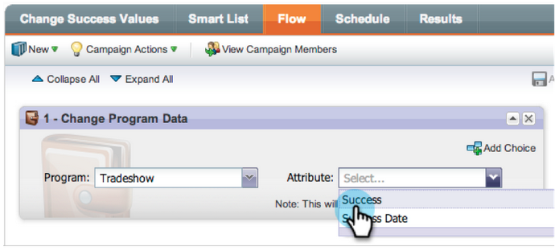

# Note sulla versione: gennaio 2013 {#release-notes-january}

La versione di gennaio amplia l&#39;offerta social con **offerte di riferimento**. Inoltre, [!DNL Marketo Lead Management] utenti possono impostare il proprio fuso orario, la propria lingua e le proprie preferenze locali. Le funzionalità contrassegnate con &#42; sono disponibili solo in Select Edition.

## Offerte di riferimento {#referral-offers}

Una **Offerta di riferimento** offre ai lead un incentivo per segnalare i propri amici. Crea obiettivi e premi per i riferimenti di successo. Puoi utilizzarlo nelle pagine di destinazione, sul sito web e persino su Facebook.

## Preferenza fuso orario {#time-zone-preference}

Puoi modificare il fuso orario predefinito per il tuo account Marketo personale. Ad esempio, anche se il valore predefinito per l’abbonamento è Ora del Pacifico, puoi impostarlo sul valore Ora orientale per il tuo account.

## Seleziona la lingua [!DNL Marketo Lead Management] {#select-your-marketo-lead-management-language}

Puoi modificare la lingua predefinita per l’account utente di Marketo. Anche se l’abbonamento è in inglese, per impostazione predefinita è possibile cambiarlo in tedesco o francese.

## Messaggi di errore modulo multilingue {#multi-lingual-form-error-messages}

Quando un lead compila un modulo di Marketo, alcuni messaggi di convalida vengono incorporati automaticamente. È possibile selezionare una lingua di visualizzazione diversa per questi messaggi di errore. Supportiamo ora l&#39;inglese, il tedesco e il francese.

Un esempio di una forma francese:

## Seleziona la lingua [!DNL Sales Insight] (solo [!DNL Salesforce]) {#select-your-sales-insight-language-salesforce-only}

Se la preferenza per la lingua [!DNL Salesforce] è impostata sul francese o sul tedesco, Marketo [!DNL Sales Insight] rispetterà questa preferenza. Scarica l’ultimo pacchetto MSI per ottenere questa funzionalità (disponibile la settimana del 14 gennaio).

## Nome visualizzato campo {#field-display-name}

I nomi di visualizzazione dei campi possono visualizzare il testo in lingue diverse (ad esempio, sono supportati caratteri multibyte).

## Cambia dati programma {#change-program-data}

Il passaggio di flusso [!UICONTROL Change Program Data] consente di modificare manualmente lo stato [!UICONTROL Success] e [!UICONTROL Success Date] di un membro del programma tramite una campagna. È possibile utilizzare questo passaggio di flusso per correggere un errore o per modificare manualmente un membro che non ha partecipato al programma come previsto.

