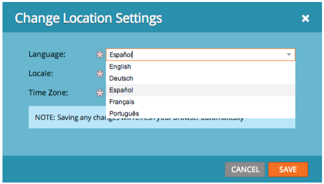

# Note sulla versione: giugno 2013 {#release-notes-june}

Le seguenti funzioni sono incluse nella versione di giugno.

## Lingue utente aggiuntive {#additional-user-languages}

L&#39;interfaccia di Marketo Lead Management è disponibile nella lingua preferita e supporta lo spagnolo e il portoghese.

## Interfaccia utente cobalto {#cobalt-user-interface}

Nei prossimi mesi noterai un nuovo tema introdotto in diverse parti dell’applicazione, che ad esempio influisce sulle finestre modali.

## Clonazione sottocartelle {#subfolder-cloning}

Clonare le risorse in sottocartelle.

## Modelli multipli {#multiple-models}

Idea fondamentale per l’analisi del ciclo dei ricavi (RCA, Revenue Cycle Analytics) nella community, questa funzione consente di creare più modelli per comprendere in modo più dettagliato il funnel dei ricavi per linea di prodotto, business unit o area geografica. I rapporti Lead per fase ricavi, Analisi del percorso di successo, Analizzatore di programma ed Esplora ricavi ora supportano la possibilità di selezionare un modello specifico per la generazione di rapporti.

Per impostazione predefinita, sono disponibili due modelli per Select SMB Edition e quindici modelli per Enterprise Edition. È possibile acquistare anche altri modelli.

