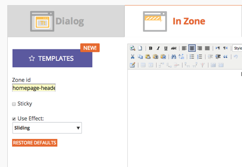

# Note sulla versione: Dicembre 2014 {#release-notes-december}

Le seguenti funzionalità sono incluse nella versione di dicembre 2014. Per informazioni sulla disponibilità delle funzioni, controlla la tua Marketo Edition. Dopo il rilascio, assicurati di tornare a trovare i collegamenti agli articoli dettagliati per ogni funzione!

## Rapporti Approfondimenti vendite {#sales-insight-reports}

Il [Rapporto sulle prestazioni delle e-mail in Approfondimenti vendite](/help/marketo/product-docs/marketo-sales-insight/msi-for-salesforce/features/performance-reports/sales-insight-email-performance-report.md) ti consente di visualizzare le metriche delle e-mail per e-mail e per rappresentante commerciale. Supporta le e-mail inviate tramite Salesforce, Microsoft Dynamics, il plug-in di Outlook e il plug-in Gmail.

## Tipi di pubblico personalizzati facebook {#facebook-custom-audiences}

Una volta aggiunto [Facebook tramite Amministratore > Punto di avvio](/help/marketo/product-docs/demand-generation/ad-network-integrations/add-facebook-custom-audiences-as-a-launchpoint-service.md), l&#39;amministratore Marketo può creare, aggiornare o [sostituire facilmente un pubblico personalizzato Facebook con i lead da un elenco statico o avanzato di Marketo](/help/marketo/product-docs/demand-generation/facebook/create-a-custom-audience-in-facebook.md). Cerca la nuova icona Facebook nella parte inferiore della griglia lead di qualsiasi elenco statico o avanzato.

## Clonazione migliorata tra le aree di lavoro  {#improved-cloning-across-workspaces}

[La clonazione di un ](/help/marketo/product-docs/core-marketo-concepts/programs/working-with-programs/clone-a-program.md) programma in un&#39;altra area di lavoro non è mai stata così facile! Quando fai clic su clone, seleziona l’area di lavoro di destinazione. Basta clonare in una cartella e poi spostare la cartella!

>[!NOTE]
>
>Questa nuova funzione Clona è disponibile solo per i programmi in questo momento.

## Elenco smart di riferimento {#reference-smart-list}

[Quando si crea un elenco o un flusso smart, è possibile ](/help/marketo/product-docs/core-marketo-concepts/smart-lists-and-static-lists/using-smart-lists/reference-a-list-or-smart-list-across-workspaces.md) fare riferimento a elenchi avanzati condivisi con un’altra area di lavoro.

## Miglioramenti all’importazione di elenchi {#list-import-improvements}

[Importa ](/help/marketo/getting-started/quick-wins/import-a-list-of-people.md) file codificato in UTF-16, Shift-JIS o EUC-JP. Continuiamo a supportare file codificati UTF-8.

## Tracciamento dei collegamenti negli script e-mail {#link-tracking-in-email-scripting}

I collegamenti all’interno degli script e-mail verranno ora tracciati e disponibili nel rapporto Prestazioni collegamento e-mail .

## Impostazione di codifica dei token {#token-encoding-setting}

È stata implementata una nuova funzione di sicurezza per la codifica automatica dei token HTML, che verrà attivata per impostazione predefinita a marzo 2015. Fino ad allora, attiva questa funzionalità in Gestione campi per testare il comportamento in anticipo. Tutti i token lead e aziendali verranno codificati quando vengono inseriti nelle e-mail o nelle pagine di destinazione. Le opzioni sono disponibili anche per i singoli campi.

## Nuove chiamate API ReST {#new-rest-api-calls}

Tre nuove chiamate per l’API Lead &amp; Activity ReST:

・ Ottieni quote lead

・ Associa lead

・ Unisci lead

I dettagli completi saranno disponibili dopo la versione all&#39;indirizzo [developers.marketo.com](https://developers.marketo.com/)

## Miglioramenti Della Compatibilità Javascript Di Munchkin {#munchkin-javascript-compatibility-enhancements}

Abbiamo apportato diversi miglioramenti minori a Munchkin per garantire che continui a caricarsi rapidamente e funzioni come desiderato nei casi con altri JavaScript sulla pagina.

Il rollout sarà messo in scena a partire da metà dicembre e continuerà per i prossimi mesi.

## Aspetto e sensazione aggiornati di Revenue Explorer {#revenue-explorer-upgraded-look-and-feel}

## RTP: Modulo elenco account denominato {#rtp-named-account-list-module}

Gestisci e monitora i tuoi account chiave ad alto rendimento nella nuova pagina Account denominati . Carica nuovi elenchi di account denominati per identificare ed eseguire il targeting di tali organizzazioni. Abbiamo automatizzato il processo, fornendo maggiore controllo e flessibilità per implementare i piani di marketing basati sull’account e indirizzare i tuoi account chiave su diversi canali (web e pubblicità).

## RTP: Effetto scorrevole per le campagne nelle aree {#rtp-sliding-effect-for-in-zone-campaigns}

È stato aggiunto un nuovo effetto di scorrimento per le campagne In Zone per consentire la creazione di contenuti personalizzati al caricamento della pagina.

