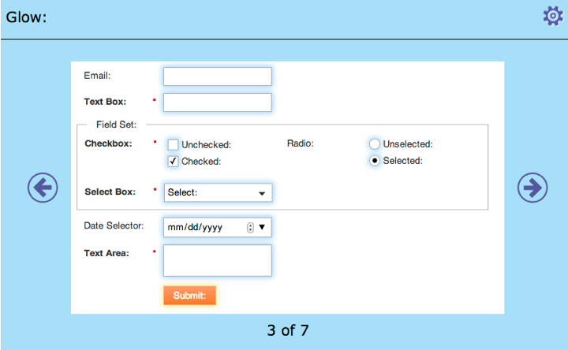
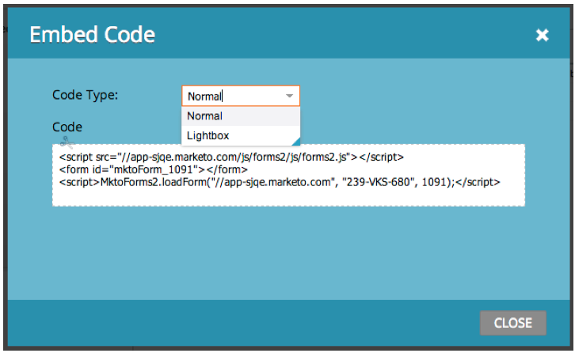

# Note sulla versione - Gennaio 2014 {#release-notes-january}

Le seguenti funzioni sono incluse nella versione di gennaio 2014. Verificare la disponibilità della funzionalità in [Marketo Edition](https://www.marketo.com/pricing/).

## Forms 2.0 {#forms}

Heads up: la documentazione di Forms 2.0 sarà presto disponibile.

Assumi il controllo del processo di creazione dei moduli e interrompi il lavoro degli sviluppatori web. Forms 2.0 è progettato per consentire agli addetti al marketing di creare moduli affidabili sia dal punto di vista visivo che funzionale, senza dover conoscere le esigenze di programmazione.

**Offri al tuo Forms il restyling visivo che merita:**

Le progettazioni dei temi, la personalizzazione dei pulsanti e i layout flessibili consentono di progettare forme dall’aspetto moderno che si adattano perfettamente all’aspetto del sito.

**Visibilità condizionale e logica della pagina di completamento:**

Vuoi che &quot;Stato&quot; venga visualizzato solo se un utente seleziona Stati Uniti come proprio &quot;Paese&quot;? Che ne dici di presentare ai clienti white paper diversi in base al modo in cui rispondono alle domande nel modulo? Crea una logica condizionale nei moduli direttamente dall’editor. Nessun [!DNL javascript] richiesto.

**Incorpora facilmente Forms nelle tue pagine di destinazione:**

Sono finiti i giorni in cui si solleva il codice HTML dai moduli inseriti nelle pagine di destinazione di Marketo e li si rilascia in un [!DNL iFrame]. È sufficiente acquisire il codice da incorporare e inserirlo nella pagina di destinazione in cui desideri eseguire il rendering del modulo. Due modalità, normale e lightbox, offrono ancora più flessibilità con Marketo Forms sul sito.

## Limiti di comunicazione per il programma e-mail {#communication-limits-for-email-program}

[Impostare i limiti di comunicazione in un programma di posta elettronica](/help/marketo/product-docs/email-marketing/email-programs/email-program-actions/enable-disable-communication-limits-in-an-email-program.md) per evitare comunicazioni eccessive al database. Se una persona supera il limite definito, non riceverà l’e-mail.

## Campi aggiuntivi nell’analisi dell’appartenenza al programma {#additional-fields-in-program-membership-analysis}

Ora puoi aggiungere e raggruppare le metriche di [Analisi sull&#39;iscrizione al programma](/help/marketo/product-docs/reporting/revenue-cycle-analytics/program-analytics/build-a-program-membership-analysis-report-that-lists-leads.md) in base agli attributi del lead e della società. Ad esempio, puoi aggiungere il campo Settore per visualizzare la suddivisione dei membri e dei successi del programma.

