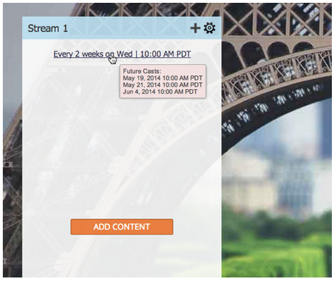

# Note sulla versione: maggio 2014 {#release-notes-may}

Le seguenti funzioni sono incluse nella versione di maggio 2014. Per informazioni sulla disponibilità delle funzioni, controllare la Marketo Edition. Dopo il rilascio, torna a trovare i collegamenti agli articoli della Knowledge Base dettagliati per ogni funzione.

## Elimina Workspace {#delete-workspace}

Ora puoi [eliminare un&#39;area di lavoro inutilizzata](/help/marketo/product-docs/administration/workspaces-and-person-partitions/delete-a-workspace.md). Accertati di spostare tutte le risorse in un’altra area di lavoro prima di tentare di eliminarla.

## Pianifica primo cast {#schedule-first-cast}

Nei programmi di coinvolgimento, puoi pianificare la data di esecuzione del [primo cast](/help/marketo/product-docs/email-marketing/drip-nurturing/engagement-program-streams/set-stream-cadence.md). Ad esempio, specificate la cadenza ogni 2 settimane e selezionate la data del primo cast.

## Programmi di coinvolgimento migliorati {#enhanced-engagement-programs}

Ora tutti ottengono più programmi, flussi e limiti di comunicazione.

## Tracciamento dei collegamenti nelle e-mail di testo {#link-tracking-in-text-emails}

[Aggiungi parentesi quadre doppie](/help/marketo/product-docs/email-marketing/general/functions-in-the-editor/add-tracked-links-to-a-text-email.md) intorno agli URL nella versione testuale delle e-mail per indicare quando i collegamenti devono essere convertiti in collegamenti di tracciamento Marketo reindirizzati

>[!NOTE]
>
>**Esempio**
>
>`[[https://www.marketo.com]]`

Per impostazione predefinita, non viene tracciato alcun collegamento nella versione testuale delle e-mail. Aggiungi questa nuova sintassi per indicare quando un collegamento deve essere convertito in un collegamento di tracciamento. Il comportamento dei collegamenti HTML è invariato.  Per aggiungere collegamenti tracciati alle e-mail:

* **Versione HTML:** Inserisci il collegamento. Per impostazione predefinita, ne viene tenuta traccia.
* **Versione testo:** Immettere l&#39;URL racchiuso tra parentesi quadre.

Per aggiungere collegamenti non tracciati alle e-mail:

* **Versione HTML:** Inserire il collegamento e aggiungere la classe &quot;mktNoTrack&quot; al collegamento.
* **Versione testo:** Inserisci l&#39;URL. Per impostazione predefinita, la registrazione viene annullata.

## Collega markup nelle e-mail di esempio {#link-markup-in-sample-emails}

Scopri in anticipo il comportamento dei collegamenti nelle e-mail. Le e-mail di esempio ora visualizzano i collegamenti esattamente come apparirebbero ai lead. Visualizza in anteprima quali collegamenti sono stati convertiti in collegamenti di tracciamento, per consentirti di comprendere meglio come il messaggio verrà effettivamente visualizzato ai destinatari.

## [!UICONTROL Abort Campaign] {#abort-campaign}

Non farti prendere dal panico! Se si verifica un errore, utilizzare il nuovo pulsante [interrompi campagna](/help/marketo/product-docs/core-marketo-concepts/smart-campaigns/using-smart-campaigns/abort-a-smart-campaign.md) per interrompere immediatamente le campagne nei brani. Riceverai una notifica che indica quanti lead erano in sospeso in ogni passaggio di flusso al momento dell’interruzione della campagna.

## [!UICONTROL Sales Insight] in giapponese, portoghese e spagnolo {#sales-insight-in-japanese-portuguese-and-spanish}

Scarica la versione più recente di [!UICONTROL Sales Insight] da AppExchange in modo che i tuoi agenti di vendita di lingua giapponese, portoghese e spagnola possano visualizzare il contenuto di [!UICONTROL Sales Insight] nella loro lingua preferita.

## Stato del programma e tempistica di successo nell’analisi dell’iscrizione al programma {#program-status-and-success-timeframe-in-program-membership-analysis}

Visualizzare il numero di [membri presenti in ogni stato del programma](/help/marketo/product-docs/reporting/revenue-cycle-analytics/program-analytics/build-a-program-membership-analysis-report-that-lists-leads.md) e il momento in cui hanno cambiato lo stato, inclusa la data in cui hanno raggiunto il successo del programma.

## E-mail test A/B in [!UICONTROL Email Analysis] {#a-b-test-emails-in-email-analysis}

Generare rapporti su ciascuna delle [varianti di e-mail di test A/B](/help/marketo/product-docs/reporting/revenue-cycle-analytics/email-analysis/build-an-email-analysis-report-that-shows-program-information.md) in [!UICONTROL Email Analysis].

## Modifiche al pacchetto di Analytics {#analytics-packaging-changes}

Modeler del ciclo dei ricavi e Success Path Analyzer sono ora inclusi in MA Standard Edition.

## Informazioni sulla piattaforma mobile {#mobile-platform-info}

[Segmentazione e attivazione](/help/marketo/product-docs/reporting/basic-reporting/report-activity/build-a-people-performance-report-with-mobile-platform-columns.md) dell&#39;apertura e del clic delle e-mail dei lead dai loro dispositivi mobili.
