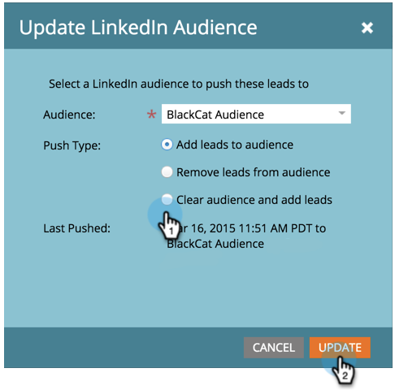
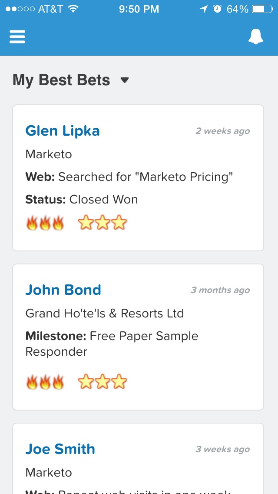

# Note sulla versione: aprile 2015 {#release-notes-april}

Le seguenti funzioni sono incluse nella versione di aprile 2015. Per informazioni sulla disponibilità delle funzioni, controllare la Marketo Edition. Dopo il rilascio, torna indietro per trovare i collegamenti agli articoli dettagliati per ogni funzione.

## Riprogettazione Home di Analytics

[Riprogettazione Home di Analytics](/help/marketo/product-docs/reporting/basic-reporting/creating-reports/navigating-the-analytics-home-page.md)

>[!NOTE]
>
>Questa funzione verrà rilasciata martedì 28 aprile.

Il nuovo [Home page di Analytics](/help/marketo/product-docs/reporting/basic-reporting/creating-reports/navigating-the-analytics-home-page.md) consente di accedere rapidamente all’esecuzione di rapporti ad hoc tra i tipi di rapporti disponibili.

Inoltre, è ora disponibile l’organizzazione di rapporti privata e condivisa. Crea o trascina i report nella cartella I miei report per impedirne la visualizzazione, la modifica o l’eliminazione da parte di altri utenti. I report del gruppo sono condivisi tra tutti gli utenti.

## Marketo Mobile Engagement {#marketo-mobile-engagement}

**Marketo Mobile Engagement**

Con Marketo Mobile Engagement, offrire esperienze mobili coinvolgenti è facile. Crea campagne altamente personalizzate che forniscono contenuti coinvolgenti senza dover mai affidarsi a un team di sviluppo di app. I nuovi filtri e trigger ti consentono di ascoltare e rispondere sul canale mobile tramite notifiche push.

## Integrazione di linkedIn Lead Accelerator

[Integrazione di linkedIn Lead Accelerator](/help/marketo/product-docs/demand-generation/social/social-functions/use-a-marketo-list-or-smart-list-as-a-linkedin-audience-segment.md)

Estendi la tua strategia di sviluppo del lead alla visualizzazione a pagamento e agli annunci social. Il [integrazione di ad network](/help/marketo/product-docs/demand-generation/ad-network-integrations/add-linkedin-matched-audiences-as-a-launchpoint-service.md) con LinkedIn Lead Accelerator puoi creare in modo sicuro un segmento di pubblico in LinkedIn in base ai membri di qualsiasi elenco smart o statico. I membri all’interno di un segmento di pubblico di LinkedIn possono quindi essere nutriti con una sequenza di annunci rilevanti.

## Marketo Sales Insight per Salesforce1 {#marketo-sales-insight-for-salesforce}

Le funzionalità di Sales Insight preferite - feed di lead, best bets, momenti interessanti e add to Marketo Campaign - sono disponibili nell’app Salesforce1.

 

## RTP - Account-Based Marketing Analytics {#rtp-account-based-marketing-analytics}

**RTP - Account-Based Marketing Analytics**

Ottieni visibilità immediata delle prestazioni degli elenchi dei tuoi account denominati chiave in base a ogni fase del ciclo di acquisto, con il nuovo grafico delle prestazioni per gli elenchi dei tuoi account denominati. Il grafico mostra la fase della visita dall’organizzazione chiave, partendo dalla consapevolezza fino all’azione, in base al numero di visite e allo stato del visitatore.
