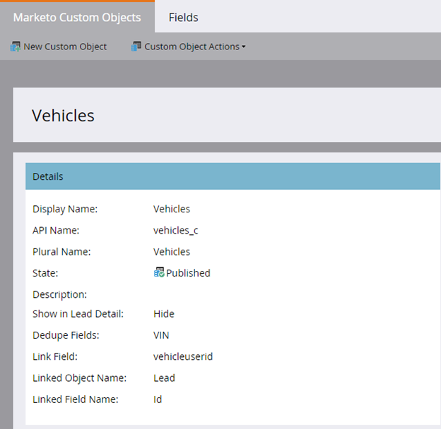
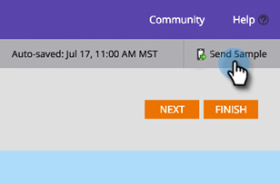
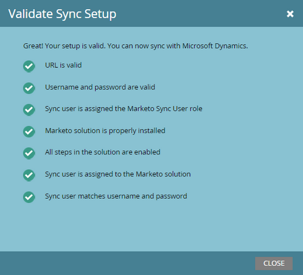

# Note sulla versione: Autunno 2015 {#release-notes-fall}

Le seguenti funzionalità sono incluse nella versione autunnale del 15. Per informazioni sulla disponibilità delle funzioni, controlla la tua Marketo Edition.

## Iscriviti a un elenco avanzato {#subscribe-to-a-smart-list}

[Iscriviti a un elenco avanzato](/help/marketo/product-docs/reporting/basic-reporting/report-subscriptions/subscribe-to-a-smart-list.md)

Iscriviti a Smart List consente agli addetti al marketing di esportare un elenco smart ed inviarlo tramite e-mail alle parti interessate che non utilizzano Marketo, ad esempio, i team di vendita o di telemarketing.

L’esportazione può essere programmata su base giornaliera, settimanale o mensile, può avere una data di consegna finale e può essere personalizzata per condividere un numero limitato di colonne.


È possibile creare più abbonamenti in un elenco smart. Vi è un limite di 100 abbonamenti con 100.000 lead per abbonamento, tra aree di lavoro, per istanza Marketo.


## Oggetti personalizzati Marketo {#marketo-custom-objects}

[Oggetti personalizzati Marketo](/help/marketo/product-docs/administration/marketo-custom-objects/understanding-marketo-custom-objects.md)

Crea facilmente oggetti personalizzati dall’interfaccia utente di amministrazione. Al momento è supportata la possibilità di creare un oggetto personalizzato 1:N in Marketo e di collegarlo a un lead o a un’azienda.

>[!NOTE]
>
>Gli oggetti personalizzati Marketo non sono disponibili per Spark.



## Marketo Insights per Google Chrome {#marketo-insights-for-google-chrome}

[Marketo Insights per Google Chrome](/help/marketo/product-docs/marketo-sales-insight/msi-chrome-plugin/using-marketo-insights-for-google-chrome.md)

Siamo entusiasti di annunciare il rilascio di un aggiornamento alla nostra estensione Google Mail Sales Insight! Visualizzalo nel [Chrome Store](https://nation.marketo.com/external-link.jspa?url=https://chrome.google.com/webstore/detail/marketo-insights-for-goog/jjkfbhajlmoeegbjgjipliamplidmbjb).

Questo aggiornamento include molte nuove funzioni e funzionalità:

* Prima di iniziare a lavorare, i venditori possono visualizzare informazioni rilevanti sui loro potenziali clienti direttamente in Google Mail, inclusi titoli di lavoro, profili twitter, informazioni aziendali, foto e altro ancora.
* I venditori possono vedere in tempo reale con quali potenziali clienti si interpongono tra i vari canali, ad esempio e-mail aperte o cliccate, eventi online o di persona a cui hanno partecipato, pagine web visitate, eBooks scaricati e molto altro ancora.
* Le e-mail inviate tramite Google Mail vengono registrate in Marketo e monitorate in tempo reale. Questo consente ai venditori di vedere quando i potenziali clienti stanno guardando le loro e-mail in modo da poter seguire al momento giusto. Marketo Sales Insight for Google Mail semplifica anche il lavoro dei venditori per sfruttare i modelli creati dal marketing al fine di inviare bellissimi inviti, offerte e altri tipi di contenuti.


## Marketo Mobile Engagement: token, invia esempio e anteprima {#marketo-mobile-engagement-tokens-send-sample-preview}

* [Token](/help/marketo/product-docs/mobile-marketing/push-notifications/configure-mobile-push-notification.md)
* [Invia esempio](/help/marketo/product-docs/mobile-marketing/push-notifications/send-a-push-notification-sample.md)
* [Anteprima](/help/marketo/product-docs/mobile-marketing/push-notifications/preview-a-push-notification.md)

Personalizza facilmente le notifiche push con [token](/help/marketo/product-docs/mobile-marketing/push-notifications/configure-mobile-push-notification.md).


Puoi anche [preview](/help/marketo/product-docs/mobile-marketing/push-notifications/preview-a-push-notification.md) o inviare una notifica push [sample](/help/marketo/product-docs/mobile-marketing/push-notifications/send-a-push-notification-sample.md) prima di distribuirla ai clienti.




## Campagne intelligenti nei momenti {#smart-campaigns-in-moments}

[Campagne intelligenti nei momenti](/help/marketo/product-docs/core-marketo-concepts/mobile-apps/marketo-moments/understanding-moments/understanding-smart-campaign-cards.md)

Le statistiche sulle e-mail inviate tramite le campagne avanzate sono ora disponibili nei Momenti . Altre funzionalità di questo aggiornamento includono:

* Scorri verso l’alto. Hai troppe carte nel tuo flusso? Ora puoi allontanarli!
* Invia un campione direttamente dalla schermata di anteprima
* Dettagli dell’elenco avanzato aggiunti alle schede del programma e-mail
* È stato aggiunto il supporto per lo stato Interrotto per i programmi e-mail


## RTP - Analisi dei contenuti e Recommendations {#rtp-content-analytics-and-recommendations}

[Analisi dei contenuti e ](/help/marketo/product-docs/web-personalization/understanding-web-personalization/understanding-content-analytics.md) Recommendations

L’analisi dei contenuti RTP mostra le prestazioni delle risorse di contenuto web dalle visite web regolari e le visite generate dal motore di raccomandazione dei contenuti RTP.

* Scopri quali contenuti hanno prestazioni migliori e ottengono il maggior numero di lead
* Aumenta il consumo di contenuti consentendo ai contenuti nel motore di contenuti predittivi di RTP di consigliare automaticamente i contenuti migliori ai visitatori giusti
* Approfondisci ogni risorsa di contenuto per visualizzare metriche, grafici e prestazioni più approfondite

La pagina Risorse di RTP è ora divisa in Analisi dei contenuti e Recommendations dei contenuti.

* **Analisi dei contenuti:** mostra le visualizzazioni e i lead diretti di tutti i contenuti web scoperti e definiti, consentendoti di analizzare i contenuti con le prestazioni migliori
* **Content Recommendations**: Mostra impression e clic dal contenuto consigliato dell’RTP e l’attribuzione del lead associata. Puoi anche modificare e abilitare i consigli sui contenuti da questa pagina per i consigli [bar](/help/marketo/product-docs/predictive-content/enabling-predictive-content/enable-the-content-recommendation-bar.md) e [rich media](/help/marketo/product-docs/predictive-content/enabling-predictive-content/enable-predictive-content-for-web-rich-media.md).

* Tutti i dati lead diretti in queste due pagine sono stati aggiornati retroattivamente dall’inizio dell’anno (1° gennaio 2015).

## RTP - Clona una campagna RTP {#rtp-clone-an-rtp-campaign}

[RTP - Clona una campagna RTP](/help/marketo/product-docs/web-personalization/working-with-web-campaigns/clone-a-web-campaign.md)

La clonazione di una campagna RTP rende più rapido ed efficiente la creazione di campagne web più personalizzate. Utilizza la funzione Clona nella pagina della campagna di RTP per copiare le impostazioni della campagna e modificare il contenuto per l’ottimizzazione del test di suddivisione, oppure clonare una campagna con lo stesso contenuto e indirizzarla verso un segmento diverso. Crea campagne in pochi secondi!


## Miglioramenti all’editor Rich Text {#rich-text-editor-improvements}

Stiamo apportando diversi miglioramenti all’editor Rich Text. Dopo il rilascio dell&#39;editor aggiornato a luglio, abbiamo ricevuto un feedback eccellente e siamo stati in grado di lavorare queste modifiche in questo aggiornamento. Ci sarà molto altro da fare nei prossimi mesi. Ecco un elenco delle novità di Q4:

* VML ora è supportato all&#39;interno del codice HTML:

```
<v:background xmlns:v="urn:schemas-microsoft-com:vml" fill="t">
<v:fill type="tile" src="<a href="https://i.imgur.com/YJOX1PC.png" rel="nofollow">https://i.imgur.com/YJOX1PC.png</a>" color="#7bceeb"/>
</v:background>
```

* È ora possibile inserire qualsiasi elemento in un commento HTML valido (alcune sintassi come visualizzate di seguito sono state precedentemente eliminate):

`<!--[if gte mso 9]> <![endif]-->`

* Non aggiungere celle di tabella vuote con `&nbsp;`

* Pulsante Ingrandisci/riduci a icona aggiunto all’editor sorgente HTML
* Le proprietà della tabella preesistenti vengono ora identificate e visualizzate nella finestra di dialogo Proprietà tabella
* Entrambe le righe di pulsanti sono ora visualizzate per impostazione predefinita.
* L’editor ora accetta qualsiasi elemento (anche elementi obsoleti o non standard):

`<myCustomElement>Hello World!</myCustomElement>`

* L’editor ora accetta qualsiasi attributo (anche attributi obsoleti o non standard):

```
<myCustomElement myCustomAttribute="foo">Hello World!</myCustomElement>
<td background="someImage.png"> 
```

## Microsoft Dynamics - Convalida sincronizzazione {#microsoft-dynamics-validate-sync}

[Microsoft Dynamics - Convalida sincronizzazione](/help/marketo/product-docs/crm-sync/microsoft-dynamics-sync/sync-setup/validate-microsoft-dynamics-sync.md)

Questo nuovo strumento di amministrazione esegue una serie di controlli per verificare se le configurazioni di sincronizzazione sono state impostate correttamente.



## Aggiungi campi alla sincronizzazione oggetti personalizzata CRM {#add-fields-to-crm-custom-object-sync}

Aggiungi facilmente nuovi campi agli oggetti personalizzati sincronizzati da Salesforce e Dynamics. È ora possibile aggiungere nuovi campi alla sincronizzazione oggetto personalizzata senza disabilitare e abilitare l’intero oggetto personalizzato.

## Modifiche alle funzioni di sicurezza {#changes-to-security-features}

* I tentativi di password sono limitati a 5. Dopo il quinto tentativo, l’utente verrà bloccato.
* Il timeout della sessione inattiva è ora configurabile per la sottoscrizione.


## Supporto IE 11 (e supporto obsoleto per IE 9) {#ie-support-and-deprecating-support-for-ie}

Ora è ufficialmente supportato il browser Microsoft Internet Explorer 11 e viene rimosso il supporto per il browser Microsoft Internet Explorer 9.

## Supporto per interfaccia utente fulmine per MSI {#lightning-ui-support-for-msi}

L’ultimo pacchetto MSI sullo scambio di app funziona sia con le versioni Lightning che con le versioni precedenti dell’interfaccia utente di Salesforce.

## Nuovo plug-in di Dynamics {#new-dynamics-plug-in}

Questo nuovo plug-in esegue varie azioni in modalità asincrona per migliorare le prestazioni.

## Ricerca per URL della pagina di destinazione in Design Studio {#search-by-url-of-landing-page-in-design-studio}

Nella griglia della pagina di destinazione di Design Studio, è ora possibile eseguire ricerche per URL della pagina per individuare le pagine di destinazione. Anche questo è esportabile.
