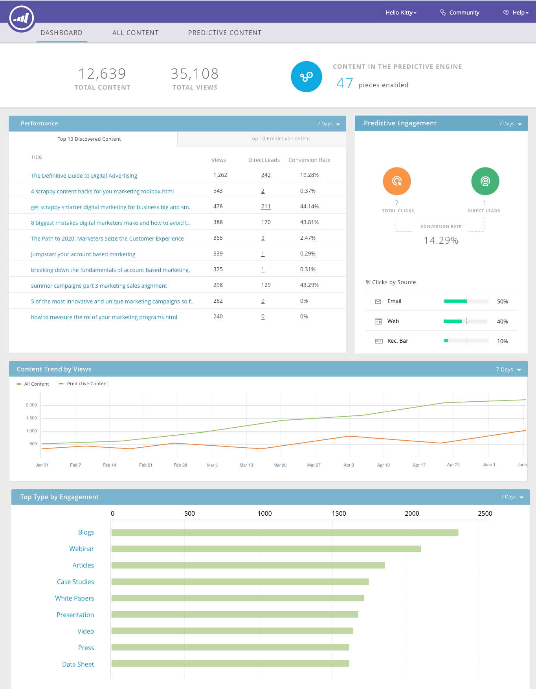

# Note sulla versione - Autunno 2016 {#release-notes-fall}

Le seguenti funzioni sono incluse nella versione di autunno del 1916. Verifica la disponibilità delle funzioni nella tua edizione di Marketo. Fai clic sui collegamenti del titolo per visualizzare articoli dettagliati per ciascuna funzione.

## [!UICONTROL Predictive Content] nell&#39;e-mail {#predictive-content-in-email}

È disponibile una nuova esperienza utente per l&#39;applicazione [!UICONTROL Predictive Content] che consente di tenere traccia, gestire e consigliare i contenuti tramite l&#39;apprendimento automatico e gli algoritmi predittivi nei canali Web e di posta elettronica.

>[!NOTE]
>
>Tutti i clienti che dispongono del modulo Predictive saranno abilitati entro il 10 gennaio.

Ora puoi aggiungere contenuto predittivo all’e-mail. Quando l’e-mail viene aperta, il destinatario riceve automaticamente contenuti pertinenti e consigliati che contribuiscono ad aumentare il coinvolgimento e le conversioni dei contenuti.

## [Conversioni offline Facebook](/help/marketo/product-docs/demand-generation/facebook/understanding-facebook-offline-conversions.md) {#facebook-offline-conversions}

Con l&#39;integrazione di [!DNL Facebook] Conversioni offline, i dati di conversione in Marketo (per lead di annunci) vengono automaticamente rimandati a [!DNL Facebook] in modo che il team pubblicitario possa ottimizzare la spesa pubblicitaria. In questo report di [!DNL Facebook] Ad Manager, le conversioni offline sono evidenziate.

## [ID universale](/help/marketo/product-docs/administration/settings/using-a-universal-id-for-subscription-login.md) {#universal-id}

Un Universal ID consente di accedere a più abbonamenti Marketo con un unico accesso e di passare rapidamente da un abbonamento all’altro. Puoi utilizzare un singolo profilo community per tutti gli abbonamenti.

>[!NOTE]
>
>Contatta il supporto Marketo per abilitare questa funzione.

## Miglioramenti del marketing basato su account Marketo {#marketo-account-based-marketing-enhancements}

Ora è possibile assegnare i team dell’account ad account denominati in Account Based Marketing (ABM), ad esempio il proprietario dell’account, il rappresentante per lo sviluppo delle vendite, il rappresentante per lo sviluppo commerciale e il Customer Success Manager. Puoi anche creare elenchi di account specifici del proprietario dell’account e inviare rapporti ABM settimanali personalizzati al team dell’account.

**API REST**

Questa versione consente inoltre di gestire gli attributi e i punteggi degli account denominati in ABM utilizzando l’API REST di Marketo. Per ulteriori dettagli sulle operazioni API, visita il [sito Web Marketo Developers](https://developers.marketo.com/rest-api/lead-database/named-accounts).

## [Miglioramenti della prova di verifica](/help/marketo/product-docs/administration/audit-trail/change-details-in-audit-trail.md) {#audit-trail-enhancements}

Audit trail fornisce una cronologia completa delle modifiche apportate all’interno dell’abbonamento Marketo. Sono state aggiunte ulteriori funzionalità di tracciamento per i programmi e sono stati evidenziati importanti dettagli di modifica per campagne intelligenti, elenchi avanzati e modifiche apportate a utenti e ruoli.

## Nuove autorizzazioni

**Rendi operativa l&#39;e-mail**

Sono finiti i giorni in cui dovevi preoccuparti che gli utenti inviassero e-mail transazionali a persone del tuo database che hanno annullato l’abbonamento. Ora puoi specificare quali utenti possono rendere operativa un’e-mail o modificarne le e-mail operative.

**Modifica restrizioni campagna**

Perché impostare [restrizioni campagna](/help/marketo/product-docs/administration/email-setup/enable-person-restrictions-for-smart-campaigns.md) se non è possibile applicarle? Quando imposti Impostazioni limite campagna in modo da limitare il numero di persone nel database a cui è possibile indirizzare una singola campagna, ora puoi limitare quali utenti possono ignorare queste impostazioni durante la pianificazione di una campagna.

## [Suono per le notifiche push per dispositivi mobili](/help/marketo/product-docs/mobile-marketing/push-notifications/configure-mobile-push-notification.md) {#sound-for-mobile-push-notifications}

Rendi più ricca la tua notifica push di iOS grazie all’abilitazione dell’audio. Questa nuova funzione consente di attivare un suono quando viene visualizzata una notifica push sul dispositivo mobile.

>[!NOTE]
>
>* I proprietari dei dispositivi possono scegliere di impedire la riproduzione dei suoni nelle impostazioni del dispositivo e gli sviluppatori di app possono assegnare ai proprietari dei dispositivi opzioni all’interno dell’app per impedire la riproduzione dei suoni.
>* I suoni vengono riprodotti automaticamente quando una notifica push viene visualizzata su un dispositivo Android.

## [Insight di vendita compatibile con Salesforce Encryption](/help/marketo/product-docs/marketo-sales-insight/msi-for-salesforce/installation/install-marketo-sales-insight-package-in-salesforce-appexchange.md) {#sales-insight-compatible-with-salesforce-encryption}

Il mercato [!DNL Sales Insight] è ora compatibile con la crittografia dello scudo [!DNL Salesforce]. Tutti i clienti [!DNL Sales Insight] devono effettuare l&#39;aggiornamento a questo pacchetto gestito più recente (versione 1.4359.2), che è [disponibile in [!DNL Appexchange]](https://appexchange.salesforce.com/listingDetail?listingId=a0N30000001SVZmEAO).

## [API account denominati](https://developers.marketo.com/rest-api/lead-database/named-accounts/) {#named-accounts-apis}

Con questa versione, gli utenti ABM di Marketo possono gestire account denominati tramite l’API Account denominati. Gli utenti possono creare, aggiornare ed eliminare account denominati, nonché leggere e aggiornare i punteggi degli account denominati ABM.

## [Supporto API dell&#39;editor di posta elettronica v2.0](https://developers.marketo.com/rest-api/assets/emails/) {#email-editor-v-api-support}

Gestisci variabili e moduli per le e-mail in formato v2.0 utilizzando l’API REST di Marketo.

## [Modifiche a Marketo Salesforce Sync](https://nation.marketo.com/docs/DOC-3840) {#changes-to-marketo-salesforce-sync}

L&#39;integrazione di Marketo [!DNL Salesforce] si sta evolvendo per migliorare il modo in cui i campi Marketo vengono sincronizzati con [!DNL Salesforce]. Ora, invece di dover sincronizzare un ampio gruppo di campi che potrebbero essere necessari o meno, puoi scegliere quali campi includere. Consulta la documentazione qui per ulteriori informazioni: [https://nation.marketo.com/docs/DOC-3840](https://nation.marketo.com/docs/DOC-3840).
