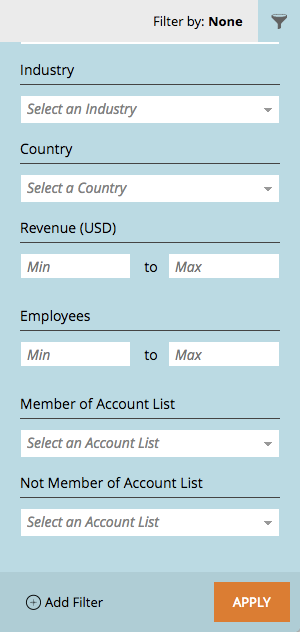

# Note sulla versione: Aprile &#39;17 Miglioramenti ABM {#release-notes-april-abm-enhancements}

Le seguenti funzionalità sono incluse nella versione di miglioramento di ABM del 17 aprile. Per informazioni sulla disponibilità delle funzioni, consulta la tua edizione Marketo .

## Sincronizzazione dei campi standard mappati per la gestione delle relazioni con i clienti {#synching-of-crm-mapped-standard-fields}

Marketo ABM sta modificando il comportamento relativo ai CRM. In futuro, Marketo ABM stabilisce e mantiene una relazione 1-to-1 tra account ABM e account nel CRM. Questo consente a Marketo di mantenere i campi dell&#39;account mappati in sincronia con il CRM.

## Campi personalizzati per l&#39;individuazione di CRM {#custom-fields-for-crm-discovery}

È ora possibile aggiungere campi personalizzati agli account, mapparli al CRM e utilizzarli per l&#39;individuazione dell&#39;account CRM in Marketo.

## Filtri basati su account nella griglia dell’account con nome {#account-based-filters-in-the-named-account-grid}

Ora puoi filtrare facilmente i tuoi account denominati in base a un Elenco account.

