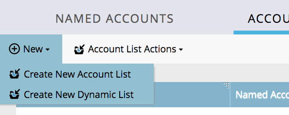

# Note sulla versione - Miglioramenti di ABM ad agosto 2017 {#release-notes-august-abm-enhancements}

Le seguenti funzioni sono incluse nella versione di miglioramento di ABM del 17 agosto. Verifica la disponibilità delle funzioni nella tua edizione di Marketo.

Fai clic sui collegamenti del titolo per visualizzare articoli dettagliati per ciascuna funzione.

## [!DNL Account Insight] {#account-insight}

**[[!DNL Account Insight]](/help/marketo/product-docs/target-account-management/setup-tam/account-insight-plug-in-overview.md)** è un plug-in di [!DNL Google Chrome] che fornisce ai team di vendita informazioni utili su ABM e account, consentendo loro di lavorare a stretto contatto con il marketing per coinvolgere gli account in modo efficace. I team di vendita otterranno visibilità sui dati e sulle informazioni generate per ciascuno dei Named Account di loro proprietà. Ciò includerà i percentili di punteggio dell’account, un elenco prioritario dei loro Account denominati, persone coinvolte all’interno di tali account e un flusso di attività live di attività recenti dall’account.

 

## [Elenchi account dinamici](/help/marketo/product-docs/target-account-management/target/account-lists.md) {#dynamic-account-lists}

Stiamo aggiungendo un nuovo modo per creare elenchi di account in ABM. Oltre agli elenchi di account esistenti, ora puoi creare elenchi di account dinamici generati dalle visualizzazioni account CRM pubbliche. Una visualizzazione account CRM è un insieme di regole che funge da filtro durante la visualizzazione degli account. Ad esempio, puoi utilizzarlo per trovare account in cui Industry is Healthcare _and_ Revenue è superiore a $ 100 milioni.

