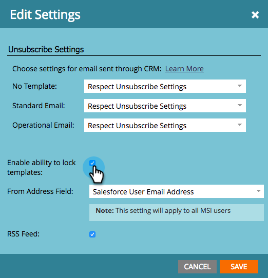

# Note sulla versione: Estate &#39;17 {#release-notes-summer}

Le seguenti funzionalità sono incluse nella versione dell’estate del 17. Per informazioni sulla disponibilità delle funzioni, consulta la tua edizione Marketo .

Fai clic sui collegamenti del titolo per visualizzare gli articoli dettagliati per ciascuna funzione. Nota: Alcune delle funzioni incluse in questa versione non hanno articoli associati. Se un argomento ha più sottotitoli, i collegamenti vengono posizionati in tale punto.

## [Stadi di conversione offline aggiuntivi di Facebook](/help/marketo/product-docs/demand-generation/facebook/set-up-facebook-offline-conversions.md) {#additional-facebook-offline-conversion-stages}

Scegli fino a 7 fasi aggiuntive di conversione offline da mappare alle fasi del ciclo di vita di Marketo (oltre le 3 disponibili oggi). Ottimizza la spesa pubblicitaria Facebook in base alle conversioni nel tuo percorso cliente per ottenere un migliore ROI.

## [Blocca modello di analisi vendite](/help/marketo/product-docs/marketo-sales-insight/msi-for-salesforce/features/actions-in-the-msi-panel/send-marketo-email/lock-sales-template.md) {#lock-sales-insight-template}

Assicurati la coerenza di messaggi e contenuti impedendo le modifiche ai modelli di vendita. Questo consente di standardizzare i modelli e mantenere le comunicazioni professionali.

## Miglioramenti di ABM {#abm-enhancements}

**Origine dati per ricerca società giapponese**

Fai corrispondere le persone ai nomi delle aziende giapponesi nella lingua locale.

**[Integrazione di ABM e LeanData](https://docs.marketo.com/x/pKmt)**

L’integrazione di LeanData ora consente la corrispondenza lead-to-account in Marketo. Tieni allineati il marketing e le vendite avendo gli stessi lead associati agli account all&#39;interno dei sistemi di vendita e marketing di record. Le opzioni più flessibili offrono alle operazioni di marketing e vendita un maggiore controllo sulle regole di corrispondenza lead-to-account, in modo da raggiungere il livello di precisione desiderato.

## Miglioramenti alla personalizzazione web {#web-personalization-enhancements}

**[Miglioramenti all’anteprima di Campaign](/help/marketo/product-docs/web-personalization/working-with-web-campaigns/preview-and-test-a-web-campaign.md)**

I professionisti del marketing possono ora garantire che le loro campagne web abbiano un aspetto eccezionale su qualsiasi dispositivo *prima* lanciarli. Con questi miglioramenti, scopri come le campagne web verranno renderizzate su desktop, dispositivi mobili e tablet. Il nuovo plug-in per Chrome offre anche anteprime più coerenti e precise.

**[Miglioramenti apportati alle campagne Widget](/help/marketo/product-docs/web-personalization/working-with-web-campaigns/create-a-new-widget-web-campaign.md)**

Sono ora disponibili nuove opzioni per le campagne Widget, tra cui:

* Attivazione di campagne (ritardo, scorrimento)
* Visualizzazione di campagne (qualsiasi posizione intorno allo schermo)
* Modificare la freccia di espansione/riduzione a icona in qualsiasi testo CTA

## ContentAI {#contentai}

**[Analisi e suggerimenti di ContentAI](/help/marketo/product-docs/predictive-content/predictive-content-analytics-overview.md)**

Incrementa il ritorno sul marketing dei contenuti con analisi più approfondite e suggerimenti di contenuti basati sull’intelligenza artificiale per migliorare il coinvolgimento. Le analisi potenti mostrano le prestazioni dei contenuti consigliati, incluse le visualizzazioni popolari, di tendenza e basate sul pubblico. Vedrai anche suggerimenti per contenuti aggiuntivi da includere.

## Analytics {#analytics}

**Miglioramenti di Approfondimenti e-mail**

Ottieni ancora di più dalla tua esperienza Approfondimenti e-mail con nuovi modi per preparare e condividere i dati. È ora possibile scaricare i risultati di Approfondimenti e-mail in Microsoft Excel e PowerPoint per lavorare con i dati esterni a Marketo.

## Supporto per la configurazione di Federated Identity {#federated-identity-configuration-support}

Mantieni l’autenticazione (Active Directory) dietro il firewall in locale mentre continui a utilizzare Microsoft Dynamics CRM nel cloud.
