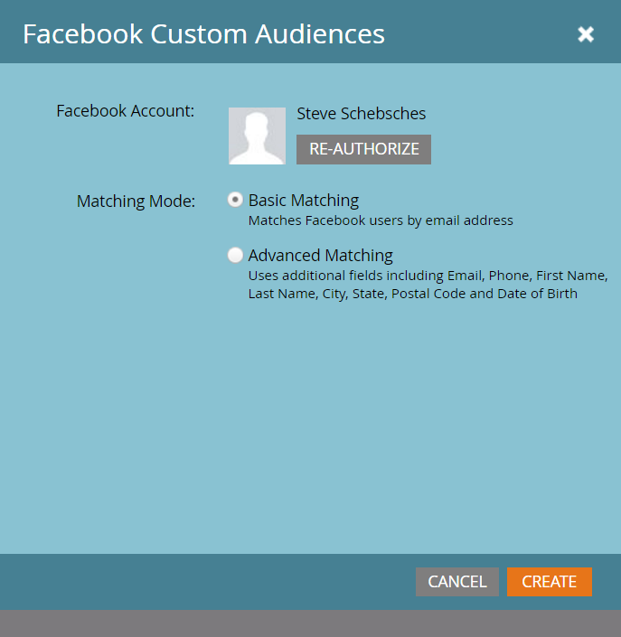

# Note sulla versione: Inverno &#39;17 {#release-notes-winter}

Le seguenti funzioni sono incluse nella versione invernale del &#39;17. Verifica la disponibilità delle funzioni nella tua edizione di Marketo.

Fai clic sui collegamenti del titolo per visualizzare articoli dettagliati per ciascuna funzione.

>[!NOTE]
>
>Se un argomento ha più sottotitoli, i collegamenti sono posizionati lì.

## [Corrispondenza avanzata per i tipi di pubblico personalizzati di Facebook](/help/marketo/product-docs/demand-generation/ad-network-integrations/add-facebook-custom-audiences-as-a-launchpoint-service.md) {#advanced-matching-for-facebook-custom-audiences}

La corrispondenza di base utilizza solo gli indirizzi e-mail, ma la nuova corrispondenza avanzata utilizza altri sette campi, aumentando il tasso di corrispondenza per una maggiore conversione.

## [API di importazione oggetti personalizzati](https://developers.marketo.com/rest-api/lead-database/custom-objects/) {#custom-object-import-api}

Questa API fornisce un’interfaccia più veloce per sincronizzare gli oggetti personalizzati in Marketo. È possibile importare file CSV, TSV o SSV in Marketo come oggetti personalizzati.

## [Esportazione campagne Web Personalization](/help/marketo/product-docs/web-personalization/working-with-web-campaigns/export-web-campaign-data.md) {#web-personalization-campaigns-export}

Esporta tutti i dettagli e le analisi della campagna web in formato CSV. Potrai quindi visualizzare i dati in un layout semplice.

## Localizzazione {#localization}

Le app Web Personalization, [!UICONTROL Predictive Content] e Email Insights sono ora disponibili in giapponese, tedesco e spagnolo. [selezionare la lingua e le impostazioni locali](/help/marketo/product-docs/administration/settings/select-your-language-locale-and-time-zone.md) per visualizzare il contenuto in queste lingue.

## Miglioramenti del marketing basato sull’account {#account-based-marketing-enhancements}

**[Importa account denominati](/help/marketo/product-docs/target-account-management/target/named-accounts/import-named-accounts.md)**

Con l&#39;opzione di importazione [!UICONTROL Named Account], crea o aggiorna più record contemporaneamente tramite il caricamento CSV.

**[Supporto di Email Insights](/help/marketo/product-docs/reporting/email-insights/filtering-in-email-insights.md)**

Utilizzare [!UICONTROL Named Account] o [!UICONTROL Account List] come dimensioni in Email Insights.

## Miglioramenti di [!UICONTROL Predictive Content] {#predictive-content-enhancements}

**[Filtra per[!UICONTROL Enabled Source]](/help/marketo/product-docs/predictive-content/working-with-predictive-content/understanding-predictive-content.md)**

Filtra [!UICONTROL Predictive Content] pezzi abilitati per [!UICONTROL Email], [!UICONTROL Rich Media] o [!UICONTROL Recommendation Bar].

**[Filtro[!UICONTROL Analytics by Source]](/help/marketo/product-docs/predictive-content/working-with-predictive-content/understanding-predictive-content.md)**

Filtra analisi [!UICONTROL Predictive Content] per origini specifiche - [!UICONTROL Email], [!UICONTROL Rich Media] o [!UICONTROL Recommendation Bar].

Editor **[!UICONTROL Predictive Content]**

L&#39;esperienza di modifica e il layout migliorati dividono la preparazione dei contenuti per origine: [!UICONTROL Email], [!UICONTROL Rich Media] o [!UICONTROL Recommendation Bar].

**[Contenuto individuazione automatica per predittivo](/help/marketo/product-docs/predictive-content/getting-started/enable-content-discovery.md)**

L’URL dell’immagine e i metadati vengono ora utilizzati nel processo di rilevamento automatico dei contenuti.

## [Miglioramenti SDK](https://developers.marketo.com/mobile/) {#sdk-enhancements}

Gli sviluppatori ora hanno un controllo aggiuntivo sulla consegna delle notifiche push con l’aggiunta di una nuova chiamata API SDK che consente agli sviluppatori di rimuovere i token push.

## Integrazione Vibes SMS LaunchPoint

Migliora il targeting con una nuova opzione di filtro, &quot;Membro dell’elenco delle vibrazioni&quot;.

## [Deprecazione editor Rich Text legacy ed editor di moduli 1.0](https://nation.marketo.com/docs/DOC-4315) {#legacy-rich-text-editor-and-form-editor-deprecation}

A partire dal 1° agosto 2017, i clienti che utilizzano ancora l’editor Rich Text e l’editor di moduli 1.0 legacy passeranno automaticamente alla nuova esperienza.

## [API attività Marketo](https://developers.marketo.com/blog/important-change-activity-records-marketo-apis/) {#marketo-activity-apis}

Un cambiamento importante sta arrivando alle API delle attività di Marketo. Sei preparato?
