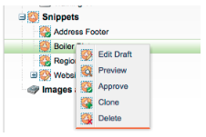
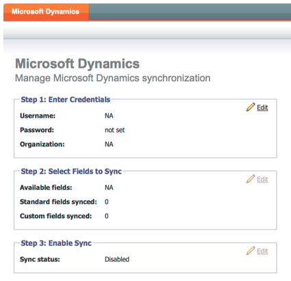
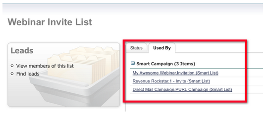
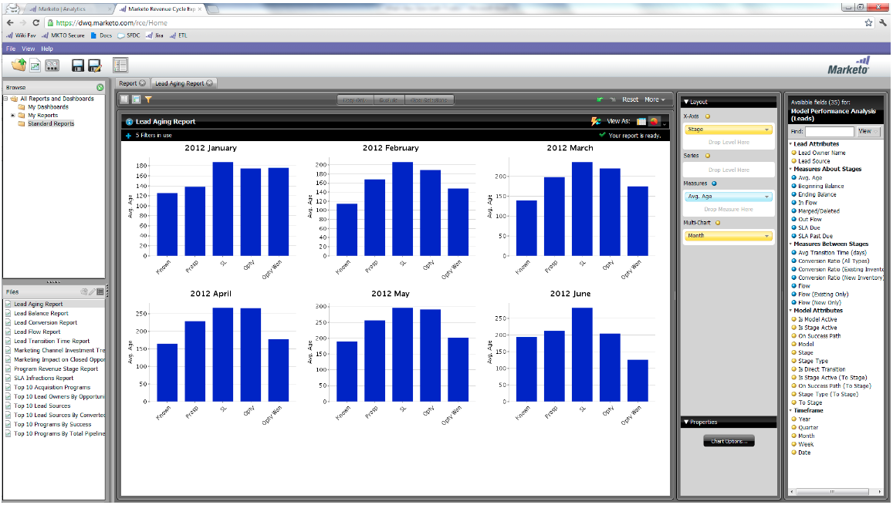
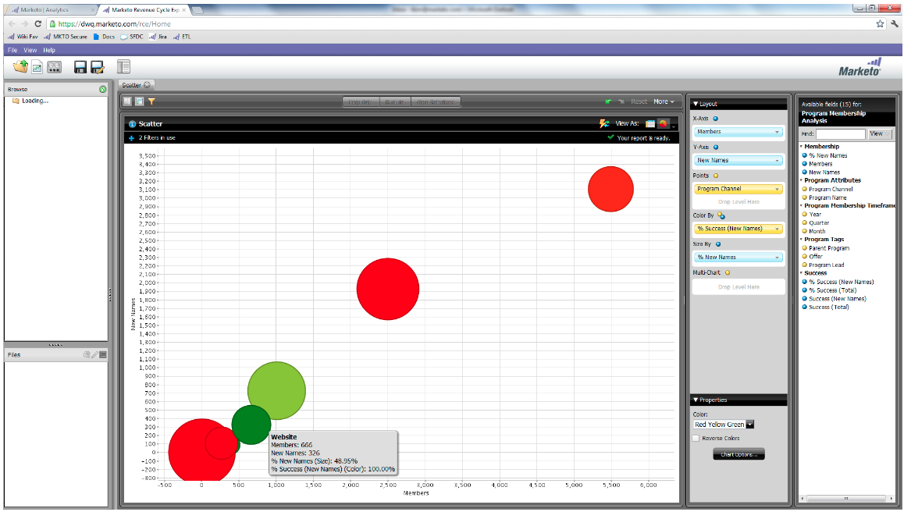
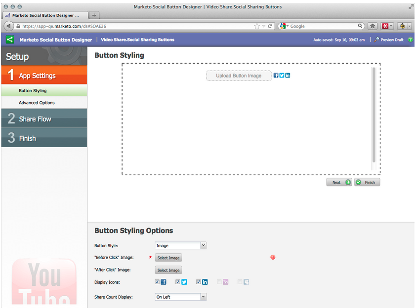
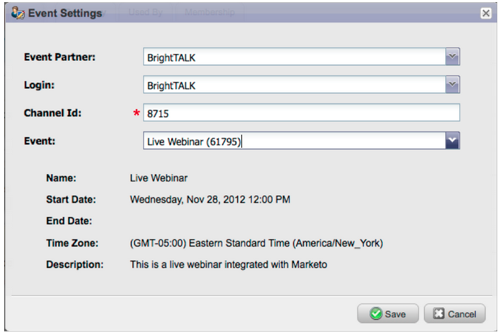
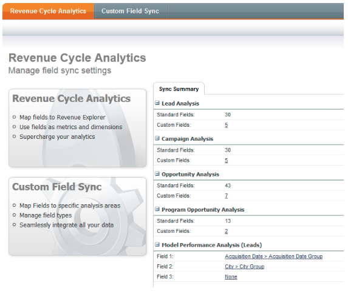

# 2012

## Gennaio/febbraio 2012 {#january-february}

Le seguenti funzioni sono incluse nella versione di gennaio/febbraio. Verifica la disponibilità delle funzioni nella tua edizione di Marketo. Torna indietro dopo il rilascio per collegamenti alla documentazione dettagliata delle funzioni.

## Contenuto dinamico avanzato {#advanced-dynamic-content}

_Disponibile per le versioni Pro ed Enterprise_

Con i contenuti dinamici avanzati puoi creare comunicazioni e-mail coinvolgenti e pagine di destinazione rilevanti per il tuo pubblico, senza dover creare più risorse per lo stesso messaggio. I visualizzatori aggiornati consentono di visualizzare ogni versione univoca in una singola schermata.

## Segmentazione  {#segmentation}

_Disponibile per le versioni Pro ed Enterprise_

La segmentazione è un gruppo di segmenti, ovvero un gruppo mirato di singoli utenti a cui si rivolge il marketing. I segmenti sono definiti da regole guidate da criteri di filtro simili agli elenchi avanzati. I segmenti possono essere basati su dati demografici, ad esempio la qualifica o il settore, oppure su comportamenti come pagine web visitate o collegamenti selezionati.

## Snippet {#snippets}

_Disponibile per le versioni Pro ed Enterprise_

Archivia contenuti avanzati che possono essere utilizzati ripetutamente per creare e-mail e pagine di destinazione statiche o dinamiche.

## PURL {#purls}

_Disponibile per le versioni Pro ed Enterprise_

Utilizzando URL personalizzati (PURL), gli esperti di marketing possono ora creare URL specifici per il contatto, per indirizzare risposte di personalizzazione, misurabilità e incremento in programmi di marketing multi-touch per campagne direct mailing e e-mail.

## Supporto della direttiva UE sulla privacy {#eu-privacy-directive-support}

Le nuove funzioni per rispettare le impostazioni &quot;Do Not Track&quot; del browser includono la possibilità di disabilitare il tracciamento per i lead anonimi; questo rende più semplice il rispetto delle normative UE più severe sul tracciamento della privacy.

## Single Sign-On {#single-sign-on}

Le organizzazioni ora possono supportare l’accesso senza problemi all’applicazione Marketo utilizzando SAML 2.0 per il single sign-on da un portale aziendale.

## Editor di e-mail e pagine di destinazione aggiornati {#updated-email-and-landing-page-editors}

Gli editor di e-mail e pagine di destinazione sono stati riprogettati con un’interfaccia più invitante, una navigazione intuitiva e un’esperienza utente notevolmente migliorata, che include:

HTML affiancato e visualizzazione testo

Nell’editor vengono visualizzati Nome mittente, Da e-mail, Rispondi a (NUOVO) e Oggetto. Tutte le altre impostazioni sono accessibili tramite il pulsante Modifica impostazioni.

## Supporto browser {#browser-support}

* [!DNL Mozilla Firefox] 9.0
* [!DNL Google Chrome] 16
* [!DNL Microsoft Internet Explorer] 8 &amp; 9
* **Nota**: non sono più supportati [!DNL Internet Explorer] 7

## Gestione del programma {#program-management}

La gestione semplificata dei programmi migliora l’usabilità con l’eliminazione dei token e l’eliminazione più semplice dei programmi.

## Annulla iscrizione al rapporto sugli abbonamenti {#unsubscribe-from-subscription-report}

Ora puoi annullare l’abbonamento direttamente dal rapporto.

## Aggiornamenti Munchkin {#munchkin-updates}

Le nuove chiamate Munchkin riducono i tempi di caricamento delle pagine web e forniscono prestazioni più coerenti per gli eventi di collegamento di clic.

## Analisi delle opportunità del programma (solo RCA) {#program-opportunity-analysis-rca-only}

Comprendere il contributo del marketing ai ricavi delle singole opportunità

## Analisi della fase dei ricavi del programma {#program-revenue-stage-analysis}

Acquisisci insight in velocità di lead del programma comprendendo quali programmi hanno acquisito i fast move

## Marzo 2012 {#march}

## Risolvi i miei token {#resolve-my-tokens}

I miei token (token di programma) vengono risolti quando si visualizza l’anteprima di un’e-mail, quando si invia un’e-mail di test e quando si invia un’e-mail locale tramite una singola azione di flusso. Non dovrai più creare una campagna intelligente all’interno del programma per testare I miei token!

## Passare da Anteprima a Editor nelle e-mail e nelle pagine di destinazione {#toggle-between-previewer-and-editor-in-emails-and-landing-pages}

Con un clic, puoi passare facilmente da un Editor all’altro e viceversa.

Editor in anteprima:

Anteprima nell&#39;editor:

## Anteprima snippet {#snippet-previewer}

Selezionando &quot;Anteprima snippet&quot; dal menu, potete visualizzare uno snippet senza che questo diventi una bozza. Inoltre, se si dispone dell&#39;accesso in sola lettura a uno snippet condiviso (tramite le aree di lavoro), è possibile visualizzare lo snippet con questa azione.

## Inviare più e-mail di test {#send-multiple-test-emails}

Con l’aggiunta del contenuto dinamico, diventa sempre più importante visualizzare in anteprima e testare tutte le varianti delle e-mail che potrebbero essere inviate ai lead. Quando visualizzi l’anteprima utilizzando Visualizza per dettaglio lead, puoi inviare un test per le varianti dall’elenco dei lead (fino a 100 e-mail di test).

## Pagine di destinazione dinamiche basate su parametro URL {#dynamic-landing-pages-based-on-url-parameter}

I lead anonimi costituiscono una quantità significativa delle visite alle pagine di destinazione. Con l’aggiunta di contenuto dinamico e la possibilità di inserire la segmentazione nell’URL come parametro, puoi visualizzare in modo dinamico il contenuto della pagina di destinazione quando un lead anonimo o noto fa clic sul collegamento.

## Aprile 2012 {#april}

## Filtri di segmentazione e attivatori {#segmentation-filters-and-triggers}

Esegui il targeting dello stesso gruppo di lead in modo coerente? In tal caso, utilizza la segmentazione negli elenchi avanzati per il targeting dei lead. Con la segmentazione, l’intero database dei lead viene sempre segmentato e può essere riutilizzato nei programmi per coerenza. I risultati della segmentazione vengono richiamati rapidamente perché non richiedono l’esecuzione dell’elenco avanzato al momento della richiesta.

## Inserire valori esterni nel contenuto delle e-mail e in altri passaggi del flusso tramite funzionalità API espanse {#insert-external-values-into-email-content-and-other-flow-steps-through-expanded-api-capabilities}

* L’API Request Campaign ora consente di inviare valori per I miei token per quella particolare esecuzione della campagna - questo è particolarmente utile per popolare il contenuto delle e-mail tramite l’API
* Le nuove API di caricamento nell’elenco e pianificazione delle campagne supportano quanto sopra per gli elenchi di lead e le campagne batch.

## E-mail di conferma più semplici per [!DNL GoToWebinar] e [!DNL WebEx] (Adobe Connect e [!DNL ON24] disponibili a breve) {#easier-confirmation-emails-for-gotowebinar-and-webex-adobe-connect-and-on-coming-soon}

L&#39;URL di conferma è stato semplificato creando un token membro che visualizza l&#39;URL di conferma della registrazione univoco per ogni lead. Non sarà più necessario creare questo URL utilizzando token diversi. Questa versione è attualmente disponibile per [!DNL GoToWebinar] e [!DNL WebEx] clienti e sarà disponibile per Adobe Connect e [!DNL ON24] nella prossima versione.

## Carica più immagini e file con un solo clic! {#upload-multiple-images-and-files-with-a-single-click}

Risparmia tempo ed è più efficiente quando si importano immagini e file in Marketo. Se si utilizza [!DNL Firefox] o [!DNL Google Chrome], è possibile selezionare più file e caricarli tutti contemporaneamente. Sebbene non vi sia alcun limite al numero di file che è possibile caricare, la dimensione massima per ogni file è di 50 MB.

Nota: al momento questa funzionalità non è supportata in [!DNL Internet Explorer] a causa delle limitazioni del browser.

## Spostare il testo in un messaggio e-mail {#move-text-in-an-email}

Puoi riordinare i blocchi di testo in un messaggio e-mail. Nell’editor di testo seleziona un blocco di testo; quando fai clic sull’icona di modifica, visualizzerai l’opzione per spostare il blocco verso l’alto o verso il basso.

## [!DNL Salesforce] riferimenti rimossi per non [!DNL Salesforce] utenti {#salesforce-references-removed-for-non-salesforce-users}

Se non si sincronizza la sottoscrizione con [!DNL Salesforce], verranno rimosse tutte le cartelle e le azioni di flusso che fanno riferimento a [!DNL Salesforce].

## Marketo Revenue Cycle Analytics {#marketo-revenue-cycle-analytics}

**Fasi gate migliorate nel ciclo dei ricavi Modeler**

Consente agli utenti di definire un ordine per le regole di transizione.

## Maggio 2012 {#may}

## Riprogettazione report prestazioni e-mail {#email-performance-report-redesign}

Nota: si tratta di un rollout graduale, a partire dalla versione di maggio

Abbiamo velocizzato l’esecuzione dei rapporti Prestazioni e-mail e Prestazioni e-mail per le campagne. Abbiamo anche migliorato le definizioni di alcune metriche e consolidato le metriche &quot;Messaggi inviati&quot; e &quot;Lead inviati&quot; in un’unica metrica, &quot;Inviati&quot;. Abbiamo unito &quot;Messaggi consegnati&quot; e &quot;Lead consegnati&quot; in &quot;Consegnati&quot;.

## Miglioramenti del passaggio Attesa {#wait-step-enhancements}

Utilizzando le nuove proprietà Advanced Wait, è possibile configurare il passaggio di attesa in un’azione Flusso di Smart Campaign in modo che l’attesa avvenga entro un giorno specifico della settimana, il giorno lavorativo successivo, una data o un’ora specifica. Questi miglioramenti garantiscono che le e-mail di sviluppo arrivino nella casella in entrata durante l’orario di lavoro!

Figura 1. Specifica il passaggio di attesa per terminare in un giorno lavorativo

## Assets Hidden archiviato {#archived-assets-hidden}

Le risorse archiviate vengono filtrate automaticamente dalla funzione di suggerimento automatico, dai menu a discesa e dai rapporti, facilitando la ricerca.

Figura 2. Esempio di filtro e-mail archiviato

## Nuova app di archiviazione eventi per iPad {#new-event-check-in-app-for-ipad}

Semplifica il processo di check-in degli eventi utilizzando la nuova app iPad. L’app Event Check-in si sincronizza con il tuo programma Marketo e ti consente di controllare facilmente gli iscritti a un evento, nonché di aggiungere al volo nuovi lead.

Richiede iOS 5.1 o versione successiva; solo iPad.

Figura 3. Home page del check-in degli eventi

Figura 4. Event Check-In: seleziona il tuo evento.

Figura 5. Archiviali

## URL di conferma del webinar avanzato {#enhanced-webinar-confirmation-url}

Ora disponibile per [!DNL ON24] e Adobe Connect. Includi un collegamento univoco nell&#39;e-mail di conferma per ogni partecipante registrato che utilizza il nuovo token `{{member.webinar URL}}`. I miglioramenti apportati ad Adobe Connect includono anche la possibilità di attivare/disattivare l’e-mail con le informazioni sull’account Adobe, che include l’ID di accesso e la password dell’utente.

Figura 6. Consegna delle persone al tuo webinar

## Anteprima modello {#template-preview}

Cerchi un modello specifico durante la creazione dell’e-mail o della pagina di destinazione, ma non sei sicuro di come sarà? Con la nuova funzionalità di anteprima modello, puoi verificare il modello selezionato prima di salvare una nuova risorsa.

Figura 7. Visualizza l&#39;anteprima del modello scelto

## Precompilazione modulo configurabile {#configurable-form-prefill}

Controlla la precompilazione dei dati del modulo a livello di abbonamento e la sovrascrittura a livello di pagina di destinazione. Senza la precompilazione, puoi assicurarti che il lead fornisca le informazioni più aggiornate.

Figura 8. Configurazione preriempimento modulo in Amministratore

Figura 9. Modificare l’impostazione di precompilazione di un modulo su una pagina di destinazione

## Marketo Treasure Chest {#marketo-treasure-chest}

Accedi alle funzioni sperimentali sviluppate da tecnici Marketo per migliorare la tua esperienza utente. Questa versione include la funzione di annullamento dell’e-mail e la possibilità di inserire commenti e collaborare con altri utenti sulle pagine di destinazione.

\

Figura 10. Funzioni di Manager Treasure Chest in Amministratore

## Integrazione di [!DNL Microsoft Dynamics]® CRM {#microsoft-dynamics-crm-integration}

Sincronizza account, contatti e lead tra Marketo e [!DNL Microsoft Dynamics] CRM Online utilizzando la nuova integrazione predefinita.

Figura 11. Configurazione di [!DNL Microsoft Dynamics]

## Miglioramenti di Marketo [!DNL Sales Insight] {#marketo-sales-insight-enhancements}

**Opzioni piè di pagina per annullamento abbonamento**

Configurare quando e se viene visualizzato il piè di pagina per l&#39;annullamento dell&#39;iscrizione per le e-mail inviate tramite [!DNL Sales Insight].

Figura 12. [!DNL Sales Insight] Impostazioni in Amministratore

## Cartelle per modelli e-mail vendite {#folders-for-sales-email-templates}

È ora possibile organizzare i modelli di posta elettronica condivisi con Marketo [!DNL Sales Insight] in cartelle specifiche, semplificando la ricerca del messaggio di posta elettronica corretto per i rappresentanti commerciali.

Figura 13. Scegli una cartella per le e-mail

## Accedere ad Analizzatore opportunità da [!DNL Sales Insight] {#access-opportunity-analyzer-from-sales-insight}

Fornisci ai tuoi rappresentanti commerciali insight in cui le attività di marketing stanno stimolando il coinvolgimento, utilizzando l&#39;accesso diretto ad Opportunity Analyzer da Marketo [!DNL Sales Insight]. Nota. Richiede la licenza Revenue Cycle Analytics.

## Campo personalizzato per lo stato del contatto {#custom-field-for-contact-status}

È ora possibile mappare un campo personalizzato in [!DNL Salesforce] per compilare il campo Stato per i contatti nelle visualizzazioni Elementi di maggiore rilevanza, Elementi di maggiore rilevanza del team e Personalizza.

Figura 14. Mappare un campo personalizzato ai contatti

Vedi Pagine visitate da lead anonimi

Espandere le pagine visualizzate da un lead anonimo dalla visualizzazione [!UICONTROL Anonymous Web Activity].

Figura 15. Vedi Attività web anonima

## Lead avanzato e Abbonamento contatti {#enhanced-lead-and-contact-subscribe}

Seguire un lead o un contatto in qualsiasi momento utilizzando il nuovo pulsante Sottoscrivi nella pagina dei dettagli del record.

## Giugno 2012 {#june}

## Miglioramenti alla gestione dei lead in Marketo {#marketo-lead-management-enhancements}

### Rinomina {#rename}

Puoi rinominare i tuoi elenchi avanzati, gli elenchi statici e le campagne. Se utilizzi queste risorse in filtri, trigger o flussi, anche qui il nome verrà aggiornato automaticamente. È sempre stato possibile rinominare e-mail, moduli e cartelle.

Inoltre, abbiamo migliorato l’inserimento e la visualizzazione del testo descrittivo delle risorse.

## Importa mappatura campi {#import-field-mapping}

L&#39;importazione di un elenco in Marketo è stata semplificata. Durante il processo di importazione, è possibile mappare il nome del campo Marketo al nome dell&#39;intestazione di colonna nel file di importazione. Inoltre, in [!UICONTROL Admin] è possibile impostare alias mappati al nome del campo in Marketo, assicurandosi che gli utenti selezionino ogni volta il campo corretto.

Continuando a importare e mappare i campi, Marketo ricorderà e visualizzerà le mappature durante l’importazione, per semplificarne l’utilizzo. Per semplificare ulteriormente la gestione, fai clic sull’intestazione Valore di esempio per visualizzare i diversi valori che verrebbero inseriti nel campo. Questo ti aiuta a mappare il campo corretto ogni volta.

## Pagina [!UICONTROL Summary] per elenchi avanzati ed elenchi statici {#summary-page-for-smart-lists-and-static-lists}

Vi siete mai chiesti dove vengono usati i vostri elenchi? Chi ha creato o modificato per ultimo l’elenco? La nuova pagina di riepilogo disponibile negli elenchi smart e statici fornirà questi importanti dettagli.

Nelle pagine di riepilogo esistenti di Programma e Campagna, sono state aggiunte anche le informazioni Data di creazione/Utente e Data/Utente ultima modifica.

## [!UICONTROL Used By] per Assets {#used-by-for-assets}

È stata aggiunta una nuova scheda alle pagine [!UICONTROL Summary] della risorsa, denominata [!UICONTROL Used By].

Esempio: [!UICONTROL Used By] per elenchi statici

## Griglia della pagina di destinazione {#landing-page-gridlines}

L’aggiunta della griglia della pagina di destinazione semplifica notevolmente l’allineamento di testo, elementi grafici e moduli nella pagina di destinazione. Attiva e disattiva questa funzione per tutte le pagine di destinazione e regola anche la larghezza tra le righe.

## Lead bloccati da mailing {#leads-blocked-from-mailings}

Quando pianifichi una campagna, puoi fare clic sul collegamento per visualizzare l’elenco dei lead che sono bloccati dalla tua mailing.

## Passaggio [!UICONTROL Wait] - Token lead e token personale {#wait-step-lead-token-and-my-token}

Nella versione di maggio sono state aggiunte opzioni avanzate al passaggio del flusso [!UICONTROL Wait]. Con queste modifiche è possibile specificare un giorno lavorativo, una data e un&#39;ora. In questa versione è stata aggiunta la possibilità di utilizzare un token nel passaggio di attesa. Ad esempio, è possibile utilizzare `{{lead.Birthday}}` per inviare un messaggio e-mail di compleanno o `{{my.Event Date}}` per inviare un promemoria finale del webinar.

## [!UICONTROL View] come [!UICONTROL Thumbnails] in Design Studio {#view-as-thumbnails-in-design-studio}

Passare da una visualizzazione elenco di immagini a una visualizzazione miniature.

Nota: a partire da questa versione, l’ordinamento precedente sulle griglie degli elenchi smart non verrà applicato al successivo elenco smart visualizzato. Ad esempio, se ordini un elenco avanzato per Nome società, il successivo elenco avanzato visualizzato dallo stesso campo non verrà ordinato automaticamente.

Promemoria: è in corso l&#39;aggiornamento del report sulle prestazioni delle e-mail.

## Miglioramenti di Marketo Revenue Cycle Analytics {#marketo-revenue-cycle-analytics-enhancements}

### Nuove metriche nell’analisi dell’opportunità del programma  {#new-metrics-in-program-opportunity-analysis}

Ora puoi ottenere informazioni sul numero medio di contatti di marketing prima che le opportunità vengano create o chiuse, nonché sul valore medio di un contatto di marketing.

## Visualizzazione di grafici multipli {#displaying-multi-charts}

La funzione a più grafici consente di visualizzare più grafici in un unico rapporto di Revenue Cycle Explorer. Ad esempio, puoi utilizzare questa funzione quando desideri visualizzare gli stessi dati in mesi diversi. Questa funzione consente inoltre di evitare la creazione di filtri e rapporti separati.

## Tipo di grafico a griglia di calore  {#heat-grid-chart-type}

Le griglie di calore consentono di visualizzare i dati in modo da identificare i pattern delle prestazioni di marketing. Questo tipo di visualizzazione assegnerà un colore al codice dei risultati, consentendoti di visualizzare analisi aziendali complesse in una visualizzazione di facile comprensione.

## Tipo di grafico a dispersione  {#scatter-chart-type}

I grafici a dispersione consentono di visualizzare i dati su più dimensioni in un unico grafico. Questo tipo di visualizzazione traccia una bolla su un grafico in base agli attributi utilizzati. Potete quindi utilizzare una misura per codificare il colore della bolla e/o una misura per specificare la dimensione della bolla.

## Settembre 2012 {#september}

Questa versione include funzioni social integrate e molto attese, oltre a utili funzioni di gestione dei lead. Nota: le funzioni social network sono disponibili come componente aggiuntivo o come parte di bundle selezionati.

## Pubblicare un video YouTube con condivisione tramite social network {#publish-a-youtube-video-with-social-sharing}

Amplifica il pubblico per i tuoi video incoraggiando i visitatori a condividerli socialmente, utilizzando il nuovo Condivisione video sulle pagine di destinazione.

## Aggiungi un pulsante Condividi {#add-a-share-button}

Personalizzare completamente i messaggi di condivisione e l&#39;aspetto di un nuovo set di pulsanti di condivisione social. Inoltre, acquisisci i dati del profilo social mentre i lead condividono i tuoi contenuti.

## Accesso social network {#social-sign-on}

Acquisisci insight e riduci gli attriti consentendo ai lead di precompilare i moduli con le informazioni provenienti dai loro social network.

## Pubblica pagine di destinazione in [!DNL Facebook] {#publish-landing-pages-to-facebook}

Amplia la portata delle tue pagine di destinazione pubblicandole direttamente in [!DNL Facebook], complete di app social, moduli e tutte le funzionalità delle pagine di destinazione di Marketo.

## Scheda evento [!DNL ReadyTalk] {#readytalk-event-adapter}

Collegare facilmente un evento Marketo a una riunione [!DNL ReadyTalk]. Utilizzare un modulo di Marketo per acquisire gli utenti registrati e registrarli automaticamente in [!DNL ReadyTalk]. Una sincronizzazione bidirezionale consente di compilare le informazioni sulla partecipazione in Marketo.

## Microsoft [!DNL Dynamics] locale {#microsoft-dynamics-on-premise}

È ora supportata la distribuzione on-premise di Microsoft [!DNL Dynamics] 2011 con connessione Internet.

## Webhook (cassa del tesoro) {#webhooks-treasure-chest}

Un webhook è un callback HTTP definito dall&#39;utente. È un ottimo modo per inviare dati da Marketo a qualsiasi altro servizio. Questa funzione è attualmente disponibile in Treasure Chest ed è supportata solo nelle campagne di attivazione al momento.

Esempi di come utilizzare i webhook includono: la pubblicazione di informazioni su nome utente e password in un altro sistema per creare un account di prova; l’invio di un SMS di testo quando si riceve un nuovo lead.

## Aggiornamento dell’API getMultipleLeads {#update-to-getmultipleleads-api}

Abbiamo aggiunto nuovi criteri di filtro alla chiamata API getMultipleLeads. Oltre a filtrare per data, ora sono supportati altri criteri:

* Intervalli di date
* Nomi elenco statici
* Array di chiavi lead

## Ottobre 2012 {#october}

La versione di ottobre include nuove funzionalità più interessanti! Le funzioni social network sono disponibili come componente aggiuntivo o come parte di bundle selezionati.

## Importa programmi e scambio di programmi {#import-programs-and-program-exchange}

Un programma può essere importato da un abbonamento Marketo a un altro. Ad esempio, puoi creare un programma in una sandbox e quindi importarlo nel tuo abbonamento live. È inoltre possibile importare un programma predefinito dalla libreria dei programmi di Marketo.

>[!NOTE]
>
>Solo gli utenti Marketo a cui è stata concessa l&#39;autorizzazione da un utente amministratore di Marketo possono importare programmi.
>
>Contatta il supporto Marketo per collegare un account sandbox al tuo abbonamento live.

## Notifiche {#notifications}

Le notifiche ti mantengono aggiornato sugli eventi di sistema che si verificano nell’abbonamento a Marketo. Ad esempio, il sistema ti invierà automaticamente una notifica quando una campagna non riesce o la sincronizzazione CRM richiede attenzione. Le notifiche sono disponibili nella scheda Il mio Marketo. Inoltre, puoi abbonarti a una notifica in modo da poterla ricevere in tempo reale, nella tua e-mail.

## Sondaggi {#polls}

Crea sondaggi per coinvolgere i tuoi lead nei contenuti. Possono votare per il loro network o film preferito, e poi condividere il sondaggio con gli amici attraverso i loro social network. Puoi raccogliere dati analitici dettagliati sul voto dei tuoi lead.

## Tracciare le attività social {#track-social-activities}

Scopri chi ha condiviso i tuoi contenuti e votato nei tuoi sondaggi creando elenchi avanzati basati su specifiche attività social. Ad esempio, crea una campagna intelligente per incrementare il punteggio dei lead che condividono maggiormente i tuoi contenuti!

## Profili social {#social-profiles}

Ora puoi raccogliere informazioni sui lead quando condividono contenuti o compilano moduli utilizzando i loro profili social. Sono inclusi [!DNL Facebook], [!DNL LinkedIn] e [!DNL Twitter] handle, il numero di amici e altro ancora.

## [!UICONTROL Revenue Explorer] sottoscrizioni report {#revenue-explorer-report-subscriptions}

Crea abbonamenti ai report e invia periodicamente report [!UICONTROL Revenue Explorer] alle principali parti interessate, inclusi gli utenti non Marketo. L&#39;e-mail contiene un&#39;anteprima della tabella o dei grafici dei dati del report e un foglio di calcolo [!DNL Excel] con tutti i dati del report.

>[!NOTE]
>
>Disponibile solo per gli utenti che hanno [!UICONTROL Revenue Explorer] acquistando Revenue Cycle Analytics con Enterprise o Select Edition.

## Dicembre 2012 {#december}

La versione di dicembre include la funzionalità **Inoltra ad amico** molto prevista, oltre a diverse altre utilità. Le funzionalità contrassegnate con un asterisco (&#42;) sono disponibili solo in Select Edition e in RCA (Revenue Cycle Analytics).

## Inoltra ad amico {#forward-to-friend}

Abilita la condivisione di contenuti con altri tramite l&#39;inclusione di un collegamento **Inoltra a amico** nelle e-mail. L’aggiunta di nuovi filtri e trigger ti aiuterà a identificare i tuoi influencer, identificando gli utenti che hanno inoltrato un’e-mail, nonché quelli che hanno ricevuto le e-mail inoltrate.

Per includere un invito **Inoltra a un amico** nell&#39;e-mail, aprilo nell&#39;editor e inserisci il token `{{system.forwardToFriendLink}}`.

Utilizza i trigger e i filtri corrispondenti per identificare gli utenti che hanno utilizzato il collegamento **Inoltra a amico** e quelli che hanno ricevuto l&#39;e-mail.

## Autorizzazioni amministratore granulari {#granular-admin-permissions}

La versione più recente offre maggiore accesso e controllo sui ruoli [!UICONTROL Admin], controllando l&#39;accesso a diverse funzioni nell&#39;area di Marketo [!UICONTROL Admin] per ogni ruolo. Quando si crea un nuovo ruolo, è possibile assegnare [!UICONTROL Admin] funzioni specifiche a cui il ruolo può accedere.

>[!NOTE]
>
>Per impostazione predefinita, i ruoli esistenti con l&#39;autorizzazione &#39;[!UICONTROL Access Admin]&#39; hanno accesso a tutte le funzioni [!UICONTROL Admin] fino a e a meno che non vengano modificati.

## Scheda [!UICONTROL BrightTALK] {#brighttalk-adapter}

L&#39;adattatore Marketo [!UICONTROL BrightTALK] consente di acquisire le informazioni sulle presenze da un webcast live o on-demand direttamente in un evento Marketo.

## Marketo [!DNL Sales Insight] per [!DNL Microsoft Dynamics] {#marketo-sales-insight-for-microsoft-dynamics}

[!DNL Sales Insight] è ora disponibile per [!DNL Microsoft Dynamics] clienti.

## Sincronizzazione opportunità [!DNL Dynamics] {#dynamics-opportunity-sync}

Sincronizza dati opportunità tra Marketo e [!DNL Microsoft Dynamics].

## Rapporto Opportunità Influenzate Dal Marketing&#42; {#marketing-influenced-opportunities-report}

Puoi vedere quale percentuale della pipeline e dei ricavi della tua azienda è stata influenzata dai programmi di marketing. In **[!UICONTROL Revenue Explorer]** è ora possibile creare report personalizzati con il nuovo punto giallo &quot;Opportunità influenzata dal marketing&quot; in Analisi opportunità. È inoltre possibile utilizzare i due rapporti seguenti nella cartella Standard:

* Influenza del marketing sulle opportunità create
* Influenza del marketing sulle opportunità chiuse

## Campi opportunità personalizzati nell&#39;analisi dell&#39;opportunità del programma&#42; {#custom-opportunity-fields-in-program-opportunity-analysis}

Aggiungere campi opportunità personalizzati per arricchire i rapporti Analisi opportunità programma in [!UICONTROL Revenue Explorer].

## Ispezionare campagna {#campaign-inspector}

Ti sei mai chiesto quali campagne utilizzano un&#39;azione di flusso specifica, ad esempio [!UICONTROL Change Score] o [!UICONTROL Request Campaign]? O dove viene utilizzato un determinato filtro? Il nuovo [!UICONTROL Campaign Inspector] (disponibile dal Treasure Chest) consente di identificare queste campagne, nonché le campagne attive e le campagne con errori.

Vai a **[!UICONTROL Admin]** > **[!UICONTROL Treasure Chest]** per abilitare **[!UICONTROL Campaign Inspector]**.

