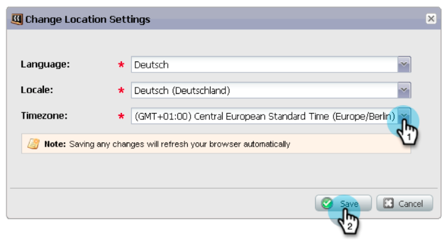
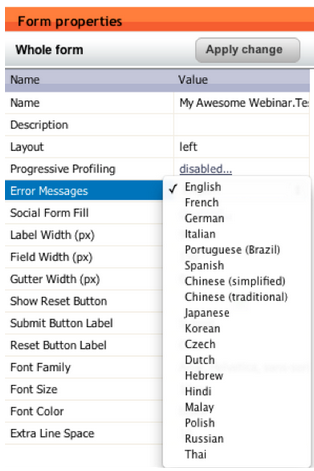
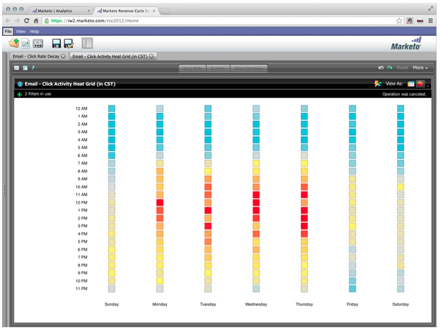
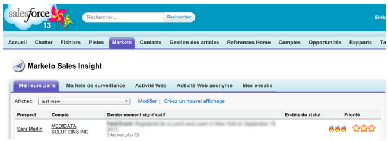
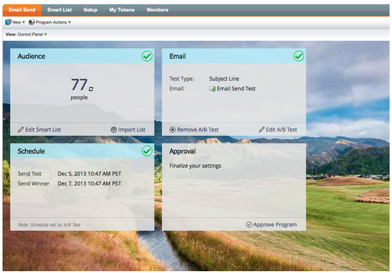

# 2013

## Gennaio 2013 {#january}

La versione di gennaio amplia l&#39;offerta social con **offerte di riferimento**. Inoltre, [!DNL Marketo Lead Management] utenti possono impostare il proprio fuso orario, la propria lingua e le proprie preferenze locali. Le funzionalità contrassegnate con &#42; sono disponibili solo in Select Edition.

## Offerte di riferimento {#referral-offers}

Una **Offerta di riferimento** offre ai lead un incentivo per segnalare i propri amici. Crea obiettivi e premi per i riferimenti di successo. Puoi utilizzarlo nelle pagine di destinazione, sul sito web e persino su Facebook.

## Preferenza fuso orario {#time-zone-preference}

Puoi modificare il fuso orario predefinito per il tuo account Marketo personale. Ad esempio, anche se il valore predefinito per l’abbonamento è Ora del Pacifico, puoi impostarlo sul valore Ora orientale per il tuo account.

## Seleziona la lingua [!DNL Marketo Lead Management] {#select-your-marketo-lead-management-language}

Puoi modificare la lingua predefinita per l’account utente di Marketo. Anche se l’abbonamento è in inglese, per impostazione predefinita è possibile cambiarlo in tedesco o francese.

## Messaggi di errore modulo multilingue {#multi-lingual-form-error-messages}

Quando un lead compila un modulo di Marketo, alcuni messaggi di convalida vengono incorporati automaticamente. È possibile selezionare una lingua di visualizzazione diversa per questi messaggi di errore. Supportiamo ora l&#39;inglese, il tedesco e il francese.

Un esempio di una forma francese:

## Seleziona la lingua [!DNL Sales Insight] (solo [!DNL Salesforce]) {#select-your-sales-insight-language-salesforce-only}

Se la preferenza per la lingua [!DNL Salesforce] è impostata sul francese o sul tedesco, Marketo [!DNL Sales Insight] rispetterà questa preferenza. Scarica l’ultimo pacchetto MSI per ottenere questa funzionalità (disponibile la settimana del 14 gennaio).

## Nome visualizzato campo {#field-display-name}

I nomi di visualizzazione dei campi possono visualizzare il testo in lingue diverse (ad esempio, sono supportati caratteri multibyte).

## Cambia dati programma {#change-program-data}

Il passaggio di flusso [!UICONTROL Change Program Data] consente di modificare manualmente lo stato [!UICONTROL Success] e [!UICONTROL Success Date] di un membro del programma tramite una campagna. È possibile utilizzare questo passaggio di flusso per correggere un errore o per modificare manualmente un membro che non ha partecipato al programma come previsto.

## Febbraio 2013 {#february}

La versione di febbraio include una funzionalità altamente richiesta, il supporto per [!DNL Apple Safari] e altri piccoli miglioramenti.

## Supporto ufficiale per [!DNL Apple Safari] {#official-support-for-apple-safari}

Le versioni più recenti di [!DNL Apple Safari] per Mac e [!DNL Windows] sono completamente supportate per l&#39;utilizzo con Gestione lead Marketo. Nota: [!DNL Safari] su iOS non è completamente compatibile.

## Miglioramenti dei webhook {#webhooks-enhancements}

I webhook vengono migliorati per l&#39;escape dei token nell&#39;URL/payload e possono inoltre aggiornare i campi lead di Marketo analizzando le risposte XML/JSON dai sistemi di terze parti (non disponibile in [!DNL Spark SMB Edition]).

## Endpoint API SOAP aggiornato {#updated-soap-api-endpoint}

L&#39;endpoint dell&#39;API SOAP preferito è stato aggiornato, come mostrato nell&#39;API [!UICONTROL Admin] -> SOAP. Aggiorna le chiamate per utilizzare questo nuovo endpoint. Le chiamate API al vecchio endpoint sono obsolete, ma continueranno a funzionare. (API SOAP non disponibile in [!DNL Spark SMB Edition])

## Supporto mobile per [!DNL Facebook] schede {#mobile-support-for-facebook-tabs}

[!DNL Facebook] schede pubblicate da Marketo rileveranno i dispositivi mobili e li indirizzeranno a una pagina di destinazione. In questo modo l&#39;utente otterrà il contenuto corretto sui dispositivi mobili su cui [!DNL Facebook] schede non sono supportate (disponibili in [!DNL Spark], [!DNL Standard], [!DNL Select SMB Editions] e [!DNL Marketo Social Marketing]).

## Disponibile a breve: supporto per più modelli {#coming-soon-support-for-multiple-models}

Stiamo gettando le basi per supportare modelli di cicli di ricavo multipli, votato #1&#39;idea per RCA nella Comunità, in una versione futura. In questa versione, noterai alcune modifiche tra cui i filtri per elenchi avanzati e Aggiungi scelte nei passaggi del flusso per supportare la selezione di un modello e un’area di visualizzazione. Stiamo inoltre spostando i campi Fase ricavi lead e Modello ciclo ricavi lead dalla scheda Griglia lead elenco avanzato.

## Marzo 2013 {#march}

Le seguenti funzioni sono incluse nella versione di marzo.

## File di calendario di Marketo {#marketo-calendar-files}

Crea un file del calendario come **Token personale** da utilizzare nelle e-mail di conferma e promemoria dell&#39;evento. Questo file di calendario integrato (ad esempio, il file .ics) eseguirà il rendering di tutti i token, inclusi i Miei token e il token `{{member.webinar URL}}`.

## Attendi fino a +/- {#wait-until}

Crea passaggi di attesa che possono eseguire un numero specificato di giorni prima o dopo un token di data. Ad esempio, puoi creare un passaggio di attesa che attende 3 giorni prima della data dell’evento e quindi inviare un promemoria.

Puoi creare un passaggio di attesa che dovrà attendere 14 giorni prima del compleanno del lead. Selezionando &quot;usa il prossimo anniversario di questa data&quot; il sistema ignorerà automaticamente l&#39;anno associato alla data e utilizzerà invece l&#39;anno di calendario corrente o successivo.

## Azioni sociali {#social-sweepstakes}

Una posta in palio dà la possibilità ai tuoi lead di vincere un premio e dire ai loro amici di te. Seleziona i vincitori a caso tra i partecipanti e inviali loro un’e-mail.

## Altre lingue del modulo [!UICONTROL Error Message] {#additional-form-error-message-languages}

Sono state aggiunte più di una dozzina di lingue ai messaggi di errore del modulo.

## Notizie e avvisi di supporto {#support-news-and-alerts}

Iscrivendoti alle Notizie e agli Avvisi per gli Avvisi P1, i Problemi noti, i suggerimenti dei nostri esperti di supporto e gli aggiornamenti dell’Assistenza clienti di Marketo, assicurati di rimanere in contatto con l’Assistenza clienti di Marketo.

## Aprile 2013 {#april}

Le seguenti funzioni sono incluse nella versione di aprile.

## Integrazione di [!DNL Box] {#box-integration}

Connetti Marketo con il tuo account [!DNL Box] per copiare facilmente i file in Design Studio.

## Plug-in [!DNL Gmail] {#gmail-plugin}

Se si utilizza Marketo [!DNL Sales Insight] e [!DNL Gmail], è possibile installare il nuovo plug-in [!DNL Gmail] tramite l&#39;archivio [!DNL Chrome]. Il plug-in consente di registrare i messaggi con Marketo, caricare modelli e-mail Marketo e inviare messaggi con le funzioni di tracciamento di Marketo.

## Analisi e-mail {#email-analysis}

Creare report e-mail avanzati in [!UICONTROL Revenue Explorer], ad esempio il report Click Activity Heat Grid. Questo rapporto fornisce ad insight il giorno e l’ora in cui le persone fanno clic sui collegamenti nelle e-mail.

La funzione di analisi dell’e-mail verrà attivata in più fasi in aprile e maggio, con la migrazione dei dati e-mail 2012 e 2013. In altre parole, alcuni clienti avranno accesso a questa funzione prima di altri.

## API del programma {#program-apis}

Supporto per i programmi nella chiamata API SOAP, incluso l’accesso in sola lettura ai dati del programma, ad esempio: conteggi di iscrizione al programma, acquisiti da, successo, impostazioni, canali, tag, token e costi. Per ulteriori informazioni, consulta la documentazione dell’API SOAP.

## Miglioramento di [!DNL ON24] {#on-enhancement}

La qualifica e il nome della società verranno sincronizzati con [!DNL ON24] dal modulo di registrazione di Marketo.

## Maggio 2013 {#may}

Le seguenti funzioni sono incluse nella versione di maggio.

## File di calendario per le pagine di destinazione {#calendar-files-for-landing-pages}

Crea un file del calendario come My Token che può essere aggiunto alla pagina di destinazione. Questo file di calendario integrato (ad esempio, il file .ics) eseguirà il rendering di tutti i token, inclusi i miei token, nelle pagine di destinazione delle risorse locali.

## Scheda Appartenenza al modello {#model-membership-tab}

Visualizza tutti i dati del membro del modello in un&#39;unica posizione per monitorare e risolvere facilmente i problemi. La nuova scheda [!UICONTROL Members] è una visualizzazione di sola lettura disponibile quando si seleziona un modello di ciclo dei ricavi approvato.

## Albero azioni flusso riorganizzato {#reorganized-flow-action-tree}

La struttura ad albero delle azioni di flusso appena riorganizzata consente di trovare più rapidamente le azioni di flusso.

## Azioni di flusso rinominate {#renamed-flow-actions}

Modifica stato progressione è ora [!UICONTROL Change Program Status]. I dati del programma di modifica sono ora [!UICONTROL Change Program Success].

## Giugno 2013 {#june}

Le seguenti funzioni sono incluse nella versione di giugno.

## Lingue utente aggiuntive {#additional-user-languages}

L&#39;interfaccia di Marketo Lead Management è disponibile nella lingua preferita e supporta lo spagnolo e il portoghese.

## Interfaccia utente cobalto {#cobalt-user-interface}

Nei prossimi mesi noterai un nuovo tema introdotto in diverse parti dell’applicazione, che ad esempio influisce sulle finestre modali.

## Clonazione sottocartelle {#subfolder-cloning}

Clonare le risorse in sottocartelle.

## Modelli multipli {#multiple-models}

Ideale per l’analisi del ciclo di ricavi nella community, questa funzione consente di creare più modelli per comprendere in modo più dettagliato il funnel dei ricavi per linea di prodotto, business unit o area geografica. I rapporti Lead per fase ricavi, Analisi del percorso di successo, Analizzatore di programma ed Esplora ricavi ora supportano la possibilità di selezionare un modello specifico per la generazione di rapporti.

Per impostazione predefinita, sono disponibili due modelli per Select SMB Edition e quindici modelli per Enterprise Edition. È possibile acquistare anche altri modelli.

## Luglio 2013 {#july}

Le seguenti funzioni sono incluse nella versione di luglio, pianificata per il rollout di venerdì 26 luglio.

## Widget di contenuto esaurito nel dashboard {#exhausted-content-widget-on-the-dashboard}

Fornisce informazioni su quando i lead esauriscono il contenuto all&#39;interno del flusso. Il sistema ti fornirà informazioni su quanti lead stanno per raggiungere contenuti esauriti o su quanto tempo i lead sono esauriti.

## Limiti di comunicazione {#communication-limits}

Vuoi interrompere l&#39;invio di e-mail in eccesso ai lead? Ora è facile limitare automaticamente la frequenza a ogni individuo. È sufficiente impostare un limite di comunicazione giornaliero e settimanale, e il sistema farà il resto. Disponibile in Select, Enterprise e con il pacchetto del componente aggiuntivo per i clienti Standard.

## Interfaccia utente cobalto {#cobalt-user-interface-july}

Nei prossimi mesi, noterai come il nostro nuovo tema verrà introdotto in diverse parti dell’applicazione. Nessuna funzionalità verrà spostata o rimossa.

## Colonna data membro programma {#program-member-date-column}

Visualizzare e ordinare la griglia membri in base alla data di aggiunta del lead.

## Modifiche al controllo ortografico in WYSIWYG Editor {#changes-to-spell-check-in-wysiwyg-editor}

Il servizio utilizzato dall’editor di WYSIWYG per il controllo ortografico è stato interrotto. Il pulsante Controllo ortografia è stato rimosso dall’editor fino a quando non è stata trovata una sostituzione.

## Agosto 2013 {#august}

Le seguenti funzioni sono incluse nella versione di agosto 2013.

**E-Mail Solo Testo**

Ora puoi inviare [solo la versione testuale](/help/marketo/product-docs/email-marketing/general/creating-an-email/create-a-text-only-email.md) di un&#39;e-mail. Tieni presente che i collegamenti non saranno decorati quando utilizzi questa opzione.

## Miglioramenti al motore di coinvolgimento dei clienti {#customer-engagement-engine-enhancements}

### Ignora contenuto esaurito {#ignore-exhausted-content}

Configurare il programma di coinvolgimento per [ignorare l&#39;esaurimento](/help/marketo/product-docs/email-marketing/drip-nurturing/using-engagement-programs/disable-and-enable-exhausted-content-notifications.md), inclusa la soppressione di eventuali notifiche.

## Test del flusso di coinvolgimento {#engagement-stream-testing}

Utilizza la [nuova funzionalità di test](/help/marketo/product-docs/email-marketing/drip-nurturing/engagement-program-streams/test-an-engagement-stream.md) per simulare un cast e testare il contenuto appena aggiunto a un flusso live.

## Test di invio personalizzato {#personalized-send-test}

Quando invii un test e-mail, puoi selezionare il nome di un lead per personalizzare l’e-mail del test.

## Token di sistema &quot;Visualizza e-mail come pagina web&quot; e &quot;Annulla iscrizione&quot; {#view-email-as-web-page-and-unsubscribe-system-tokens}

Utilizza questi [nuovi token](/help/marketo/product-docs/email-marketing/general/using-tokens/system-tokens-glossary.md) per fornire un maggiore controllo sul loro posizionamento nelle e-mail.

## Pulizia automatica campagna trigger {#automatic-trigger-campaign-cleanup}

Marketo ti invierà periodicamente una notifica e [disattiverà automaticamente le campagne trigger](/help/marketo/product-docs/core-marketo-concepts/smart-campaigns/using-smart-campaigns/automatic-trigger-campaign-cleanup.md) che non sono state eseguite negli ultimi sei mesi.

## Miglioramento di Marketo Financial Management {#marketo-financial-management-enhancement}

### Aggiornamento costo programma  {#program-cost-update}

La sincronizzazione dei costi del programma consente il tracciamento dei costi del programma su più piattaforme.

### Interfaccia utente cobalto {#cobalt-user-interface-august}

Stiamo continuando il rollout della nostra nuova interfaccia Cobalt. Questo progetto renderà tutto molto attraente in Marketo! L&#39;aggiornamento continuerà per tutto il resto dell&#39;anno.

## Settembre 2013 {#september}

Le seguenti funzioni sono incluse nella versione di settembre.

## URL più brevi {#shorter-urls}

Agli URL e-mail è stato assegnato un trim per essere facili da cliccare per il destinatario, preservando al contempo tutte le funzionalità di tracciamento

>[!CAUTION]
>
>Quando passiamo agli URL brevi, i collegamenti nelle e-mail inviate prima della versione di settembre scadranno 90 giorni dopo questa versione.

Utilizza i dati provenienti da oggetti personalizzati di Marketo o aggiungi una logica condizionale al contenuto dell’e-mail utilizzando il linguaggio del modello Velocity.

## Cambia il test di invio in Invia campione {#change-send-test-to-send-sample}

L’azione Invia test è stata rinominata Invia campione

## Personalizzato [!UICONTROL Send Sample Email] {#personalized-send-sample-email}

Quando invii un esempio di e-mail, puoi selezionare il nome di un lead per personalizzare l’e-mail di esempio.

## Sincronizzazione campi aggiuntivi per [!DNL GoToWebinar] {#additional-field-sync-for-gotowebinar}

È possibile sincronizzare il nome della società e la posizione lavorativa dal modulo Marketo a [!DNL GoToWebinar]. Per abilitare questi campi aggiuntivi, passare a Partner eventi e selezionare &quot;Abilita campi aggiuntivi&quot;.

## Limita l&#39;accesso degli utenti solo all&#39;SSO {#restrict-user-login-to-sso-only}

Configura le sottoscrizioni per consentire agli utenti di Marketo di accedere solo tramite SSO e non tramite la normale schermata di accesso

## Virus Scan dei file caricati {#virus-scan-of-uploaded-files}

I file caricati in Design Studio vengono analizzati e bloccati automaticamente se contengono virus

## Analizzatore influenza opportunità di esportazione {#export-opportunity-influence-analyzer}

È ora possibile esportare i dati in Analisi influenza opportunità in [!DNL Excel]. Ogni file [!DNL Excel] esportato contiene tutte le interazioni di marketing per tutti i lead (inclusi quelli senza un ruolo nell&#39;opportunità) nonché tutte le opportunità nell&#39;account selezionato nell&#39;analizzatore. Le righe dell’opportunità sono evidenziate in verde. Puoi utilizzare le funzionalità native di filtro dei dati di [!DNL Excel] se devi concentrarti su lead specifici o attività di marketing.

## Impostazioni di attribuzione programma {#program-attribution-settings}

Puoi modificare il modo in cui Marketo collega contatti e opportunità per le metriche di attribuzione di primo e più contatti, inclusa la possibilità di eseguire l’attribuzione basata sull’account. Queste impostazioni avranno un impatto sulle metriche di attribuzione nei rapporti [!UICONTROL Revenue Explorer] nell&#39;area Analisi opportunità del programma e nell&#39;area Analisi opportunità. Questo influirà anche sulle metriche di attribuzione in Analisi programma.

È possibile modificare le impostazioni di attribuzione del programma in una delle tre opzioni disponibili. La modifica di questa impostazione non comporta la modifica di dati Marketo o CRM, ma semplicemente modifica il modo in cui vengono eseguiti i rapporti e può essere ripristinato in qualsiasi momento.

L&#39;impostazione Esplicita esaminerà solo i contatti con i ruoli (comportamento corrente). Implicit esaminerà tutti i contatti associati all&#39;account indipendentemente dal ruolo. Se possibile, consigliamo vivamente di utilizzare la modalità esplicita. L’utilizzo di Implicit può creare falsi positivi, ossia persone che hanno il merito di un’opportunità nonostante non abbiano una reale influenza su di essa.

## [!UICONTROL Sales Insight] disponibile in francese e tedesco (solo [!DNL Salesforce]) {#sales-insight-available-in-french-and-german-salesforce-only}

Scarica la versione più recente di Marketo Lead Management e Marketo [!UICONTROL Sales Insight] da [!DNL AppExchange] per consentire ai venditori francesi e tedeschi di visualizzare il contenuto di [!UICONTROL Sales Insight] nella lingua preferita.

## Interfaccia utente cobalto {#cobalt-user-interface-september}

Nei prossimi mesi verrà introdotto un nuovo tema in diverse aree dell’applicazione. Questo mese, potresti notare altre nuove finestre modali blu.

## Ottobre 2013 {#october}

Le seguenti funzioni sono incluse nella versione di ottobre 2013.

## templates.marketo.com {#templates-marketo-com}

[Templates.marketo.com](/help/marketo/product-docs/demand-generation/landing-pages/landing-page-templates/guided-landing-page-template-list.md) mostra i modelli di e-mail e pagine di destinazione (inclusi i modelli di e-mail per dispositivi mobili responsive) che puoi scaricare da [!DNL Marketo Program Library]. I modelli verranno aggiunti mensilmente e sarà possibile controllarli nuovamente.

## developers.marketo.com {#developers-marketo-com}

[Developer.adobe.com](https://experienceleague.adobe.com/it/docs/marketo-developer/marketo/home) è destinato agli sviluppatori che desiderano creare integrazioni in Marketo. Puoi fare riferimento a diverse opzioni di integrazione, tra cui API JavaScript di Munchkin, esempi di codice API di SOAP, webhook e script di e-mail. Java SDK è disponibile anche su [GitHub](https://github.com/Marketo/SOAP-API-Java-Client).

## Aggiornamento dell&#39;adattatore eventi [!DNL BrightTALK] {#updated-brighttalk-event-adapter}

Sincronizza campi aggiuntivi da [!DNL BrightTALK] a Marketo, inclusi Nome società, Qualifica, Settore e Dimensione società.

## App di check-in evento Android Tablet {#android-tablet-event-check-in-app}

Controlla gli utenti registrati nel tuo evento utilizzando la nuova app di check-in basata su Android disponibile su Google Play.

## Dicembre 2013 {#december}

Le seguenti funzioni sono incluse nella versione di dicembre.

Dopo il rilascio, controlla la scheda Nuova versione nella community per articoli della Knowledge Base dettagliati per ogni funzione.

## Programma e-mail {#email-program}

Inviare un’e-mail non è mai stato così facile. Utilizza il nuovo [programma e-mail](/help/marketo/product-docs/email-marketing/email-programs/creating-an-email-program/understanding-email-programs.md) per inviare un&#39;e-mail batch, invece del programma predefinito. Definisci l’elenco avanzato, invia un’e-mail all’indirizzo e pianifica l’invio.

Controlla anche il nuovo [Dashboard delle metriche e-mail](/help/marketo/product-docs/email-marketing/email-programs/email-program-data/view-the-email-program-dashboard.md) per vedere le prestazioni dell&#39;e-mail.

## Test A/B e-mail {#email-a-b-testing}

Nel nuovo programma e-mail, esegui un test [A/B](/help/marketo/product-docs/email-marketing/email-programs/email-program-actions/email-test-a-b-test/add-an-a-b-test.md) su una percentuale della popolazione complessiva di invio e-mail. Puoi scegliere tra 4 diversi tipi di test: riga dell’oggetto, indirizzo mittente, data/ora e e-mail intera. Puoi anche scegliere di promuovere manualmente il vincitore o lasciare che il sistema lo promuova in base a criteri di vincita predefiniti. Il nuovo programma E-mail, incluso il test A/B, può essere nidificato in Eventi e il programma predefinito per rendere l’invio dell’e-mail così semplice.

## Test di Email Champion/Challenger {#email-champion-challenger-testing}

[Il test Champion/Challenger](/help/marketo/product-docs/email-marketing/general/functions-in-the-editor/email-tests-champion-challenger/add-an-email-champion-challenger.md) è simile al test A/B, ma la differenza è che viene utilizzato per le e-mail attivate e non si invia automaticamente un vincitore. Questo test ti permette di sfidare un modo consolidato di fare qualcosa, chiamato Champion, e di verificare se è ancora il migliore introducendo un Challenger. Inoltre, i test e-mail Champion/Challenger possono essere utilizzati all’interno dei flussi del programma di coinvolgimento.

## Dettagli lead in [!UICONTROL Email Analysis] {#lead-details-in-email-analysis}

Sono stati introdotti ulteriori attributi lead e società in [!UICONTROL Email Analysis]. Ora puoi visualizzare le statistiche dei messaggi e-mail raggruppate per nuovi attributi, ad esempio [!UICONTROL Industry] e [!UICONTROL Lead Source].

## Adattatore evento [!DNL BrightTALK] avanzato {#enhanced-brighttalk-event-adapter}

Ora puoi richiamare gli utenti registrati in Marketo dal tuo canale ed evento [!DNL BrightTALK]. Puoi utilizzare queste informazioni per informare altre campagne di marketing.

