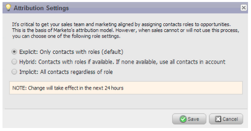
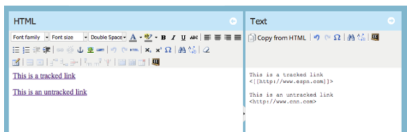
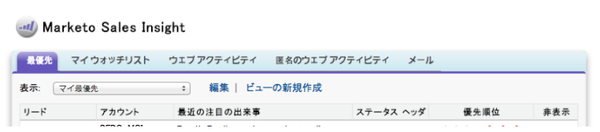
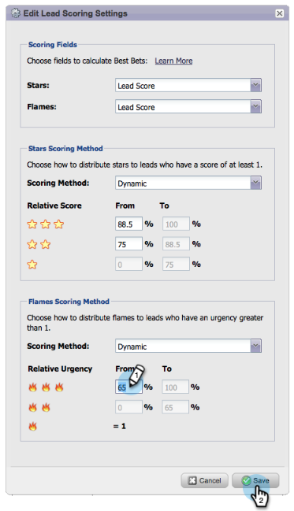
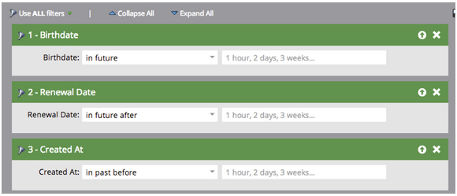

# 2014

## Gennaio 2014 {#january}

Le seguenti funzioni sono incluse nella versione di gennaio 2014. Verificare la disponibilità della funzionalità in [Marketo Edition](https://www.marketo.com/pricing/).

## Forms 2.0 {#forms}

Heads up: la documentazione di Forms 2.0 sarà presto disponibile.

Assumi il controllo del processo di creazione dei moduli e interrompi il lavoro degli sviluppatori web. Forms 2.0 è progettato per consentire agli addetti al marketing di creare moduli affidabili sia dal punto di vista visivo che funzionale, senza dover conoscere le esigenze di programmazione.

**Offri al tuo Forms il restyling visivo che merita:**

Le progettazioni dei temi, la personalizzazione dei pulsanti e i layout flessibili consentono di progettare forme dall’aspetto moderno che si adattano perfettamente all’aspetto del sito.

**Visibilità condizionale e logica della pagina di completamento:**

Vuoi che &quot;Stato&quot; venga visualizzato solo se un utente seleziona Stati Uniti come proprio &quot;Paese&quot;? Che ne dici di presentare ai clienti white paper diversi in base al modo in cui rispondono alle domande nel modulo? Crea una logica condizionale nei moduli direttamente dall’editor. Nessun [!DNL javascript] richiesto.

**Incorpora facilmente Forms nelle tue pagine di destinazione:**

Sono finiti i giorni in cui si solleva il codice HTML dai moduli inseriti nelle pagine di destinazione di Marketo e li si rilascia in un [!DNL iFrame]. È sufficiente acquisire il codice da incorporare e inserirlo nella pagina di destinazione in cui desideri eseguire il rendering del modulo. Due modalità, normale e lightbox, offrono ancora più flessibilità con Marketo Forms sul sito.

## Limiti di comunicazione per il programma e-mail {#communication-limits-for-email-program}

[Impostare i limiti di comunicazione in un programma di posta elettronica](/help/marketo/product-docs/email-marketing/email-programs/email-program-actions/enable-disable-communication-limits-in-an-email-program.md) per evitare comunicazioni eccessive al database. Se una persona supera il limite definito, non riceverà l’e-mail.

## Campi aggiuntivi nell’analisi dell’appartenenza al programma {#additional-fields-in-program-membership-analysis}

Ora puoi aggiungere e raggruppare le metriche di analisi dell’iscrizione al programma in base agli attributi del lead e dell’azienda. Ad esempio, puoi aggiungere il campo Settore per visualizzare la suddivisione dei membri e dei successi del programma.

## Febbraio 2014 {#february}

Le seguenti funzioni sono incluse nella versione di febbraio 2014. Per informazioni sulla disponibilità delle funzioni, controllare la Marketo Edition. Dopo il rilascio, torna a trovare i collegamenti agli articoli della Knowledge Base dettagliati per ogni funzione.

## [!UICONTROL Engagement Score] come criterio vincente {#engagement-score-as-winning-criteria}

[Utilizza il punteggio di coinvolgimento](/help/marketo/product-docs/email-marketing/email-programs/email-program-actions/email-test-a-b-test/define-the-a-b-test-winner-criteria.md) per determinare la variante vincente nel test A/B split o nel test Champion/Challenger. Il test deve essere eseguito per un minimo di 24 ore, per ottenere un punteggio di coinvolgimento adeguato.

## Scheda Programma e-mail [!UICONTROL Results] {#email-program-results-tab}

[Visualizza i risultati](/help/marketo/product-docs/email-marketing/email-programs/email-program-data/view-email-program-results.md) e le attività registrate per il programma e-mail.

## Persone/[!UICONTROL Leads] bloccate per l&#39;invio {#people-leads-blocked-from-mailing}

[Fai clic sul numero di persone/lead che non possono inviare](/help/marketo/product-docs/email-marketing/email-programs/managing-people-in-email-programs/define-an-audience-with-a-smart-list.md) per vedere chi non riceverà l&#39;e-mail perché è stato annullato l&#39;abbonamento, inserito nella blacklist, ha un indirizzo e-mail non valido o vuoto o perché il marketing è stato sospeso.

## Esporta dati programma e-mail {#export-email-program-data}

[Esporta metriche e-mail in [!DNL Excel]](/help/marketo/product-docs/email-marketing/email-programs/email-program-data/export-email-program-dashboard-to-excel.md), inclusi i dati della variante del test AB.

## [!UICONTROL Engagement Score] nel report [!UICONTROL Engagement Stream Performance] {#engagement-score-in-engagement-stream-performance-report}

Abbiamo aggiunto il punteggio di coinvolgimento al report [[!UICONTROL Engagement Stream Performance]](/help/marketo/product-docs/email-marketing/drip-nurturing/reports-and-notifications/engagement-stream-performance-report.md) per aiutarti a vedere l&#39;efficacia del contenuto nel tuo programma di coinvolgimento.

## Dettagli del programma in E-mail Analysis {#program-details-in-email-analysis}

Ora puoi raggruppare le metriche e-mail per Nome programma, Canale e Tag. Il nome del programma viene aggiunto al campo Nome e-mail quando l’e-mail è una risorsa locale del programma. Il nuovo campo Nome programma mostra il nome del programma della campagna avanzata che ha inviato l’e-mail. Potrebbe essere diverso dal programma nel campo Nome e-mail se l’e-mail è una risorsa locale di un altro programma.

## Aggiorna a Clic, Collega filtri e attivatore {#update-to-clicks-link-filters-and-trigger}

Sono stati aggiornati i seguenti nomi di filtro e attivatore:

* Clic sul collegamento a [!UICONTROL Clicks Link on Web Page]
* Collegamento a [!UICONTROL Clicked Link on Web Page] su cui è stato fatto clic
* Collegamento a [!UICONTROL Not Clicked Link on Web Page] non selezionato

## Miglioramenti di Forms 2.0 {#forms-enhancements}

Con questa versione di Forms 2.0 sono stati apportati diversi aggiornamenti relativi alla &quot;qualità della vita&quot;. Oltre ad abilitare la profilatura progressiva sui moduli incorporati, sono state apportate modifiche al flusso di lavoro e all&#39;interfaccia utente che semplificheranno l&#39;utilizzo delle funzionalità più avanzate nell&#39;editor, [incluse le regole di visibilità](/help/marketo/product-docs/demand-generation/forms/form-fields/dynamically-toggle-visibility-of-a-form-field.md), le pagine di ringraziamento avanzate e i campi nascosti.

## Marzo 2014 {#march}

Le seguenti funzioni sono incluse nella versione di marzo 2014. Per informazioni sulla disponibilità delle funzioni, controllare la Marketo Edition. Dopo il rilascio, torna indietro per i collegamenti agli articoli della knowledge base per ogni funzione.

## Pulsante Aggiorna dashboard programma e-mail {#email-program-dashboard-refresh-button}

Utilizza il [pulsante di aggiornamento](/help/marketo/product-docs/email-marketing/email-programs/email-program-data/use-the-email-program-dashboard.md) per ottenere metriche e-mail aggiornate sull&#39;invio di e-mail o sul test AB.

## Annulla/Ripristina nell’editor e-mail e nell’editor frammenti {#undo-redo-in-the-email-editor-and-snippet-editor}

[Annulla o ripristina](/help/marketo/product-docs/email-marketing/general/email-editor-2/edit-elements-in-an-email.md) fino a 50 azioni per la sessione corrente.

## Colonne dello stato del programma nel rapporto sulle prestazioni del programma {#program-status-columns-in-program-performance-report}

Quando si utilizza il [report sulle prestazioni del programma](/help/marketo/product-docs/core-marketo-concepts/programs/program-performance-report/add-program-status-columns-to-a-program-report.md), è ora possibile vedere quante persone si trovano in quali stati del programma.

## Programmi inclusivi e operativi per Analytics {#inclusive-and-operational-programs-for-analytics}

È ora possibile includere i programmi senza costi di periodo in [!UICONTROL Revenue Explorer] e Analyzer impostando l&#39;opzione Comportamento di Analytics su &quot;Inclusivo&quot; quando si modificano i canali del programma. È inoltre possibile escludere tutti i programmi operativi dal reporting scegliendo &quot;Operativo&quot;.

## Opzioni ibride e implicite per la conversione dei lead {#hybrid-and-implicit-options-for-lead-conversion}

In Analisi lead è possibile modificare il modo in cui Marketo collega contatti e opportunità per le metriche di conversione dei lead. È possibile [modificare l&#39;impostazione di attribuzione](/help/marketo/product-docs/administration/settings/change-attribution-settings-for-analytics.md) in una delle tre opzioni disponibili. La modifica di questa impostazione non comporta la modifica di dati Marketo o CRM, ma semplicemente modifica il modo in cui vengono eseguiti i rapporti e può essere ripristinato in qualsiasi momento.

L’impostazione Esplicita tratterà solo i contatti con i ruoli in un’opportunità come lead convertiti (comportamento predefinito). Implicit tratterà tutti i contatti associati all’account nell’opportunità, indipendentemente dal ruolo, come convertiti. Hybrid tratta i contatti con i ruoli come convertiti se disponibili; se non ne è disponibile uno, tutti i contatti nell’account vengono trattati come convertiti.

Come promemoria, questa impostazione modifica anche le metriche di attribuzione del programma.

## Lingua utente aggiuntiva {#additional-user-language}

Seleziona [Lingua Dell&#39;Applicazione Marketo](/help/marketo/product-docs/administration/settings/change-time-zone.md). Visualizza l&#39;interfaccia Gestione lead di Marketo nella lingua preferita, che ora supporta il giapponese.

## Blog per sviluppatori Marketo {#marketo-developer-blog}

Il blog [Marketo Developer](https://developers.marketo.com/blog/) è dedicato agli sviluppatori Web e agli ingegneri software che supportano le esigenze in rapida evoluzione del moderno addetto al marketing. Puoi abbonarti e ricevere annunci sulle nuove opzioni di integrazione, sugli aggiornamenti delle versioni API e su una nuova serie di articoli che includono esempi di codice e best practice sull’integrazione con la piattaforma Marketo.

Il [primo articolo](https://developers.marketo.com/blog/retrieving-customer-and-prospect-information-from-marketo-using-the-api/) di questa serie illustra come recuperare in modo efficiente le informazioni sulle persone (clienti/contatti/lead) memorizzate in Marketo utilizzando l&#39;API.

## Maggio 2014 {#may}

Le seguenti funzioni sono incluse nella versione di maggio 2014. Per informazioni sulla disponibilità delle funzioni, controllare la Marketo Edition. Dopo il rilascio, torna a trovare i collegamenti agli articoli della Knowledge Base dettagliati per ogni funzione.

## Elimina Workspace {#delete-workspace}

Ora puoi [eliminare un&#39;area di lavoro inutilizzata](/help/marketo/product-docs/administration/workspaces-and-person-partitions/delete-a-workspace.md). Accertati di spostare tutte le risorse in un’altra area di lavoro prima di tentare di eliminarla.

## Pianifica primo cast {#schedule-first-cast}

Nei programmi di coinvolgimento, puoi pianificare la data di esecuzione del [primo cast](/help/marketo/product-docs/email-marketing/drip-nurturing/engagement-program-streams/set-stream-cadence.md). Ad esempio, specificate la cadenza ogni 2 settimane e selezionate la data del primo cast.

## Programmi di coinvolgimento migliorati {#enhanced-engagement-programs}

Ora tutti ottengono più programmi, flussi e limiti di comunicazione.

## Tracciamento dei collegamenti nelle e-mail di testo {#link-tracking-in-text-emails}

[Aggiungi parentesi quadre doppie](/help/marketo/product-docs/email-marketing/general/functions-in-the-editor/add-tracked-links-to-a-text-email.md) intorno agli URL nella versione testuale delle e-mail per indicare quando i collegamenti devono essere convertiti in collegamenti di tracciamento Marketo reindirizzati

>[!NOTE]
>
>**Esempio**
>
>`[[https://www.marketo.com]]`

Per impostazione predefinita, non viene tracciato alcun collegamento nella versione testuale delle e-mail. Aggiungi questa nuova sintassi per indicare quando un collegamento deve essere convertito in un collegamento di tracciamento. Il comportamento dei collegamenti HTML è invariato.  Per aggiungere collegamenti tracciati alle e-mail:

* **Versione HTML:** Inserisci il collegamento. Per impostazione predefinita, ne viene tenuta traccia.
* **Versione testo:** Immettere l&#39;URL racchiuso tra parentesi quadre.

Per aggiungere collegamenti non tracciati alle e-mail:

* **Versione HTML:** Inserire il collegamento e aggiungere la classe &quot;mktNoTrack&quot; al collegamento.
* **Versione testo:** Inserisci l&#39;URL. Per impostazione predefinita, la registrazione viene annullata.

## Collega markup nelle e-mail di esempio {#link-markup-in-sample-emails}

Scopri in anticipo il comportamento dei collegamenti nelle e-mail. Le e-mail di esempio ora visualizzano i collegamenti esattamente come apparirebbero ai lead. Visualizza in anteprima quali collegamenti sono stati convertiti in collegamenti di tracciamento, per consentirti di comprendere meglio come il messaggio verrà effettivamente visualizzato ai destinatari.

## [!UICONTROL Abort Campaign] {#abort-campaign}

Non farti prendere dal panico! Se si verifica un errore, utilizzare il nuovo pulsante [interrompi campagna](/help/marketo/product-docs/core-marketo-concepts/smart-campaigns/using-smart-campaigns/abort-a-smart-campaign.md) per interrompere immediatamente le campagne nei brani. Riceverai una notifica che indica quanti lead erano in sospeso in ogni passaggio di flusso al momento dell’interruzione della campagna.

## [!UICONTROL Sales Insight] in giapponese, portoghese e spagnolo {#sales-insight-in-japanese-portuguese-and-spanish}

Scarica la versione più recente di [!UICONTROL Sales Insight] da AppExchange in modo che i tuoi agenti di vendita di lingua giapponese, portoghese e spagnola possano visualizzare il contenuto di [!UICONTROL Sales Insight] nella loro lingua preferita.

## Stato del programma e tempistica di successo nell’analisi dell’iscrizione al programma {#program-status-and-success-timeframe-in-program-membership-analysis}

Visualizzare il numero di membri presenti in ogni stato del programma e quando sono passati a ogni stato, inclusa la data in cui hanno raggiunto il successo del programma.

## E-mail test A/B in [!UICONTROL Email Analysis] {#a-b-test-emails-in-email-analysis}

Generare rapporti su ciascuna variante di e-mail per test A/B in [!UICONTROL Email Analysis].

## Modifiche al pacchetto di Analytics {#analytics-packaging-changes}

Modeler del ciclo dei ricavi e Success Path Analyzer sono ora inclusi in MA Standard Edition.

## Informazioni sulla piattaforma mobile {#mobile-platform-info}

[Segmentazione e attivazione](/help/marketo/product-docs/reporting/basic-reporting/report-activity/build-a-people-performance-report-with-mobile-platform-columns.md) dell&#39;apertura e del clic delle e-mail dei lead dai loro dispositivi mobili.

## Giugno 2014 {#june}

Le seguenti funzioni sono incluse nella versione di giugno 2014. Per informazioni sulla disponibilità delle funzioni, controllare la Marketo Edition.

## Interfaccia utente aggiornata a breve. {#updated-ui-coming-soon}

Un nuovo aspetto, inclusa la navigazione per [!DNL Marketo Lead Management], sarà presto disponibile in una versione successiva.

## Plug-in [!DNL Sales Insight] per [!DNL Outlook] 2013 {#sales-insight-plugin-for-outlook}

Sarà necessario scaricare il nuovo plug-in. Puoi scaricarlo da [qui](/help/marketo/product-docs/marketo-sales-insight/msi-outlook-plugin/install-the-marketo-email-add-in-for-outlook-with-a-registration-code.md).

## Risoluzione token {#token-resolution}

Quando si invia un&#39;e-mail di test da [!DNL Sales Insight], i token presenti nell&#39;e-mail non vengono risolti e viene inviato il valore predefinito. Questo miglioramento garantirà la risoluzione dei token nelle e-mail di test.

## Personalizza percentuali per stelle e fiamme {#customize-percentages-for-stars-and-flames}

[Impostare la percentuale](/help/marketo/product-docs/marketo-sales-insight/msi-for-salesforce/features/stars-and-flames/customize-stars-and-flames.md) di lead che ricevono 1, 2 o 3 stelle e fiamme.

## API REST lead {#lead-rest-api}

Crea, leggi e aggiorna i lead a livello di programmazione tramite la nuova API ReST. Per iniziare a utilizzare ReST è necessario [creare un servizio personalizzato](/help/marketo/product-docs/administration/additional-integrations/create-a-custom-service-for-use-with-rest-api.md) in Marketo. Per informazioni dettagliate sull&#39;utilizzo di questa API, visita il [sito per sviluppatori](https://experienceleague.adobe.com/it/docs/marketo-developer/marketo/rest/rest-api).

## Aggiornamento pagina campagne Marketo Real-Time Personalization (RTP) {#marketo-real-time-personalization-rtp-campaigns-page-update}

Le campagne RTP ora includono un nuovo design con visualizzazioni di miniature e prestazioni della campagna. Inoltre, puoi [organizzare le campagne](/help/marketo/product-docs/web-personalization/working-with-web-campaigns/sort-web-campaigns-by-latest-or-top-performing.md) in base alla data o alle prestazioni migliori.

## Integrazioni di Web Analytics {#web-analytics-integrations}

Aggiungi tutti i dati RTP nella piattaforma di analisi web.

L&#39;integrazione con [Google Analytics](/help/marketo/product-docs/web-personalization/reporting-for-web-personalization/web-analytics-integrations/integrate-rtp-with-google-analytics.md) (GA) è ora attivata per impostazione predefinita, quindi in Impostazioni account attivare il parametro per cui si desidera inviare i dati alle variabili ed eventi personalizzati GA.

È stata inoltre completata l&#39;integrazione con [Adobe SiteCatalyst](/help/marketo/product-docs/web-personalization/reporting-for-web-personalization/web-analytics-integrations/integrate-with-adobe-analytics.md).

## Luglio 2014 {#july}

Le seguenti funzioni sono incluse nella versione di luglio 2014. Per informazioni sulla disponibilità delle funzioni, controllare la Marketo Edition. Torna indietro dopo il rilascio per collegamenti alla documentazione dettagliata delle funzioni.

## Calendario marketing {#marketing-calendar}

Visualizza tutti gli eventi, le e-mail e altro nei vari programmi. [Questo nuovo prodotto](/help/marketo/product-docs/core-marketo-concepts/marketing-calendar/understanding-the-calendar/navigating-the-marketing-calendar.md) sarà disponibile gratuitamente per i clienti con un massimo di 10 [!DNL Marketo Lead Management] o utenti Dialog.

La documentazione sul calendario di marketing sarà disponibile al momento del rilascio.

## Nuovo look and feel {#new-look-and-feel}

[!DNL Marketo Lead Management] verrà aggiornato con un nuovo aspetto moderno ed elegante e include una navigazione aggiornata.

## Operatori data {#date-operators}

[Filtri avanzati](/help/marketo/product-docs/core-marketo-concepts/smart-lists-and-static-lists/creating-a-smart-list/smart-list-filter-operators-glossary.md) per &quot;[!UICONTROL in past before]&quot;, &quot;[!UICONTROL in future]&quot; e &quot;[!UICONTROL in future after]&quot;. Ad esempio, trova i lead con una data di nascita nei successivi 3 mesi o un contratto che scade dopo 6 mesi.

## Vista Pianificazione del programma {#program-schedule-view}

Oltre al calendario di marketing con cui gestisci gli eventi e i programmi predefiniti, sul programma viene visualizzata una nuova visualizzazione della pianificazione.

* Riprogramma tutte le date contemporaneamente
* Nuove Date Provvisorie - matita!
* Tipi di voce personalizzati - Da fare, Comunicato stampa, tutto ciò che si desidera

## Elencare le operazioni nell’API REST {#list-operations-in-the-rest-api}

Abbiamo aggiunto le seguenti chiamate relative alle operazioni di elenco in ReST. Per la documentazione completa, consulta [https://experienceleague.adobe.com/en/docs/marketo-developer/marketo/rest/rest-api](https://experienceleague.adobe.com/it/docs/marketo-developer/marketo/rest/rest-api).

* Ottieni elenco per ID
* Ottieni più elenchi
* Importa nell&#39;elenco
* Ottieni stato importazione in elenco

## Importazione elenchi rapidi {#fast-list-import}

Più di **50x più veloce**, i tuoi file si ingrandiranno in Marketo! Le precedenti opzioni di importazione &quot;Normale&quot; e &quot;Ottimizzato per nuovi lead&quot; sono state sostituite da &quot;Predefinito (Importazione rapida)&quot;.

L’opzione &quot;Ignora nuovi lead e aggiornamenti&quot; rimane invariata.

## Nuovo Munchkin migliorato {#new-improved-munchkin}

Il rollout sarà messo in scena a partire da metà luglio e continuerà per diversi mesi.

* Rimuove la dipendenza [!DNL jQuery] per compatibilità completa e futura
* Più compatibile con altri JavaScript sul tuo sito
* Completamente testato su molti siti nel corso dell&#39;ultimo anno!

## RTP: modelli di campagne Personalization in tempo reale {#rtp-real-time-personalization-campaign-templates}

La pagina Imposta campagna RTP ora [include modelli già pronti](/help/marketo/product-docs/web-personalization/using-templates/using-templates-to-create-web-campaigns.md). Scegli tra una varietà di stili tra cui webinar, case study, ebook.

## RTP: miglioramenti API di JavaScript {#rtp-javascript-api-enhancements}

Nuova chiamata API RTP per ottenere i dati dei visitatori in tempo reale come organizzazione, settore, posizione e corrispondenza del codice di segmento. Inoltre, passando il cursore sul nome di un segmento nella pagina Segmenti viene visualizzata una descrizione comando che mostra il codice del segmento. Per la documentazione completa, consulta il [sito per sviluppatori](https://experienceleague.adobe.com/en/docs/marketo-developer/marketo/javascriptapi/rich-media-recommendation).

## RTP: supporto di HTML5 nell’editor di contenuti di Campaign {#rtp-html-support-in-campaign-content-editor}

L’editor di contenuti WYSIWYG nella pagina Imposta campagne ora è completamente compatibile con HTML5. Fai clic sull’icona &quot;HTML&quot; all’interno dell’editor per inserire un codice HTML5.

## Agosto 2014 {#august}

Le seguenti funzioni sono incluse nella versione di agosto 2014. Verifica la disponibilità delle funzioni nella tua edizione di Marketo. Torna indietro dopo il rilascio per collegamenti alla documentazione dettagliata delle funzioni.

## Licenze Marketing Calendar {#marketing-calendar-licenses}

Dopo il 5 settembre 2014, solo 5 utenti possono avere accesso gratuito al calendario di marketing. Assicurati di [rilasciare/revocare una licenza di Marketing Calendar](/help/marketo/product-docs/core-marketo-concepts/marketing-calendar/understanding-the-calendar/issue-revoke-a-marketing-calendar-license.md) agli utenti da te scelti prima di tale data per un accesso ininterrotto.

## Autorizzazioni per nuovi utenti {#new-user-permissions}

Sono state aggiunte le seguenti nuove autorizzazioni utente:

| Autorizzazione | Descrizione |
|---|---|
| Accedi a Gestione ricavi | Se hai acquistato RCA, ora avrai il controllo su chi può accedervi. |
| Importa elenco | Impedisci agli utenti di importare elenchi nel database dei lead. |
| Importazione elenco | Limita gli utenti dall’importazione di elenchi tramite un programma in attività di marketing. |
| Attiva campagna trigger | Controlla chi può e non può attivare le campagne di attivazione. |
| Pianifica campagna batch | Controlla chi può e non può pianificare le esecuzioni delle campagne batch. |

## Esporta utenti e ruoli da [!UICONTROL Admin] {#export-users-and-roles-from-admin}

È ora possibile [esportare un elenco di utenti e ruoli](/help/marketo/product-docs/administration/users-and-roles/export-a-list-of-users-and-roles.md) da Marketo. Puoi anche includere nell’esportazione il timestamp &quot;Last Login&quot; (Ultimo accesso).

## Elimina canali e tag {#delete-channels-and-tags}

Ora puoi eliminare tutti i canali e gli stati non utilizzati. Come sempre, è possibile nasconderne solo uno attualmente in uso.

## [!DNL DKIM] automatizzato {#automated-dkim}

Per migliorare il recapito messaggi, tutte le e-mail in uscita saranno firmate [!DNL DKIM] (DomainKeys Identified Mail). Per impostazione predefinita, le e-mail utilizzeranno la firma [!DNL DKIM] condivisa di Marketo. È possibile personalizzare la firma.

>[!NOTE]
>
>Verrà eseguito il rollout di [!DNL DKIM] lentamente. È possibile che non venga visualizzato per alcune settimane.

## Aggiornamenti di Real-Time Personalization {#real-time-personalization-updates}

Abbiamo aggiunto delle etichette alla pagina della campagna per consentirti di assegnare tag al contenuto dei tuoi cuori.

## Targeting per dispositivi mobili {#mobile-targeting}

Hai chiesto alla community e abbiamo consegnato il progetto! Ora puoi includere, escludere o impostare un call to action specifico per gli utenti di dispositivi mobili e tablet.

## Segmentazione e targeting migliorati per 1:1 {#enhanced-segmentation-and-targeting}

Ora puoi utilizzare operatori di filtro avanzati per il targeting di visitatori noti.

## Condivisione di campagne {#campaign-sharing}

Ora puoi condividere in modo rapido e semplice il collegamento di anteprima di una campagna RTP.

## Report del motore di consigli sui contenuti {#content-recommendation-engine-report}

È stato aggiunto un nuovo report sul motore di consigli dei contenuti per consentirti di visualizzare un riepilogo efficace.

## Amministrazione utenti migliorata {#enhanced-user-administration}

Gli utenti amministratori possono ora bloccare gli utenti a causa di più tentativi di accesso non riusciti. Puoi anche sbloccarli, se lo desideri.

## Controllo del tracciamento {#tracking-control}

Ora puoi escludere IP specifici da tutte le attività di tracciamento e reporting in Real-Time Personalization.

## Ottobre 2014 {#october}

Verifica la disponibilità delle funzioni nella tua edizione di Marketo. La documentazione verrà fornita al momento del rilascio.

## Focus sul programma nel calendario di marketing {#program-focus-in-marketing-calendar}

[Crea e modifica le voci](/help/marketo/product-docs/core-marketo-concepts/marketing-calendar/understanding-the-calendar/understand-enable-program-focus.md) direttamente dal calendario di marketing.

## Nuove chiamate API REST {#new-rest-api-calls}

Utilizza l’API per richiamare nuove attività o modifiche ai lead:

* Ottieni modifiche lead
* Ottieni attività lead
* Ottieni tipi di attività
* Ottieni token di paging

I dettagli completi saranno disponibili dopo il rilascio all&#39;indirizzo [https://experienceleague.adobe.com/en/docs/marketo-developer/marketo/rest/rest-api](https://experienceleague.adobe.com/it/docs/marketo-developer/marketo/rest/rest-api).

## MSI - Invia e-mail Marketo per [!DNL Microsoft Dynamics] {#msi-send-marketo-email-for-microsoft-dynamics}

[Invia e tieni traccia delle e-mail di vendita](/help/marketo/product-docs/marketo-sales-insight/msi-for-microsoft-dynamics/setting-up-and-using/send-a-marketo-sales-email-from-microsoft-dynamics.md) ai lead e ai contatti da [!DNL Microsoft Dynamics].

## MSI - Aggiungi a campagne Marketo per [!DNL Microsoft Dynamics] {#msi-add-to-marketo-campaigns-for-microsoft-dynamics}

[Aggiungi lead e contatti alle campagne Smart di Marketo](/help/marketo/product-docs/marketo-sales-insight/msi-for-microsoft-dynamics/setting-up-and-using/add-a-lead-contact-to-a-marketo-campaign-from-microsoft-dynamics.md) direttamente da [!DNL Microsoft Dynamics]. Il marketing può scegliere quali campagne Marketo sono disponibili per le vendite.

## Supporto entità personalizzata per la sincronizzazione [!DNL Microsoft Dynamics] {#custom-entity-support-for-microsoft-dynamics-sync}

[Utilizza i dati oggetto personalizzati](/help/marketo/product-docs/crm-sync/microsoft-dynamics-sync/microsoft-dynamics-sync-details/enable-sync-for-a-custom-entity.md) di [!DNL Microsoft Dynamics] per filtrare e attivare elenchi avanzati, campagne avanzate e programmi...

## Supporto per gli azionisti per la sincronizzazione di [!DNL Microsoft Dynamics] {#shareholder-support-for-microsoft-dynamics-sync}

Sincronizza i dati dell&#39;azionista dell&#39;opportunità da [!DNL Dynamics]. Sono supportate anche le opportunità connesse a un account tramite il campo &quot;Account principale&quot; e le opportunità connesse al contatto tramite la sincronizzazione &quot;Contatto principale&quot;.

## RTP - Miglioramenti del dashboard {#rtp-dashboard-enhancements}

La dashboard è ora migliorata per includere più dati immediati:

* Visite organizzative totali
* Primi 5 settori produttivi
* Totale visitatori coinvolti

## RTP - Nuovi modelli mobili per campagne {#rtp-new-mobile-templates-for-campaigns}

[crea campagne per dispositivi mobili](/help/marketo/product-docs/web-personalization/using-templates/using-templates-to-create-web-campaigns.md) in modo rapido e semplice con questi nuovi modelli.

## RTP - API contesto utente {#rtp-user-context-api}

Utilizza una nuova chiamata che tiene traccia della cronologia delle visite precedenti del visitatore. Personalizza le campagne in base al:

* Pagine visualizzate in precedenza
* Prodotti interessati a
* Quali campagne RTP hanno visto

Visita [https://experienceleague.adobe.com/en/docs/marketo-developer/marketo/javascriptapi/rich-media-recommendation](https://experienceleague.adobe.com/en/docs/marketo-developer/marketo/javascriptapi/rich-media-recommendation) per informazioni dettagliate.

## Dicembre 2014 {#december}

Le seguenti funzioni sono incluse nella versione di dicembre 2014. Per informazioni sulla disponibilità delle funzioni, controllare la Marketo Edition. Dopo il rilascio, torna indietro per trovare i collegamenti agli articoli dettagliati per ogni funzione.

## [!DNL Sales Insight] report {#sales-insight-reports}

Il [[!DNL Sales Insight] Rapporto prestazioni e-mail](/help/marketo/product-docs/marketo-sales-insight/msi-for-salesforce/features/performance-reports/sales-insight-email-performance-report.md) consente di visualizzare le metriche delle e-mail per e-mail e rappresentante commerciale. Supporta le e-mail inviate tramite [!DNL Salesforce], [!DNL Microsoft Dynamics], il plug-in [!DNL Outlook] e il plug-in [!DNL Gmail].

## [!DNL Facebook] tipi di pubblico personalizzati {#facebook-custom-audiences}

Dopo che il tuo amministratore di Marketo ha aggiunto [[!DNL Facebook] tramite [!UICONTROL Admin] > [!UICONTROL LaunchPoint]](/help/marketo/product-docs/demand-generation/ad-network-integrations/add-facebook-custom-audiences-as-a-launchpoint-service.md), puoi facilmente creare, aggiornare o [sostituire un pubblico personalizzato [!DNL Facebook] con lead da un elenco Marketo statico o smart](/help/marketo/product-docs/demand-generation/facebook/create-a-custom-audience-in-facebook.md). Cercare la nuova icona [!DNL Facebook] nella parte inferiore della griglia del lead di un elenco statico o smart.

## Clonazione migliorata in più aree di lavoro  {#improved-cloning-across-workspaces}

[La clonazione di un programma](/help/marketo/product-docs/core-marketo-concepts/programs/working-with-programs/clone-a-program.md) in un&#39;altra area di lavoro non è mai stata così semplice. Quando si fa clic su clona, viene selezionato il workspace di destinazione. Non clonare più in una cartella e quindi spostare la cartella.

>[!NOTE]
>
>Questa nuova funzione di clonazione è attualmente disponibile solo per i programmi.

## Elenco avanzato riferimenti {#reference-smart-list}

È possibile fare riferimento a [elenchi avanzati condivisi con un&#39;altra area di lavoro](/help/marketo/product-docs/core-marketo-concepts/smart-lists-and-static-lists/using-smart-lists/reference-a-list-or-smart-list-across-workspaces.md) durante la creazione di un elenco avanzato o di un flusso.

## Miglioramenti all’importazione degli elenchi {#list-import-improvements}

[Importa file](/help/marketo/getting-started/quick-wins/import-a-list-of-people.md) codificati in UTF-16, Shift-JIS o EUC-JP. Continuiamo a supportare i file con codifica UTF-8.

## Tracciamento dei collegamenti nello script e-mail {#link-tracking-in-email-scripting}

I collegamenti all’interno degli script e-mail verranno ora tracciati e disponibili all’interno del rapporto sulle prestazioni del collegamento e-mail.

## Impostazione codifica token {#token-encoding-setting}

È stata implementata una nuova funzione di sicurezza per codificare automaticamente i token in HTML, che verrà abilitata per impostazione predefinita a marzo 2015. Fino ad allora, attiva questa funzionalità in Gestione campi per verificare il comportamento in anticipo. Tutti i token di lead e società verranno codificati quando vengono inseriti nelle e-mail o nelle pagine di destinazione. Saranno inoltre disponibili opzioni per singoli campi.

## Nuove chiamate API REST {#new-rest-api-calls-december}

Tre nuove chiamate per l’API REST per lead e attività:

· Ottieni partizioni lead

· Associa lead

· Unisci lead

I dettagli completi saranno disponibili dopo il rilascio all&#39;indirizzo [https://experienceleague.adobe.com/en/docs/marketo-developer/marketo/home](https://experienceleague.adobe.com/it/docs/marketo-developer/marketo/home)

## [!DNL Munchkin Javascript] miglioramenti alla compatibilità {#munchkin-javascript-compatibility-enhancements}

Sono stati apportati diversi miglioramenti minori a [!DNL Munchkin] per garantire che continui a essere caricato rapidamente e funzioni come desiderato nei casi in cui altri JavaScript siano presenti nella pagina.

Il rollout sarà messo in scena a partire da metà dicembre e continuerà per diversi mesi.

## [!UICONTROL Revenue Explorer] aspetto aggiornato {#revenue-explorer-upgraded-look-and-feel}

## RTP: modulo elenco account denominati {#rtp-named-account-list-module}

Gestisci e monitora i tuoi account chiave ad alto rendimento nella nuova pagina [!UICONTROL Named Accounts]. Carica nuovi elenchi di account denominati per identificare ed eseguire il targeting di queste organizzazioni. Abbiamo automatizzato il processo per offrirti maggiore controllo e flessibilità nell’implementazione di piani di marketing basati sull’account e nel targeting dei tuoi account chiave per diversi canali (web e pubblicitari).

## RTP: effetto scorrevole per le campagne In Zone {#rtp-sliding-effect-for-in-zone-campaigns}

Abbiamo aggiunto un nuovo effetto Scorrimento per le campagne In Zone per consentire ai contenuti personalizzati di scorrere in posizione al caricamento della pagina.

