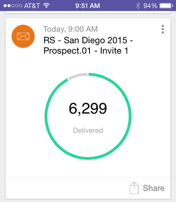
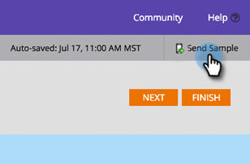

# 2015

## Gennaio 2015 {#january}

Le seguenti funzioni sono incluse nella versione di gennaio 2015. Per informazioni sulla disponibilità delle funzioni, controllare la Marketo Edition. Dopo il rilascio, torna indietro per trovare i collegamenti agli articoli dettagliati per ogni funzione.

## Aggiornamenti di Marketing Automation {#marketing-automation-updates}

**Pagine Di Destinazione Per Dispositivi Mobili**

Ora puoi [creare visualizzazioni per dispositivi mobili per le pagine di destinazione](/help/marketo/product-docs/demand-generation/landing-pages/free-form-landing-pages/add-a-mobile-view-for-your-free-form-landing-page.md) dall&#39;editor delle pagine di destinazione. Distribuisci il messaggio in modo efficace indipendentemente dal dispositivo e aumenta il coinvolgimento personalizzando i contenuti per facilitarne l’utilizzo in movimento. Questa funzione verrà implementata gradualmente nel corso della settimana successiva al rilascio.

[-Video introduttivo sulla pagina di destinazione-](https://youtu.be/aPQHlG2X6c0)

**Nuove chiamate REST API**

Tre nuove chiamate per l’API REST per lead e attività:

* Elimina lead
* Ottieni lead per ID programma
* Ottieni lead eliminati

Inoltre, è disponibile una nuova opzione per Lead di sincronizzazione, che consente di scrivere la modifica del lead in modo asincrono per una chiamata API più veloce. I dettagli completi saranno disponibili dopo il rilascio all&#39;indirizzo [https://experienceleague.adobe.com/en/docs/marketo-developer/marketo/home](https://experienceleague.adobe.com/it/docs/marketo-developer/marketo/home)

**Supporto Oggetto Personalizzato Script E-Mail**

Ora puoi accedere agli oggetti personalizzati associati all’oggetto Account dall’interno degli script e-mail.

## Real-Time Personalization {#real-time-personalization}

**Remarketing personalizzato per Google e[!DNL Facebook]**

Il remarketing mostra annunci a persone che hanno visitato il tuo sito web. Ora puoi personalizzare le campagne di remarketing su [Google](/help/marketo/product-docs/web-personalization/website-retargeting/personalized-remarketing-in-google.md) e [[!DNL Facebook]](/help/marketo/product-docs/web-personalization/website-retargeting/personalized-remarketing-in-facebook.md) utilizzando i dati di Real-Time Personalization. Rivolgiti a tipi di pubblico di diversi settori, elenchi di account denominati, dimensioni dell’azienda o qualsiasi dato proveniente da lead noti.

[Modulo elenco account denominati](/help/marketo/product-docs/web-personalization/account-based-web-marketing/create-a-new-account-list.md)

I miglioramenti al modulo Account denominati miglioreranno le percentuali di corrispondenza e le convalide per gli utenti. Le aggiunte includono:

* Associare le organizzazioni dall’elenco Account denominato utilizzando l’indirizzo e-mail del lead (anche per i clienti solo RTP)
* Supporto per un massimo di 100.000 record per account
* Modello di file CSV da visualizzare e scaricare


**Opzioni tag RTP aggiornate**

Le opzioni dei tag RTP in Impostazioni account sono state aggiornate per includere:

1. CDN e asincrono (tag consigliato)
1. CDN e sincrono (alta velocità)
1. Tag asincrono senza CDN
1. Tag sincrono senza CDN

Per ottenere prestazioni ottimali, si consiglia di posizionare il tag nella parte superiore dell&#39;intestazione della pagina Web dopo `<head>`. Tutti i tag consentono l&#39;utilizzo dell&#39;[API RTP](https://experienceleague.adobe.com/en/docs/marketo-developer/marketo/javascriptapi/rich-media-recommendation). Per informazioni su come distribuire il tag RTP, vedi [qui](/help/marketo/product-docs/web-personalization/rtp-tag-implementation/deploy-the-rtp-javascript.md).


## Febbraio 2015 {#february}

Le seguenti funzioni sono incluse nella versione di febbraio 2015. Per informazioni sulla disponibilità delle funzioni, controllare la Marketo Edition. Dopo il rilascio, torna indietro per trovare i collegamenti agli articoli dettagliati per ogni funzione. Rullo di tamburo...

## Miglioramenti dell’automazione del marketing {#marketing-automation-enhancements}

**[Sposta campagna avanzata](/help/marketo/product-docs/core-marketo-concepts/smart-campaigns/using-smart-campaigns/move-a-smart-campaign.md)**

Rallegratevi! Ora è possibile spostare le campagne intelligenti all’interno e all’esterno dei programmi tramite il trascinamento della selezione o la funzione Sposta nella struttura.

**[[!DNL Dynamics] 2015 (online)](https://docs.marketo.com/display/docs/microsoft+dynamics+2013+on-premises)** - supportato.

**Modifiche al certificato HTTPS**

Per proteggere la riservatezza e l&#39;integrità dei dati dei clienti e dei servizi SaaS, Marketo segue le best practice del settore SaaS

e sostituirà i protocolli di sicurezza attualmente utilizzati (SHA-1 e SSL) con versioni più sicure (SHA-2 (alias SHA-256) e TLS) per i seguenti domini:

* marketo.net (traffico [!DNL Munchkin] crittografato)

* [marketo.com](https://marketo.com) (principali applicazioni SaaS)

Ciò avverrà poco dopo questa versione. Il protocollo SHA-1 verrà temporaneamente supportato sul dominio [mktoapi.com](https://mktoapi.com) fino a dicembre 2015 per consentire ai proprietari di sistemi e applicazioni legacy di aggiornare i propri sistemi con compatibilità SHA-2.

**Proteggi[!DNL Munchkin]**

È in corso la rimozione del supporto per SSL3. Abbiamo mantenuto SSL3 fino ad ora per mantenere il supporto per i vecchi browser web, ma nel 2015 non vediamo più traffico web significativo da questi browser. Questo influisce solo su [!DNL Munchkin] se utilizzato su pagine sicure e verrà distribuito lentamente dopo la versione di febbraio.

## Miglioramenti di Real-Time Personalization {#real-time-personalization-enhancements}

**[URL di destinazione per campagne](/help/marketo/product-docs/web-personalization/working-with-web-campaigns/adding-a-target-url-to-a-web-campaign.md)**

Seleziona le pagine da visualizzare per la campagna in tempo reale utilizzando &quot;Aggiungi un URL di destinazione&quot;. Questa funzione funziona con tutti i tipi di campagna (Finestra di dialogo, Nella zona, Widget), ma è particolarmente utile per le campagne Nella zona in cui una campagna eseguirà il rendering nell’ID zona per solo l’URL di destinazione selezionato. Supporta l’aggiunta di più URL per il targeting di pagine web diverse.


**Paese e stato aggiunti al targeting basato sull&#39;account**

È ora possibile aggiungere il paese e lo stato agli elenchi degli account denominati. Eseguire il targeting di potenziali account chiave da posizioni specifiche.

## Marzo 2015 {#march}

Le seguenti funzioni sono incluse nella versione di marzo 2015. Per informazioni sulla disponibilità delle funzioni, controllare la Marketo Edition. Dopo il rilascio, torna indietro per trovare i collegamenti agli articoli dettagliati per ogni funzione.

## Calendario HD {#calendar-hd}

Visualizza le attività di marketing del tuo team con la nuova modalità di presentazione del calendario. Sono ideali per TV o monitor giganti in ufficio! Imposta e visualizza gli obiettivi in base a un elenco avanzato o a metriche personalizzate.

>[!NOTE]
>
>Questa funzionalità non è disponibile per le edizioni Spark e [!DNL Standard].


## Integrazione di [!DNL Google Adwords] {#google-adwords-integration}

Collega il tuo account [[!DNL Google AdWords]  a Marketo](/help/marketo/product-docs/administration/additional-integrations/add-google-adwords-as-a-launchpoint-service.md) per caricare automaticamente i dati di conversione offline da Marketo a [!DNL Google AdWords]. Quindi, dall&#39;interfaccia utente di [!DNL AdWords], potrai vedere facilmente quali clic hanno generato lead qualificati, opportunità e nuovi clienti (o qualsiasi fase dei ricavi desideri monitorare).


## Riprogettazione [!UICONTROL Revenue Explorer] {#revenue-explorer-redesign}

[!UICONTROL Revenue Explorer] ha un nuovo aspetto, così come il nuovo tipo di grafico Sunburst. Lo presenteremo nelle prime due settimane di aprile.

## Nuove API REST di Assets {#new-asset-rest-apis}

[Nuove API REST di Assets](https://experienceleague.adobe.com/en/docs/marketo-developer/marketo/rest/assets/assets)

È ora disponibile il supporto per la creazione e la modifica di e-mail, modelli, token, file e snippet [tramite l&#39;API](https://developer.adobe.com/marketo-apis/api/asset/).

## [!DNL Microsoft Dynamics] 2015 locale {#microsoft-dynamics-on-premise}

Supportato con il programma di installazione più recente ora [accessibile tramite l&#39;app](/help/marketo/product-docs/crm-sync/microsoft-dynamics-sync/sync-setup/update-the-marketo-solution-for-microsoft-dynamics.md).


## RTP - Coinvolgimento web personalizzato con dati lead {#rtp-personalized-web-engagement-with-lead-data}

Sfrutta i [campi dati lead](/help/marketo/product-docs/web-personalization/using-web-segments/manage-person-data.md) che hai nel database Marketo lead per creare campagne di segmentazione in tempo reale e contenuti personalizzati. Gestisci i campi dati lead in RTP e aggiungi/elimina i campi lead rilevanti.

## RTP - Personalizzazione dei contenuti web per e-mail o nome della campagna del programma {#rtp-personalize-web-content-by-email-or-program-campaign-name}

Continua la conversazione con il tuo lead tra canali diversi, dall’e-mail al web. [Personalizza il contenuto in entrata in base al nome della campagna e-mail o del programma](/help/marketo/product-docs/web-personalization/using-web-segments/web-segments.md) utilizzato nelle attività di marketing di Marketo.

## Aprile 2015 {#april}

Le seguenti funzioni sono incluse nella versione di aprile 2015. Per informazioni sulla disponibilità delle funzioni, controllare la Marketo Edition. Dopo il rilascio, torna indietro per trovare i collegamenti agli articoli dettagliati per ogni funzione.

## Riprogettazione Home di Analytics

[Riprogettazione Home di Analytics](/help/marketo/product-docs/reporting/basic-reporting/creating-reports/navigating-the-analytics-home-page.md)

>[!NOTE]
>
>Questa funzione verrà rilasciata martedì 28 aprile.

La nuova home page [[!UICONTROL Analytics]](/help/marketo/product-docs/reporting/basic-reporting/creating-reports/navigating-the-analytics-home-page.md) consente l&#39;accesso rapido per l&#39;esecuzione di report ad hoc tra i tipi di report disponibili.


Inoltre, è ora disponibile l’organizzazione di rapporti privata e condivisa. Crea o trascina i report nella cartella [!UICONTROL My Reports] per impedirne la visualizzazione, la modifica o l&#39;eliminazione da parte di altri utenti. [!UICONTROL Group Reports] è condiviso tra tutti gli utenti.

## Marketo Mobile Engagement {#marketo-mobile-engagement}

**Marketo Mobile Engagement**

Con Marketo Mobile Engagement, offrire esperienze mobili coinvolgenti è facile. Crea campagne altamente personalizzate che forniscono contenuti coinvolgenti senza dover mai affidarsi a un team di sviluppo di app. I nuovi filtri e trigger ti consentono di ascoltare e rispondere sul canale mobile tramite notifiche push.


## Integrazione di [!DNL LinkedIn] Lead Accelerator

[Integrazione di [!DNL LinkedIn] Lead Accelerator](/help/marketo/product-docs/demand-generation/social/social-functions/use-a-marketo-list-or-smart-list-as-a-linkedin-audience-segment.md)

Estendi la tua strategia di sviluppo del lead alla visualizzazione a pagamento e agli annunci social. L&#39;integrazione di rete [ad](/help/marketo/product-docs/demand-generation/ad-network-integrations/add-linkedin-matched-audiences-as-a-launchpoint-service.md) con [!DNL LinkedIn] Lead Accelerator consente di creare in modo sicuro un segmento di pubblico in [!DNL LinkedIn] in base ai membri di qualsiasi elenco smart o statico. I membri all&#39;interno di un segmento di pubblico [!DNL LinkedIn] possono quindi essere nutriti con una sequenza di annunci rilevanti.


## Marketo [!DNL Sales Insight] per [!DNL Salesforce1] {#marketo-sales-insight-for-salesforce}

Le tue caratteristiche preferite di [!DNL Sales Insight] - feed di lead, best bets, momenti interessanti e aggiungi a Marketo Campaign - sono tutte disponibili nell&#39;app [!DNL Salesforce1].

 

## RTP - Account-Based Marketing Analytics {#rtp-account-based-marketing-analytics}

**RTP - Account-Based Marketing Analytics**

Ottieni visibilità immediata delle prestazioni degli elenchi dei tuoi account denominati chiave in base a ogni fase del ciclo di acquisto, con il nuovo grafico delle prestazioni per gli elenchi dei tuoi account denominati. Il grafico mostra la fase della visita dall’organizzazione chiave, partendo dalla consapevolezza fino all’azione, in base al numero di visite e allo stato del visitatore.

## Maggio 2015 {#may}

Le seguenti funzioni sono incluse nella versione di maggio 2015. Per informazioni sulla disponibilità delle funzioni, controllare la Marketo Edition. Dopo il rilascio, torna indietro per trovare i collegamenti agli articoli dettagliati per ogni funzione.

## Pagine di destinazione completamente reattive

[Pagine di destinazione completamente reattive](/help/marketo/product-docs/demand-generation/landing-pages/guided-landing-pages/create-a-guided-landing-page.md)

Stiamo rilasciando una nuova modalità di modifica della pagina di destinazione e una nuova sintassi del modello. A differenza del nostro editor di pagine di destinazione &quot;in formato libero&quot;, il nuovo editor di pagine di destinazione &quot;guidato&quot; fornirà un’esperienza di modifica strutturata per pagine di destinazione pienamente reattive.


## Annullare il programma e-mail

[Annullare il programma e-mail](/help/marketo/product-docs/email-marketing/email-programs/email-program-actions/abort-email-program.md)

Hai premuto Invia prima che un programma e-mail fosse pronto per essere inviato? Tirare i freni con il nuovo pulsante del programma e-mail di interruzione. In questo modo i programmi e-mail in-flight si interromperanno immediatamente.

## Recapito e-mail  {#email-deliverability}

Marketo eseguirà ora [!DNL SPF] e [!DNL DKIM] controlli settimanali automatizzati sui domini aggiunti. Per continuare, controlla le notifiche.

## Modifica comportamento modello e-mail {#email-template-behavior-change}

A partire da questa versione, i commenti validi di HTML sono ora consentiti e non rimossi durante la creazione di nuove e-mail.

## RTP: trascinamento dell’editor di segmenti {#rtp-drag-and-drop-segment-editor}

RTP: [Trascina e rilascia l&#39;editor di segmenti](/help/marketo/product-docs/web-personalization/using-web-segments/web-segments.md)

Trascina e rilascia i criteri nel generatore di segmenti, definisci il valore e sei sulla strada giusta per creare un segmento in tempo reale.

## RTP: consigli sui contenuti predittivi {#rtp-predictive-content-recommendations}

[Consigli sui contenuti predittivi](/help/marketo/product-docs/predictive-content/enabling-predictive-content/enable-predictive-content-for-web-rich-media.md)

Utilizza gli algoritmi di apprendimento automatico e analisi predittiva di RTP per consigliare i contenuti giusti al potenziale cliente. Migliora visivamente le risorse di contenuto con immagini e descrizioni di testo e consiglia più di una risorsa di contenuto.

## Giugno 2015 {#june}

Le seguenti funzioni sono incluse nella versione di giugno 2015. Per informazioni sulla disponibilità delle funzioni, controllare la Marketo Edition. Dopo il rilascio, torna indietro per trovare i collegamenti agli articoli dettagliati per ogni funzione.

## [Rapporto e-mail attribuzione](/help/marketo/product-docs/web-personalization/reporting-for-web-personalization/email-reports.md) {#attribution-email-report}

Scopri il valore che la personalizzazione e i contenuti consigliati forniscono alle attività di marketing. [Nel report e-mail di attribuzione](/help/marketo/product-docs/web-personalization/reporting-for-web-personalization/email-reports.md) sono visualizzati i lead diretti e assistiti attribuiti dalle campagne di personalizzazione e di contenuto consigliato di RTP. In RTP, Impostazioni utente e Rapporto e-mail, aggiungi il Rapporto e-mail di attribuzione per ricevere e-mail mensili o trimestrali.

## Luglio 2015 {#july}

## [!DNL Marketo Moments] {#marketo-moments}

Sei fuori a pranzo ma devi riprogrammare un&#39;email? L&#39;app [!DNL Marketo Moments], disponibile da App Store o [!DNL Google Play], ti consente di visualizzare in tempo reale le prestazioni delle campagne e-mail ed eventi e quelle future dal telefono iPhone, iPad o Android.



## Aggiornamento dell’editor Rich Text {#rich-text-editor-update}

L’editor di testo è stato aggiornato con aspetto moderno, inclusa la formattazione del testo semplificata, la modifica delle immagini, l’inserimento di collegamenti e la modifica di HTML. L’editor di HTML ora dispone di una convalida minima, che consente modifiche del codice meno restrittive.`<iframe width="420" height="315" src="https://www.youtube.com/embed/LmmBN6IQrII" frameborder="0" allowfullscreen></iframe>` Questo aggiornamento verrà implementato automaticamente entro pochi giorni dalla versione di luglio. In seguito, potrai passare dalla versione nuova a quella legacy dell&#39;editor da **[!UICONTROL Admin]> [!UICONTROL Email] >[!UICONTROL Edit Editor Settings]**.


Sono state aggiornate le finestre di dialogo per collegamenti e immagini.


Attiva/disattiva la versione dell’editor di testo.


## Single Sign-On per il recapito messaggi e-mail {#email-deliverability-single-sign-on}

Quando fai clic sul riquadro recapito messaggi e-mail, non devi più fornire le credenziali di accesso.

## Priorità campagna {#campaign-prioritization}

Hai configurato diverse campagne RTP personalizzate e hai notato che alcune di esse potrebbero sovrapporsi ad altre? Procedi e imposta una priorità per la quale l’RTP delle campagne deve essere visualizzato rispetto alle altre.


## API società {#company-api}

**Accesso agli oggetti aziendali tramite API REST**: l&#39;API REST ora fornisce accesso all&#39;oggetto società Marketo (alias account). Ciò significa che puoi leggere, aggiornare ed eliminare gli oggetti aziendali creati in Marketo e associare i lead a tali aziende utilizzando l&#39;API [!DNL Lead] aggiornata.

Ulteriori informazioni [ulteriori]<https://developer.adobe.com/marketo-apis/api/mapi/#tag/Companies>) nella nostra guida di riferimento per l&#39;API aziendale.

## Accesso al recapito messaggi e-mail {#access-email-deliverability}

**Accesso allo strumento di recapito messaggi e-mail**: questa nuova autorizzazione consente agli amministratori di concedere agli utenti l&#39;accesso allo strumento di recapito messaggi e-mail.

## Autunno 2015 {#fall}

Le seguenti funzioni sono incluse nella versione di autunno del 1915. Per informazioni sulla disponibilità delle funzioni, controllare la Marketo Edition.

## Abbonati a un elenco avanzato {#subscribe-to-a-smart-list}

[Abbonati a un elenco avanzato](/help/marketo/product-docs/reporting/basic-reporting/report-subscriptions/subscribe-to-a-smart-list.md)

Iscriviti a elenco avanzato consente agli addetti al marketing di esportare un elenco avanzato e inviarlo tramite e-mail alle parti interessate che non utilizzano Marketo, ad esempio i team di vendita o di telemarketing.

L’esportazione può essere programmata su base giornaliera, settimanale o mensile, può avere una data di consegna finale e può essere personalizzata per condividere un numero limitato di colonne.


È possibile creare più sottoscrizioni in un elenco avanzato. È previsto un limite di 100 abbonamenti con 100.000 lead per abbonamento, in più aree di lavoro, per istanza di Marketo.


## Oggetti personalizzati di Marketo {#marketo-custom-objects}

[Oggetti personalizzati di Marketo](/help/marketo/product-docs/administration/marketo-custom-objects/understanding-marketo-custom-objects.md)

Crea facilmente oggetti personalizzati dall’interfaccia utente di amministrazione. Attualmente è supportata la possibilità di creare un oggetto personalizzato 1:N in Marketo e di collegarlo a un lead o a un&#39;azienda.

>[!NOTE]
>
>Gli oggetti personalizzati di Marketo non sono disponibili per Spark.


## Approfondimenti Marketo per [!DNL Google Chrome] {#marketo-insights-for-google-chrome}

[Approfondimenti Marketo per  [!DNL Google Chrome]](/help/marketo/product-docs/marketo-sales-insight/msi-chrome-plugin/using-marketo-insights-for-google-chrome.md)

Siamo entusiasti di annunciare il rilascio di un aggiornamento all&#39;estensione [!DNL Google Mail] [!DNL Sales Insight]. Visualizzalo in [[!DNL Chrome Store]](https://chrome.google.com/webstore/detail/marketo-insights-for-goog/jjkfbhajlmoeegbjgjipliamplidmbjb).

Questo aggiornamento include molte nuove funzionalità:

* Prima di essere coinvolti, i venditori possono visualizzare informazioni rilevanti sui potenziali clienti direttamente in [!DNL Google Mail], tra cui titoli di lavoro, profili Twitter, informazioni aziendali, foto e altro ancora.
* I venditori possono vedere in tempo reale quali contenuti i potenziali clienti sono coinvolti nei diversi canali, ad esempio e-mail aperte o cliccate, eventi online o di persona frequentati, pagine web visitate, eBooks scaricati e molto altro.
* Le e-mail inviate tramite [!DNL Google Mail] sono registrate in Marketo e monitorate in tempo reale. Questo consente ai venditori di vedere quando i potenziali clienti esaminano le loro e-mail in modo da poter dare un seguito al momento giusto. Marketo [!DNL Sales Insight] per [!DNL Google Mail] consente inoltre ai venditori di sfruttare facilmente i modelli creati dal marketing per inviare inviti, offerte e altri tipi di contenuti.


## Marketo Mobile Engagement: token, invia esempio e anteprima {#marketo-mobile-engagement-tokens-send-sample-preview}

* [Token](/help/marketo/product-docs/mobile-marketing/push-notifications/configure-mobile-push-notification.md)
* [Invia esempio](/help/marketo/product-docs/mobile-marketing/push-notifications/send-a-push-notification-sample.md)
* [Anteprima](/help/marketo/product-docs/mobile-marketing/push-notifications/preview-a-push-notification.md)

Personalizza facilmente le notifiche push con [token](/help/marketo/product-docs/mobile-marketing/push-notifications/configure-mobile-push-notification.md).


Puoi anche [visualizzare in anteprima](/help/marketo/product-docs/mobile-marketing/push-notifications/preview-a-push-notification.md) o inviare una notifica push [di esempio](/help/marketo/product-docs/mobile-marketing/push-notifications/send-a-push-notification-sample.md) prima di distribuirla ai clienti.




## Campagne intelligenti nei momenti {#smart-campaigns-in-moments}

[Campagne intelligenti nei momenti](/help/marketo/product-docs/core-marketo-concepts/mobile-apps/marketo-moments/understanding-moments/understanding-smart-campaign-cards.md)

Le statistiche sulle e-mail inviate tramite campagne intelligenti sono ora disponibili in Momenti. Altre funzionalità di questo aggiornamento includono:

* Scorri fino a fine. Hai troppe carte nel flusso? Ora puoi spazzarli via!
* Invia un esempio direttamente dalla schermata di anteprima
* Dettagli dell’elenco avanzato aggiunti alle schede del programma e-mail
* È stato aggiunto il supporto per lo stato Interrotto per i programmi e-mail


## RTP - Content Analytics e Recommendations {#rtp-content-analytics-and-recommendations}

[Content Analytics](/help/marketo/product-docs/web-personalization/understanding-web-personalization/understanding-content-analytics.md) e consigli

RTP Content Analytics mostra le prestazioni delle risorse di contenuti web da visite regolari e anche visite generate dal motore di consigli dei contenuti di RTP.

* Scopri quali contenuti hanno prestazioni migliori e quali sono più promettenti
* Aumenta il consumo di contenuti consentendo al contenuto nel motore di contenuti predittivi di RTP di consigliare automaticamente il contenuto migliore ai visitatori giusti
* Approfondisci ogni risorsa di contenuto per visualizzare metriche, grafici e prestazioni più approfondite

La pagina Assets di RTP è ora divisa in Content Analytics e Consigli sui contenuti.

* **Content Analytics:** mostra le visualizzazioni e i lead diretti di tutti i contenuti web individuati e definiti, per aiutarti ad analizzare i tuoi contenuti con le migliori prestazioni
* **Consigli sui contenuti:** mostra impression e clic dal contenuto consigliato di RTP e dall&#39;attribuzione del lead associato. Puoi anche modificare e abilitare i consigli sui contenuti da questa pagina per i consigli [bar](/help/marketo/product-docs/predictive-content/enabling-predictive-content/enable-the-content-recommendation-bar.md) e [rich media](/help/marketo/product-docs/predictive-content/enabling-predictive-content/enable-predictive-content-for-web-rich-media.md).

* Tutti i dati dei lead diretti in queste due pagine sono stati aggiornati retrospettivamente dall’inizio dell’anno (1° gennaio 2015).

## RTP - Clona una campagna RTP {#rtp-clone-an-rtp-campaign}

[RTP - Clona una campagna RTP](/help/marketo/product-docs/web-personalization/working-with-web-campaigns/clone-a-web-campaign.md)

La clonazione di una campagna RTP rende più rapida ed efficiente la creazione di campagne web più personalizzate. Utilizza la funzione di clonazione nella pagina della campagna RTP per copiare le impostazioni della campagna e modificare il contenuto per l’ottimizzazione del test di suddivisione, oppure clona una campagna con lo stesso contenuto e impostala per un segmento diverso. Crea campagne in pochi secondi.


## Miglioramenti dell’editor Rich Text {#rich-text-editor-improvements}

Stiamo apportando diversi miglioramenti all’editor Rich Text. Dopo aver rilasciato l’editor aggiornato a luglio, abbiamo ricevuto un feedback molto positivo e siamo stati in grado di lavorare su queste modifiche con l’aggiornamento. Ci sarà molto altro da fare nei prossimi mesi. Ecco un elenco delle novità del quarto trimestre:

* VML è ora supportato nel codice HTML:

```
<v:background xmlns:v="urn:schemas-microsoft-com:vml" fill="t">
<v:fill type="tile" src="<a href="https://i.imgur.com/YJOX1PC.png" rel="nofollow">https://i.imgur.com/YJOX1PC.png</a>" color="#7bceeb"/>
</v:background>
```

* Ora è possibile inserire qualsiasi cosa in un commento HTML valido (alcune sintassi, come quelle riportate di seguito, sono state precedentemente rimosse):

`<!--[if gte mso 9]> <![endif]-->`

* Non incollare celle di tabella vuote con `&nbsp;`

* Pulsante Ingrandisci/Riduci a icona aggiunto all’editor sorgente HTML
* Le proprietà preesistenti della tabella vengono ora identificate e visualizzate nella finestra di dialogo Proprietà tabella
* Entrambe le righe di pulsanti sono ora visualizzate per impostazione predefinita.
* L’editor ora accetta qualsiasi elemento (anche elementi obsoleti o non standard):

`<myCustomElement>Hello World!</myCustomElement>`

* L’editor ora accetta qualsiasi attributo (anche obsoleto o non standard):

```
<myCustomElement myCustomAttribute="foo">Hello World!</myCustomElement>
<td background="someImage.png">
```

## [!DNL Microsoft Dynamics] - Convalida sincronizzazione {#microsoft-dynamics-validate-sync}

[[!DNL Microsoft Dynamics] - Convalida sincronizzazione](/help/marketo/product-docs/crm-sync/microsoft-dynamics-sync/sync-setup/validate-microsoft-dynamics-sync.md)

Questo nuovo strumento di amministrazione esegue una serie di controlli per verificare se le configurazioni di sincronizzazione sono state configurate correttamente.


## Aggiungi campi alla sincronizzazione oggetti personalizzati CRM {#add-fields-to-crm-custom-object-sync}

Aggiungere facilmente nuovi campi agli oggetti personalizzati sincronizzati da [!DNL Salesforce] e [!DNL Dynamics]. È ora possibile aggiungere nuovi campi alla sincronizzazione personalizzata degli oggetti senza disabilitare e abilitare l’intero oggetto personalizzato.

## Modifiche alle funzioni di sicurezza {#changes-to-security-features}

* I tentativi di password sono limitati a 5. Dopo il quinto tentativo l’utente verrà bloccato.
* Il timeout della sessione inattiva è ora configurabile per l’abbonamento.


## Supporto di IE 11 (e supporto obsoleto per IE 9) {#ie-support-and-deprecating-support-for-ie}

Il browser [!DNL Microsoft Internet Explorer] 11 è ora supportato ufficialmente e verrà rimosso il supporto per il browser [!DNL Microsoft Internet Explorer] 9.

## Supporto dell’interfaccia utente Lightning per MSI {#lightning-ui-support-for-msi}

Il pacchetto MSI più recente sullo scambio di app funziona sia con le versioni Lightning che con le versioni precedenti dell&#39;interfaccia utente [!DNL Salesforce].

## Nuovo plug-in [!DNL Dynamics] {#new-dynamics-plug-in}

Questo nuovo plug-in esegue varie azioni in modalità asincrona per migliorare le prestazioni.

## Ricerca per URL della pagina di destinazione in Design Studio {#search-by-url-of-landing-page-in-design-studio}

Nella griglia della pagina di destinazione di Design Studio, è ora possibile eseguire ricerche per URL della pagina per trovare le pagine di destinazione. Questo è anche esportabile.

