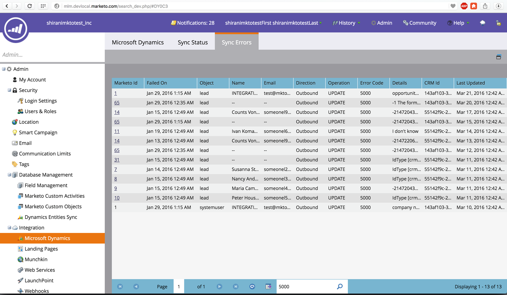
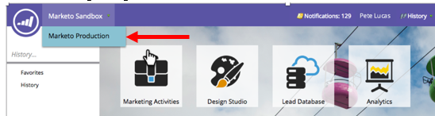

# 2016

## Inverno 2016 {#winter}

Le seguenti funzioni sono incluse nella versione invernale del &#39;16. Fai clic sui collegamenti del titolo per visualizzare articoli dettagliati per ciascuna funzione.

## [Filtro anonimo](/help/marketo/product-docs/administration/additional-integrations/add-munchkin-tracking-code-to-your-website/next-generation-munchkin-tracking-faq.md) {#is-anonymous-filter}

Il filtro È anonimo è stato rimosso per gli elenchi avanzati. Per informazioni dettagliate, consulta il documento [Domande frequenti sul tracciamento dei Munchkin di nuova generazione](/help/marketo/product-docs/administration/additional-integrations/add-munchkin-tracking-code-to-your-website/next-generation-munchkin-tracking-faq.md). Questa modifica non interessa il Web Personalization (RTP), che continua a identificare i visitatori anonimi e noti e a personalizzare i contenuti in tempo reale per tali visitatori.

## [Dashboard database](/help/marketo/product-docs/core-marketo-concepts/smart-lists-and-static-lists/managing-people-in-smart-lists/database-dashboard.md)  {#database-dashboard}

[!UICONTROL Lead Database] dispone di una dashboard di riepilogo aggiornata che include la dimensione totale del database delle persone, il numero di lead commerciabili e una suddivisione dei lead per le prime cinque origini.

## [Browser Microsoft Edge](/help/marketo/product-docs/administration/setup-administration/supported-browsers.md) {#microsoft-edge-browser}

[!DNL Microsoft Edge] è stato aggiunto all&#39;[elenco di browser](https://docs.marketo.com/display/public/DOCS/Supported+Browsers) supportati da Marketo.

## [Microsoft Outlook 2016](/help/marketo/product-docs/marketo-sales-insight/msi-outlook-plugin/install-the-marketo-email-add-in-for-outlook-with-a-registration-code.md) {#microsoft-outlook}

[[!DNL Microsoft Outlook] 2016](/help/marketo/product-docs/marketo-sales-insight/msi-outlook-plugin/install-the-marketo-email-add-in-for-outlook-with-a-registration-code.md) è ora supportato.

## [Inizio intestazione programma e-mail](/help/marketo/product-docs/email-marketing/email-programs/email-program-actions/head-start-for-email-programs.md) {#email-program-head-start}

Utilizza [!UICONTROL Head Start] per indicare che l&#39;elaborazione per l&#39;invio deve avvenire in anticipo. Invece di qualificare i lead e preparare le e-mail all&#39;ora pianificata del programma, [!UICONTROL Head Start] assicura che queste attività vengano eseguite in anticipo. In questo modo, il pubblico inizierà a ricevere e-mail all’ora pianificata.

Per utilizzare questa funzione, il programma e-mail deve essere pianificato con almeno 12 ore di anticipo e l’elenco avanzato verrà bloccato 12 ore prima dell’invio.

>[!NOTE]
>
>Questa funzione verrà implementata gradualmente per una settimana dopo il rilascio della versione invernale del 16. Non è disponibile per l’utilizzo con campagne intelligenti o con l’API.

## [Miglioramenti al marketing per dispositivi mobili](/help/marketo/product-docs/mobile-marketing/admin/add-a-mobile-app.md) {#mobile-marketing-enhancements}

Supporto di **[!DNL PhoneGap]:** Offriamo ora il supporto di [!DNL PhoneGap] per la tua app mobile. [Ulteriori informazioni](https://developers.marketo.com/documentation/mobile/phonegap-plugin/).

**Supporto per le app sandbox**:

## [API programma](https://developers.marketo.com/documentation/programs/) {#program-api}

Crea, aggiorna e clona programmi tramite l’API REST. Ciò non include la creazione o l’aggiornamento di elenchi avanzati e campagne intelligenti all’interno di un programma.

## [Miglioramenti Microsoft Dynamics](/help/marketo/product-docs/crm-sync/microsoft-dynamics-sync/microsoft-dynamics-sync-details/sync-status.md) {#microsoft-dynamics-enhancements}

**[[!UICONTROL Sync Status]](/help/marketo/product-docs/crm-sync/microsoft-dynamics-sync/microsoft-dynamics-sync-details/sync-status.md)**: Mantieni schede sulla velocità effettiva corrente e sul backlog del processo di sincronizzazione. Suddividilo per il numero di inserimenti e aggiornamenti per oggetto.

**[[!UICONTROL Notifications]](/help/marketo/product-docs/core-marketo-concepts/miscellaneous/understanding-notifications/notification-types.md)**: ricevere notifiche per gli errori di sincronizzazione comuni, insieme a un elenco di lead che presentano tale errore.

## [Miglioramenti agli oggetti personalizzati](/help/marketo/product-docs/administration/marketo-custom-objects/create-marketo-custom-objects.md) {#custom-objects-enhancements}

È ora possibile creare relazioni molti-a-molti tra lead/account e un oggetto personalizzato utilizzando un oggetto intermedio con più campi di collegamento.

## [Annunci lead Facebook](/help/marketo/product-docs/demand-generation/facebook/set-up-facebook-lead-ads.md) {#facebook-lead-ads}

[[!UICONTROL Facebook Lead ads]](https://www.facebook.com/business/a/lead-ads) sono un modo più diretto per un&#39;azienda di eseguire campagne di generazione di lead su [!DNL Facebook]. Le persone compilano un modulo per esprimere interesse per un prodotto o un servizio, in modo che l&#39;azienda possa seguirli. L&#39;integrazione di Marketo con [!UICONTROL Facebook Lead Ads] acquisisce automaticamente le informazioni fornite da un lead all&#39;interno del modulo Annuncio lead. Le azioni di completamento e le notifiche possono quindi essere automatizzate utilizzando il nuovo trigger [!UICONTROL Fills Out Facebook Lead Ads].

## [Utilità di pianificazione campagne Web (Real-Time Personalization)](/help/marketo/product-docs/web-personalization/working-with-web-campaigns/schedule-a-web-campaign.md) {#web-real-time-personalization-campaign-scheduler}

Pianifica la campagna in anticipo. Imposta una data di inizio e una data di fine per i contenuti web personalizzati e per le campagne ripetute in giorni e ore specifici. Personalizza la pianificazione per visualizzare la campagna in base all’ora del visitatore web o al fuso orario selezionato.

## Primavera 2016 {#spring}

Le seguenti funzioni sono incluse nella versione di primavera del 1916. Fai clic sui collegamenti del titolo per visualizzare articoli dettagliati per ciascuna funzione.

## [Informazioni e-mail](/help/marketo/product-docs/reporting/email-insights/email-insights-overview.md) {#email-insights}

Email Insights è una nuovissima esperienza di analisi dei dati aggregati e-mail, riprogettata end-to-end per offrire prestazioni incredibilmente veloci. Offre un design dell’interfaccia utente completamente nuovo, ottimizzato per soddisfare le esigenze e il flusso di lavoro degli esperti di e-mail marketing.

>[!NOTE]
>
>A partire dal 3 giugno lanceremo Email Insights per i clienti in batch. Il nostro obiettivo è quello di completarlo nei prossimi mesi. Ti invieremo una notifica via e-mail quando sarai abilitato.

## [Selettore di modelli per e-mail](/help/marketo/product-docs/email-marketing/general/email-editor-2/email-template-picker-overview.md) {#email-template-picker}

Crea splendide e-mail utilizzando i nostri nuovi modelli Starter! Inoltre, individua rapidamente i modelli dalle miniature live.

>[!NOTE]
>
>L’editor e-mail 2.0 (con il selettore di modelli) verrà introdotto gradualmente a partire dal 3 giugno. Il rollout verrà completato entro il 30 giugno. A differenza di Email Insights, non riceverai una notifica quando disporrai dell’accesso. Per verificare se ciò accade, segui i passaggi descritti in [questo articolo](/help/marketo/product-docs/email-marketing/general/email-editor-2/transitioning-to-email-editor-2-0.md).

## [Modifica e-mail—riprogettata](/help/marketo/product-docs/email-marketing/general/email-editor-2/email-editor-v2-0-overview.md) {#email-editing-re-imagined}

Esatto, un editor e-mail completamente nuovo! Utilizza la funzionalità di trascinamento della selezione per aggiungere e riordinare i contenuti. I nuovi elementi, tra cui immagini, video, variabili e moduli, migliorano sicuramente l’esperienza di modifica. Consulta anche l’editor di codice aggiornato, il visualizzatore di anteprime e il supporto della preintestazione.

## [Messaggi In-App Per Dispositivi Mobili](/help/marketo/product-docs/mobile-marketing/in-app-messages/understanding-in-app-messages.md) {#mobile-in-app-messages}

Crea straordinari messaggi in-app per la tua app direttamente in Marketo. Definisci esattamente chi deve visualizzarlo e quando con il programma di messaggi in-app. Monitora facilmente le sue prestazioni con la dashboard del programma.

## [Nessun frammento bozza](/help/marketo/product-docs/administration/users-and-roles/enable-no-draft-for-snippets.md) {#no-draft-snippets}

Sono finiti i giorni in cui devi riapprovare tutto ogni volta che uno snippet viene aggiornato. Con Nessuna bozza, tutte le e-mail e le pagine di destinazione che utilizzano uno snippet riceveranno gli aggiornamenti dello snippet e manterranno i loro stati precedenti. Ogni volta che approvate uno snippet, potete scegliere se eseguire No-Draft (Nessuna bozza) e aggiornare tutto o creare delle bozze. Sta a te! Nessuna bozza sarà disponibile per tutti i clienti e controllata da una nuova autorizzazione in Amministratore.

## [Pagina di destinazione, Modello pagina di destinazione e API modulo](https://developers.marketo.com/blog/spring-2016-updates/) {#landing-page-landing-page-template-and-form-apis}

Le API REST di Marketo ora supportano il controllo sulle pagine di destinazione, i modelli di pagina di destinazione e i moduli di Marketo. Gli utenti possono ora creare, aggiornare il contenuto, approvare ed eliminare queste risorse direttamente tramite l’API REST di Marketo.

## [IP in attesa di accesso API](/help/marketo/product-docs/administration/additional-integrations/create-an-allowlist-for-ip-based-api-access.md) {#ip-allowlisting-for-api-access}

Analogamente alla funzione di inserire nell&#39;elenco Consentiti dell’IP per gli accessi degli utenti Marketo, gli amministratori di Marketo ora possono impostare un elenco Consentiti di indirizzi IP che possono accedere alle API Marketo SOAP e REST, bloccando in tal modo l’accesso da indirizzi IP non autorizzati. Questo offre un ulteriore livello di sicurezza all’istanza Marketo e garantisce che l’accesso API sia possibile solo dall’interno della rete dell’organizzazione. I dettagli sulla configurazione sono disponibili nel [sito della documentazione di Marketo](/help/marketo/product-docs/administration/additional-integrations/create-an-allowlist-for-ip-based-api-access.md).

## [Nuovo Connettore Di Sincronizzazione Microsoft Dynamics Ad Alta Velocità](/help/marketo/product-docs/crm-sync/microsoft-dynamics-sync/microsoft-dynamics-sync-details/sync-status.md) {#new-high-speed-microsoft-dynamics-sync-connector}

Il nuovo connettore Dynamics ad alta velocità offre velocità fino a 20 volte superiori per la sincronizzazione iniziale e fino a 5 volte superiori per la sincronizzazione incrementale. Tutti i nuovi clienti effettueranno l’onboarding a questo connettore alla data di rilascio e lo distribuiremo gradualmente ai clienti esistenti nel periodo di rilascio estivo.

**Aggiorna dati per nuovi campi**: ora è possibile abilitare nuovi campi di sincronizzazione in qualsiasi momento e tutti i valori dei dati per tale campo verranno aggiornati da [!DNL Dynamics] CRM in Marketo. Nessun ulteriore problema sulla necessità di selezionare tutti i campi durante la configurazione iniziale. Se si disattiva un campo di sincronizzazione esistente e lo si riattiva in seguito, tutti i valori dei dati per tale campo verranno aggiornati da [!DNL Dynamics] CRM in Marketo.

**Sincronizza lead come contatto**: l&#39;azione di flusso [!UICONTROL Sync Lead to Microsoft] dispone di una nuova opzione per la sincronizzazione come lead o contatto.

**Scheda Amministrazione errori di sincronizzazione**: consente di sfogliare, cercare o esportare lead (e altri oggetti) che non sono stati sincronizzati con dettagli quali operazione, direzione, codice di errore e messaggio di errore.

**[!DNL Microsoft Dynamics]2016**: il connettore è completamente certificato per [!DNL Dynamics] 2016 [!DNL Online] e [!DNL On-premise] versioni.

**Gli aggiornamenti dei plug-in sono ora documentati:** Consulta l&#39;articolo della documentazione sugli aggiornamenti dei [plug-in](/help/marketo/product-docs/crm-sync/microsoft-dynamics-sync/marketo-plugin-releases-for-microsoft-dynamics.md).

## [Nome istanza descrittivo](/help/marketo/product-docs/administration/settings/edit-subscription-settings.md) {#friendly-instance-name}

Attualmente è difficile distinguere tra istanze di Marketo, ad esempio istanze sandbox e di produzione. Questa funzione consente di sapere su quali istanze si sta attualmente lavorando.

## Accesso limitato nel tempo per gli abbonamenti {#limited-time-access-for-subscriptions}

Oggi, gli utenti sono invitati a iscriversi a Marketo per un periodo di tempo indefinito. Questa funzione consente agli amministratori di invitare gli utenti agli abbonamenti per un periodo di tempo limitato, ad esempio 2 settimane o 1 mese.

## [Griglia oggetti personalizzati](/help/marketo/product-docs/administration/marketo-custom-objects/understanding-marketo-custom-objects.md) {#custom-objects-grid}

Ora è possibile visualizzare il numero di record e campi per tutti gli oggetti personalizzati pubblicati.

## Attività personalizzate {#custom-activities}

Gli amministratori di Marketo possono ora definire e gestire i propri tipi di attività personalizzati tramite il modellatore di definizione di attività personalizzata di Marketo. Simile (e in combinazione con) a Marketo Custom Object Modeler, ora gli amministratori possono estendere il modello dati in base alle loro esatte esigenze aziendali. I dettagli sull&#39;utilizzo di questa funzionalità sono disponibili nel [sito della documentazione di Marketo](/help/marketo/product-docs/administration/marketo-custom-activities/understanding-custom-activities.md).

## Estate 2016 {#summer}

Le seguenti funzioni sono incluse nella versione dell’estate del 16. Verifica la disponibilità delle funzioni nella tua edizione di Marketo. Fai clic sui collegamenti del titolo per visualizzare articoli dettagliati per ciascuna funzione.

## [Marketing basato su account](https://docs.marketo.com/display/docs/account+based+marketing) {#account-based-marketing}

Il marketing basato su account Marketo offre tutte le funzionalità di base in un’unica piattaforma unificata:

* **Target** - Individuazione account, corrispondenza lead-account ed elenchi di account denominati
* **Coinvolgi** - Personalization basato su account, coinvolgimento su più canali e flussi di lavoro specifici per l&#39;account
* **Misura** - Informazioni a livello di account ed elenco, punteggio di coinvolgimento dell&#39;account e impatto sulla pipeline e sui ricavi

>[!NOTE]
>
>ABM è disponibile come componente aggiuntivo per l’abbonamento a Marketo; per favore contatta il tuo rappresentante di vendita per l’implementazione.

## [Audit trail](/help/marketo/product-docs/administration/audit-trail/audit-trail-overview.md) {#audit-trail}

Audit trail fornisce una cronologia completa delle modifiche apportate all’interno dell’abbonamento Marketo. Creerà responsabilità tra utenti e amministratori, aiuterà a identificare la causa di comportamenti imprevisti e fornirà la sicurezza di sapere chi sta facendo cosa e quando. Queste informazioni saranno disponibili in qualsiasi momento e possono essere utilizzate per rispondere a domande quali:

* Cos’è successo a questa risorsa o impostazione e chi l’ha aggiornata per ultimo?
* Cosa ha fatto X l&#39;utente?
* Chi accede al nostro account?

## Integrazione Marketo-Vibes SMS LaunchPoint

Creazione semplice di messaggi SMS direttamente in Marketo. Personalizza e indirizza il messaggio utilizzando dati Marketo avanzati e monitorane facilmente le prestazioni tramite la dashboard dei messaggi SMS.

>[!NOTE]
>
>Questa funzionalità richiede un account [!DNL Vibes SMS] esistente.

## [Miglioramenti e-mail 2.0](/help/marketo/product-docs/email-marketing/general/email-editor-2/email-editor-v2-0-overview.md) {#email-enhancements}

**Variabili a livello di modulo**

In precedenza, tutte le variabili specificate in Modelli e-mail 2.0 erano &quot;globali&quot; nell’ambito. Quando si utilizzano variabili all’interno di moduli, questo non è sempre opportuno se si intende utilizzare più istanze del modulo. Con questa versione, le variabili possono ora essere specificate come &quot;livello modulo&quot;, che consente di indicare che l’utente deve essere in grado di impostare valori univoci per ogni modulo in cui vengono utilizzate.

**Aggiornamenti sintassi**

* Ora è possibile utilizzare &quot;mktoAddByDefault&quot; sui moduli specificati in Modelli e-mail 2.0 per indicare quali moduli devono essere visualizzati nelle nuove e-mail per impostazione predefinita. Questa funzione è molto più utile se stai creando un modello e-mail con un numero elevato di moduli.
* Sugli elementi immagine è ora possibile specificare se le proprietà &quot;height&quot; e &quot;width&quot; dell&#39;elemento HTML sottostante devono essere bloccate o modificabili per l&#39;utente finale. ``mktoLockImgSize=&quot;true&quot; causerà il blocco di altezza/larghezza (anche se l&#39;immagine viene modificata). Analogamente, mktoLockImgStyle=&quot;true&quot; causerà il blocco della proprietà &quot;style&quot;.

**Ricerca codice**

Utilizza la nuova funzionalità di ricerca per trovare e sostituire in modo efficiente il contenuto all’interno del codice e-mail. Questa funzionalità è disponibile anche nell’editor dei modelli e-mail.

**Supporto token negli elementi immagine**

Ora è possibile utilizzare i token nell’area &quot;External URL&quot; dell’esperienza di inserimento immagine. Se hai specificato immagini con `{{my.tokens}}`, ora puoi fare riferimento a questi token in Email Editor 2.0. Tieni presente che l’immagine risulterà ancora danneggiata nell’area di lavoro di Email Editor 2.0. Tuttavia, li vedrai renderizzati in Anteprima e Invia campione prima di inviare l’e-mail.

## Più domini di branding {#multiple-branding-domains}

Sono finiti i giorni in cui i collegamenti di tracciamento e-mail potevano essere contrassegnati con un solo dominio di branding. Ora puoi aggiungere più domini di branding per ispirare la fiducia dei consumatori, conferire un aspetto più semplice al brand, migliorare il recapito messaggi e-mail e scegliere, in base alle e-mail, quale dominio di branding utilizzare per i collegamenti di tracciamento di ogni e-mail.

## [Token programma](/help/marketo/product-docs/demand-generation/landing-pages/personalizing-landing-pages/tokens-overview.md) {#program-tokens}

È stato creato un nuovo tipo di token per i programmi. Ora puoi eseguire il rendering di Nome programma, Descrizione e ID nei passaggi di risorse e flusso di campagne intelligenti.

## [Chiave organizzazione](/help/marketo/product-docs/marketo-sales-insight/msi-outlook-plugin/authorize-the-marketo-outlook-plugin.md) {#enterprise-key}

Richiedere a ogni persona nel team vendite di installare il plug-in [!DNL Sales Insight] per [!DNL Outlook] può essere noioso. È stato introdotto un nuovo modo per installare il plug-in per [!DNL Outlook] in remoto utilizzando una chiave Enterprise. Invia al tuo team IT la tua chiave univoca trovata nella sezione Marketo [!DNL Sales Insight] di [!UICONTROL Admin] e lascia fare il resto.

## [Campagne Web Personalization](/help/marketo/product-docs/web-personalization/working-with-web-campaigns/create-a-new-dialog-web-campaign.md) {#web-personalization-campaigns}

Specifica un ritardo nella reazione delle campagne web sul tuo sito web.

## [Esportazione Content Analytics e consigli](/help/marketo/product-docs/web-personalization/understanding-web-personalization/understanding-content-analytics.md) {#content-analytics-and-recommendations-export}

Visualizzare i dati di analisi dei contenuti e consigli offline.

## [Supporto API per l&#39;editor e-mail 2.0](https://developers.marketo.com/documentation/asset-api/) {#api-support-for-email-editor}

Le API di Asset preesistenti, in precedenza compatibili solo con e-mail e modelli v1.0, ora sono abilitate per le risorse e-mail v2.0.

## [Sito sviluppatori Marketo](https://developers.marketo.com/) {#marketo-developers-site}

Nuovo e migliorato!

## [Impostazioni privacy](/help/marketo/product-docs/administration/settings/understanding-privacy-settings.md) {#privacy-settings}

Gli addetti al marketing possono utilizzare le impostazioni relative alla privacy per decidere se tenere traccia dei visitatori utilizzando le funzionalità di [!DNL Munchkin] e Web Personalization. Il livello di tracciamento è controllato utilizzando l’impostazione Do Not Track del browser, un cookie di rinuncia o un IP non specifico. Questi metodi possono influenzare il valore e le funzionalità di Marketo in aree specifiche, ma se l’addetto marketing non cambia nulla, le funzionalità di Marketo rimangono le stesse.

Questa funzione verrà rilasciata gradualmente ai clienti in un periodo di sei settimane. Se ne hai bisogno immediatamente, contatta il supporto Marketo.

## Autunno 2016 {#fall}

Le seguenti funzioni sono incluse nella versione di autunno del 1916. Verifica la disponibilità delle funzioni nella tua edizione di Marketo. Fai clic sui collegamenti del titolo per visualizzare articoli dettagliati per ciascuna funzione.

## [!UICONTROL Predictive Content] nell&#39;e-mail {#predictive-content-in-email}

È disponibile una nuova esperienza utente per l&#39;applicazione [!UICONTROL Predictive Content] che consente di tenere traccia, gestire e consigliare i contenuti tramite l&#39;apprendimento automatico e gli algoritmi predittivi nei canali Web e di posta elettronica.

>[!NOTE]
>
>Tutti i clienti che dispongono del modulo Predictive saranno abilitati entro il 10 gennaio.

Ora puoi aggiungere contenuto predittivo all’e-mail. Quando l’e-mail viene aperta, il destinatario riceve automaticamente contenuti pertinenti e consigliati che contribuiscono ad aumentare il coinvolgimento e le conversioni dei contenuti.

## [Conversioni offline Facebook](/help/marketo/product-docs/demand-generation/facebook/understanding-facebook-offline-conversions.md) {#facebook-offline-conversions}

Con l&#39;integrazione di [!DNL Facebook] Conversioni offline, i dati di conversione in Marketo (per lead di annunci) vengono automaticamente rimandati a [!DNL Facebook] in modo che il team pubblicitario possa ottimizzare la spesa pubblicitaria. In questo report di [!DNL Facebook] Ad Manager, le conversioni offline sono evidenziate.

## ID universale {#universal-id}

Un Universal ID consente di accedere a più abbonamenti Marketo con un unico accesso e di passare rapidamente da un abbonamento all’altro. Puoi utilizzare un singolo profilo community per tutti gli abbonamenti.

>[!NOTE]
>
>Contatta il supporto Marketo per abilitare questa funzione.

## Miglioramenti del marketing basato su account Marketo {#marketo-account-based-marketing-enhancements}

Ora è possibile assegnare i team dell’account ad account denominati in Account Based Marketing (ABM), ad esempio il proprietario dell’account, il rappresentante per lo sviluppo delle vendite, il rappresentante per lo sviluppo commerciale e il Customer Success Manager. Puoi anche creare elenchi di account specifici del proprietario dell’account e inviare rapporti ABM settimanali personalizzati al team dell’account.

**API REST**

Questa versione consente inoltre di gestire gli attributi e i punteggi degli account denominati in ABM utilizzando l’API REST di Marketo. Per ulteriori dettagli sulle operazioni API, visita il [sito Web Marketo Developers](https://developers.marketo.com/rest-api/lead-database/named-accounts).

## [Miglioramenti della prova di verifica](/help/marketo/product-docs/administration/audit-trail/change-details-in-audit-trail.md) {#audit-trail-enhancements}

Audit trail fornisce una cronologia completa delle modifiche apportate all’interno dell’abbonamento Marketo. Sono state aggiunte ulteriori funzionalità di tracciamento per i programmi e sono stati evidenziati importanti dettagli di modifica per campagne intelligenti, elenchi avanzati e modifiche apportate a utenti e ruoli.

## Nuove autorizzazioni

**Rendi operativa l&#39;e-mail**

Sono finiti i giorni in cui dovevi preoccuparti che gli utenti inviassero e-mail transazionali a persone del tuo database che hanno annullato l’abbonamento. Ora puoi specificare quali utenti possono rendere operativa un’e-mail o modificarne le e-mail operative.

**Modifica restrizioni campagna**

Perché impostare [restrizioni campagna](/help/marketo/product-docs/administration/email-setup/enable-person-restrictions-for-smart-campaigns.md) se non è possibile applicarle? Quando imposti Impostazioni limite campagna in modo da limitare il numero di persone nel database a cui è possibile indirizzare una singola campagna, ora puoi limitare quali utenti possono ignorare queste impostazioni durante la pianificazione di una campagna.

## [Suono per le notifiche push per dispositivi mobili](/help/marketo/product-docs/mobile-marketing/push-notifications/configure-mobile-push-notification.md) {#sound-for-mobile-push-notifications}

Rendi più ricca la tua notifica push di iOS grazie all’abilitazione dell’audio. Questa nuova funzione consente di attivare un suono quando viene visualizzata una notifica push sul dispositivo mobile.

>[!NOTE]
>
>* I proprietari dei dispositivi possono scegliere di impedire la riproduzione dei suoni nelle impostazioni del dispositivo e gli sviluppatori di app possono assegnare ai proprietari dei dispositivi opzioni all’interno dell’app per impedire la riproduzione dei suoni.
>* I suoni vengono riprodotti automaticamente quando una notifica push viene visualizzata su un dispositivo Android.

## [Insight di vendita compatibile con Salesforce Encryption](/help/marketo/product-docs/marketo-sales-insight/msi-for-salesforce/installation/install-marketo-sales-insight-package-in-salesforce-appexchange.md) {#sales-insight-compatible-with-salesforce-encryption}

Il mercato [!DNL Sales Insight] è ora compatibile con la crittografia dello scudo [!DNL Salesforce]. Tutti i clienti [!DNL Sales Insight] devono effettuare l&#39;aggiornamento a questo pacchetto gestito più recente (versione 1.4359.2), che è [disponibile in [!DNL Appexchange]](https://appexchange.salesforce.com/listingDetail?listingId=a0N30000001SVZmEAO).

## [API account denominati](https://developers.marketo.com/rest-api/lead-database/named-accounts/) {#named-accounts-apis}

Con questa versione, gli utenti ABM di Marketo possono gestire account denominati tramite l’API Account denominati. Gli utenti possono creare, aggiornare ed eliminare account denominati, nonché leggere e aggiornare i punteggi degli account denominati ABM.

## [Supporto API dell&#39;editor di posta elettronica v2.0](https://developers.marketo.com/rest-api/assets/emails/) {#email-editor-v-api-support}

Gestisci variabili e moduli per le e-mail in formato v2.0 utilizzando l’API REST di Marketo.

## [Modifiche a Marketo Salesforce Sync](https://nation.marketo.com/docs/DOC-3840) {#changes-to-marketo-salesforce-sync}

L&#39;integrazione di Marketo [!DNL Salesforce] si sta evolvendo per migliorare il modo in cui i campi Marketo vengono sincronizzati con [!DNL Salesforce]. Ora, invece di dover sincronizzare un ampio gruppo di campi che potrebbero essere necessari o meno, puoi scegliere quali campi includere. Consulta la documentazione qui per ulteriori informazioni: [https://nation.marketo.com/docs/DOC-3840](https://nation.marketo.com/docs/DOC-3840).
