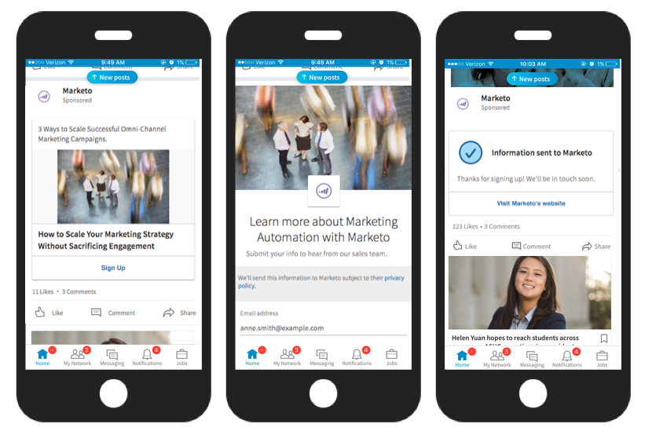
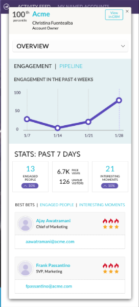

# 2017

## Inverno 2017 {#winter}

Le seguenti funzioni sono incluse nella versione invernale del &#39;17. Verifica la disponibilità delle funzioni nella tua edizione di Marketo.

Fai clic sui collegamenti del titolo per visualizzare articoli dettagliati per ciascuna funzione.

>[!NOTE]
>
>Se un argomento ha più sottotitoli, i collegamenti sono posizionati lì.

## [Corrispondenza avanzata per i tipi di pubblico personalizzati di Facebook](/help/marketo/product-docs/demand-generation/ad-network-integrations/add-facebook-custom-audiences-as-a-launchpoint-service.md) {#advanced-matching-for-facebook-custom-audiences}

La corrispondenza di base utilizza solo gli indirizzi e-mail, ma la nuova corrispondenza avanzata utilizza altri sette campi, aumentando il tasso di corrispondenza per una maggiore conversione.

## [API di importazione oggetti personalizzati](https://developers.marketo.com/rest-api/lead-database/custom-objects/) {#custom-object-import-api}

Questa API fornisce un’interfaccia più veloce per sincronizzare gli oggetti personalizzati in Marketo. È possibile importare file CSV, TSV o SSV in Marketo come oggetti personalizzati.

## [Esportazione campagne Web Personalization](/help/marketo/product-docs/web-personalization/working-with-web-campaigns/export-web-campaign-data.md) {#web-personalization-campaigns-export}

Esporta tutti i dettagli e le analisi della campagna web in formato CSV. Potrai quindi visualizzare i dati in un layout semplice.

## Localizzazione {#localization}

Le app Web Personalization, [!UICONTROL Predictive Content] e Email Insights sono ora disponibili in giapponese, tedesco e spagnolo. [selezionare la lingua e le impostazioni locali](/help/marketo/product-docs/administration/settings/change-time-zone.md) per visualizzare il contenuto in queste lingue.

## Miglioramenti del marketing basato sull’account {#account-based-marketing-enhancements}

**[Importa account denominati](/help/marketo/product-docs/target-account-management/target/named-accounts/import-named-accounts.md)**

Con l&#39;opzione di importazione [!UICONTROL Named Account], crea o aggiorna più record contemporaneamente tramite il caricamento CSV.

**[Supporto di Email Insights](/help/marketo/product-docs/reporting/email-insights/filtering-in-email-insights.md)**

Utilizzare [!UICONTROL Named Account] o [!UICONTROL Account List] come dimensioni in Email Insights.

## Miglioramenti di [!UICONTROL Predictive Content] {#predictive-content-enhancements}

**[Filtra per[!UICONTROL Enabled Source]](/help/marketo/product-docs/predictive-content/working-with-predictive-content/understanding-predictive-content.md)**

Filtra [!UICONTROL Predictive Content] pezzi abilitati per [!UICONTROL Email], [!UICONTROL Rich Media] o [!UICONTROL Recommendation Bar].

**[Filtro[!UICONTROL Analytics by Source]](/help/marketo/product-docs/predictive-content/working-with-predictive-content/understanding-predictive-content.md)**

Filtra analisi [!UICONTROL Predictive Content] per origini specifiche - [!UICONTROL Email], [!UICONTROL Rich Media] o [!UICONTROL Recommendation Bar].

Editor **[!UICONTROL Predictive Content]**

L&#39;esperienza di modifica e il layout migliorati dividono la preparazione dei contenuti per origine: [!UICONTROL Email], [!UICONTROL Rich Media] o [!UICONTROL Recommendation Bar].

**[Contenuto individuazione automatica per predittivo](/help/marketo/product-docs/predictive-content/getting-started/enable-content-discovery.md)**

L’URL dell’immagine e i metadati vengono ora utilizzati nel processo di rilevamento automatico dei contenuti.

## [Miglioramenti SDK](https://developers.marketo.com/mobile/) {#sdk-enhancements}

Gli sviluppatori ora hanno un controllo aggiuntivo sulla consegna delle notifiche push con l’aggiunta di una nuova chiamata API SDK che consente agli sviluppatori di rimuovere i token push.

## Integrazione Vibes SMS LaunchPoint

Migliora il targeting con una nuova opzione di filtro, &quot;Membro dell’elenco delle vibrazioni&quot;.

## [Deprecazione editor Rich Text legacy ed editor di moduli 1.0](https://nation.marketo.com/docs/DOC-4315)

A partire dal 1° agosto 2017, i clienti che utilizzano ancora l’editor Rich Text e l’editor di moduli 1.0 legacy passeranno automaticamente alla nuova esperienza.

## [API attività Marketo](https://developers.marketo.com/blog/important-change-activity-records-marketo-apis/) {#marketo-activity-apis}

Un cambiamento importante sta arrivando alle API delle attività di Marketo. Sei preparato?

## Primavera 2017 {#spring}

Le seguenti funzioni sono incluse nella versione di primavera del 17. Verifica la disponibilità delle funzioni nella tua edizione di Marketo.

Fai clic sui collegamenti del titolo per visualizzare articoli dettagliati per ciascuna funzione. **Nota**: se un argomento ha più sottotitoli, i collegamenti sono posizionati lì.

## [LinkedIn Generazione lead Forms](/help/marketo/product-docs/demand-generation/social/social-functions/set-up-linkedin-lead-gen-forms.md) {#linkedin-lead-gen-forms}

[[!UICONTROL LinkedIn Lead Gen] Forms](https://business.linkedin.com/marketing-solutions/native-advertising/lead-gen-ads) è un modo più diretto per un&#39;azienda di eseguire campagne di generazione di lead su [!DNL LinkedIn]. Le persone possono compilare i moduli per esprimere interesse per un prodotto o un servizio, consentendo all’azienda di acquisire i dettagli della persona e sincronizzarli con Marketo, dove possono verificarsi processi di follow-up automatizzati e attività di instradamento dei lead.

L&#39;integrazione di Marketo con [!UICONTROL LinkedIn Lead Gen] Forms acquisisce automaticamente le informazioni fornite da un lead all&#39;interno del modulo Lead Gen. Le azioni di follow-up e le notifiche possono quindi essere automatizzate utilizzando il nuovo trigger e filtro **Compila modulo [!DNL LinkedIn Lead Gen]**.

## [Scadenza modello MSI](/help/marketo/product-docs/marketo-sales-insight/msi-for-salesforce/features/actions-in-the-msi-panel/send-marketo-email/publish-an-email-to-sales-insight.md) {#expire-msi-template}

Sono finiti i giorni di pulizia dei modelli obsoleti in [!DNL Sales Insight]. Imposta una data di scadenza quando pubblichi l’e-mail; ci occuperemo di annullarne la pubblicazione quando la data di scadenza sarà riportata.

>[!NOTE]
>
>Se si imposta la data di scadenza per il 5/31/17, il modello verrà rimosso da [!DNL Sales Insight] alla fine del giorno, il 5/31/17.

## [API di estrazione in blocco per persone e attività](https://developers.marketo.com/rest-api/bulk-extract/) {#bulk-extract-apis-for-people-and-activities}

Trasferisci facilmente grandi quantità di dati relativi a persone e attività da Marketo ai sistemi esterni.

## Miglioramenti ABM

**[Campi personalizzati in account denominati ABM](https://docs.marketo.com/x/1wnG)**

Marketo ABM ora consente di creare fino a 10 campi personalizzati sui tuoi account denominati. Puoi mappare questi campi personalizzati ai campi nell’oggetto Account CRM e Marketo ABM sincronizzerà i dati, consentendoti di estendere gli account denominati ABM e aiutarti a indirizzare il tuo marketing.

**[Punteggio percentuale su account denominati ABM](https://docs.marketo.com/display/docs/assets/abmpercentiles.png)**

I punteggi degli account denominati possono variare notevolmente. Marketo ABM ora calcola automaticamente un percentile per ciascuno dei tuoi punteggi, in modo da poter visualizzare immediatamente la posizione di ogni account denominato rispetto agli altri account denominati.

**[API elenco account ABM](https://developers.marketo.com/rest-api/lead-database/named-account-lists/)**

Sfrutta le avanzate e affidabili integrazioni di partner ABM con supporto API avanzato per gli elenchi di account denominati.

## Miglioramenti di Web Personalization

**[Campagna Web Al Momento Dello Scorrimento](/help/marketo/product-docs/web-personalization/working-with-web-campaigns/set-how-your-web-campaign-displays.md)**

I nuovi effetti della campagna web offrono ai visitatori un’esperienza più personalizzata. Imposta [!UICONTROL Web Campaigns] personalizzato in modo che venga visualizzato solo quando un visitatore Web scorre la pagina Web verso il basso. È possibile impostare la finestra di dialogo [!UICONTROL Web Campaigns] in modo che venga visualizzata dopo lo scorrimento in base a:

* percentuale della pagina a cui è stato eseguito lo scorrimento
* pixel raggiunti
* scorrimento sotto la pagina

**[Campagna Web All&#39;Intenzione Di Uscita](/help/marketo/product-docs/web-personalization/working-with-web-campaigns/set-how-your-web-campaign-displays.md)**

Cattura l’attenzione del visitatore prima che chiuda la pagina. Imposta [!UICONTROL Web Campaigns] personalizzato in modo che venga visualizzato solo quando un gesto del mouse indica che il visitatore sta lasciando la pagina.

**[Effetti animazione per[!UICONTROL Web Campaigns]](/help/marketo/product-docs/web-personalization/working-with-web-campaigns/create-a-new-dialog-web-campaign.md)**

Impostare gli effetti di animazione per la campagna Web Dialog in modo da personalizzare la modalità di visualizzazione di una campagna all&#39;immissione o all&#39;uscita dalla pagina Web. È possibile scegliere tra 6 effetti diversi e controllare la tempistica e la direzione della finestra di dialogo.

**[Personalizzazione pulsante di chiusura finestra di dialogo](/help/marketo/product-docs/web-personalization/working-with-web-campaigns/create-a-new-dialog-web-campaign.md)**

Personalizzare il pulsante Chiudi per le finestre di dialogo. Selezionare una delle opzioni utilizzate nello stile della finestra di dialogo trasparente [!UICONTROL Web Campaigns]. Selezionare l&#39;icona, il colore e il posizionamento per il pulsante Chiudi. È inoltre possibile aggiungere un&#39;immagine del pulsante personalizzata.

**[Archivia campagne Web](/help/marketo/product-docs/web-personalization/working-with-web-campaigns/archive-a-web-campaign.md)**

Archivia è un nuovo stato di Campagna Web che consente di archiviare [!UICONTROL Web Campaigns] e nasconderli dalla visualizzazione predefinita Campagna Web. Questo consente di concentrarsi sulle campagne attive più rilevanti e di recuperare on-demand le campagne archiviate meno recenti.

**[Localizzazione](/help/marketo/product-docs/administration/settings/change-time-zone.md)**

Web Personalization è ora disponibile in tutte le lingue supportate da Marketo (inglese, giapponese, tedesco, spagnolo, francese e portoghese).

## Miglioramenti predittivi {#predictive-enhancements}

**[Localizzazione](/help/marketo/product-docs/administration/settings/change-time-zone.md)**

Il contenuto predittivo è ora disponibile in tutte le lingue supportate da Marketo (inglese, giapponese, tedesco, spagnolo, francese e portoghese).

## [Deprecazione editor Rich Text legacy ed editor di moduli 1.0](https://nation.marketo.com/docs/DOC-4315)

A partire dal 1° agosto 2017, i clienti che utilizzano ancora l’editor Rich Text e l’editor di moduli 1.0 legacy passeranno automaticamente alla nuova esperienza.

## Estate 2017 {#summer}

Le seguenti funzioni sono incluse nella versione dell’estate del 17. Verifica la disponibilità delle funzioni nella tua edizione di Marketo.

Fai clic sui collegamenti del titolo per visualizzare articoli dettagliati per ciascuna funzione. Nota: ad alcune funzioni incluse in questa versione non sono associati articoli. Se un argomento ha più sottotitoli, i collegamenti sono posizionati lì.

## [Fasi aggiuntive di conversione offline Facebook](/help/marketo/product-docs/demand-generation/facebook/set-up-facebook-offline-conversions.md) {#additional-facebook-offline-conversion-stages}

Scegli fino a 7 fasi di conversione offline aggiuntive da mappare alle fasi del ciclo di vita di Marketo (oltre alle 3 disponibili oggi). Ottimizza la spesa pubblicitaria di [!DNL Facebook] in base alle conversioni nel percorso del cliente per ottenere un ROI migliore.

## [Blocca modello Insight vendite](/help/marketo/product-docs/marketo-sales-insight/msi-for-salesforce/features/actions-in-the-msi-panel/send-marketo-email/lock-sales-template.md) {#lock-sales-insight-template}

Assicurati la coerenza del messaggio e del contenuto impedendo modifiche ai modelli di vendita. Questo consente di standardizzare i modelli e mantenere comunicazioni professionali.

## Miglioramenti ABM

**Source dati per ricerca società giapponese**

Associa persone a nomi di società giapponesi nella lingua locale.

**[Integrazione ABM e LeanData](https://docs.marketo.com/x/pKmt)**

L&#39;integrazione di [!DNL LeanData] ora consente la corrispondenza lead-account in Marketo. Mantenere il marketing e le vendite allineati con gli stessi lead associati agli account all&#39;interno dei sistemi di vendita e marketing di record. Opzioni più flessibili consentono alle operazioni di marketing e vendita un maggiore controllo sulle regole di corrispondenza lead-account, in modo che possano raggiungere il livello di precisione desiderato.

## Miglioramenti di Web Personalization

**[Miglioramenti di Anteprima campagna](/help/marketo/product-docs/web-personalization/working-with-web-campaigns/preview-and-test-a-web-campaign.md)**

I professionisti del marketing possono ora garantire che le loro campagne web avranno un aspetto ottimale su qualsiasi dispositivo *prima* del loro avvio. Con questi miglioramenti, scopri come verrà eseguito il rendering delle campagne web su desktop, dispositivi mobili e tablet. Il nuovo plug-in per [!DNL Chrome] offre inoltre anteprime più coerenti e precise.

**[Miglioramenti campagna widget](/help/marketo/product-docs/web-personalization/working-with-web-campaigns/create-a-new-widget-web-campaign.md)**

Sono ora disponibili nuove opzioni per le campagne Widget, tra cui:

* Attivazione di campagne (ritardo, scorrimento)
* Visualizzazione delle campagne (qualsiasi posizione intorno allo schermo)
* Cambia la freccia di espansione/riduzione a icona in qualsiasi testo CTA

## ContentAI {#contentai}

**[Analisi e suggerimenti di ContentAI](/help/marketo/product-docs/predictive-content/predictive-content-analytics-overview.md)**

Aumenta il ritorno sul marketing dei contenuti con analisi più approfondite e suggerimenti di contenuti basati sull’intelligenza artificiale per aumentare il coinvolgimento. Le analisi avanzate mostrano le prestazioni dei contenuti consigliati, incluse le visualizzazioni popolari, di tendenza e basate sul pubblico. Vedrai anche i suggerimenti per contenuti aggiuntivi da includere.

## Analisi {#analytics}

**[!UICONTROL Email Insights]miglioramenti**

Ottieni di più dalla tua esperienza con [!UICONTROL Email Insights] grazie a nuovi modi per preparare e condividere i dati. È ora possibile scaricare i risultati di [!UICONTROL Email Insights] in [!DNL Microsoft Excel] e [!DNL PowerPoint] per lavorare con i dati al di fuori di Marketo.

## Supporto della configurazione di identità federate {#federated-identity-configuration-support}

Mantieni l&#39;autenticazione (Active Directory) dietro il firewall locale mentre continui a utilizzare il CRM [!DNL Microsoft Dynamics] nel cloud.

## Autunno 2017 {#fall}

Le seguenti funzioni sono incluse nella versione di autunno del 1917. Verifica la disponibilità delle funzioni nella tua edizione di Marketo.

Fai clic sui collegamenti del titolo per visualizzare articoli dettagliati per ciascuna funzione. Nota: ad alcune funzioni incluse in questa versione non sono associati articoli. Se un argomento ha più sottotitoli, i collegamenti sono posizionati lì.

## Affidabilità del sistema {#system-reliability}

Sono stati apportati ulteriori miglioramenti all&#39;infrastruttura Marketo di base, tra cui una migliore sequenza, meno incongruenze e una maggiore stabilità di [!DNL Munchkin].

## Prestazioni sincronizzazione SFDC {#sfdc-sync-performance}

Sfruttare la sincronizzazione più completa e veloce tra Marketo e [!DNL Salesforce]. Le modifiche ai dati che richiedono aggiornamenti in blocco su account o lead possono essere suddivise in code parallele per evitare backlog. Gli eventi e le attività ora si sincronizzano anche fino al 50% più rapidamente.

## Miglioramenti delle prestazioni di Analytics {#analytics-performance-improvements}

I recenti miglioramenti dell’infrastruttura offrono tempi di attività e stabilità più elevati all’interno degli strumenti di reporting e analisi di Marketo, consentendo di creare report ad hoc in modo più rapido.

## [Fuso orario destinatario](/help/marketo/product-docs/email-marketing/email-programs/email-program-actions/scheduling-with-recipient-time-zone/understanding-recipient-time-zone.md) {#recipient-time-zone}

Con questa nuova funzione, ora è possibile conservare e consegnare le e-mail in base ai fusi orari locali. I programmi di e-mail e coinvolgimento possono essere configurati per essere consegnati nei fusi orari dei destinatari, eliminando la necessità di creare più programmi: invia una volta e Marketo manterrà automaticamente l’e-mail fino all’ora locale corretta. Aumenta le metriche delle e-mail, osserva le pratiche locali e risparmia tempo utilizzando un singolo programma a livello globale.

>[!NOTE]
>
>Se non riesci ancora ad abilitare il fuso orario del destinatario nei tuoi programmi di e-mail e coinvolgimento, non preoccuparti. Questa funzione viene gradualmente attivata per tutti i clienti.

## [Rivedi e-mail di esempio per segmento](/help/marketo/product-docs/email-marketing/general/creating-an-email/send-a-sample-email.md) {#review-sample-emails-by-segment}

Marketo ha una nuova opzione per scegliere un segmento quando si inviano e-mail di esempio per la revisione. Non è più necessario determinare manualmente a quale segmento appartiene un lead, semplificando l’invio di e-mail contenenti contenuto dinamico a segmenti diversi.

## [Domande personalizzate di generazione lead collegate](/help/marketo/product-docs/demand-generation/social/social-functions/set-up-linkedin-lead-gen-forms.md) {#linkedin-lead-gen-custom-questions}

Personalizza i moduli [!UICONTROL LinkedIn Lead Gen] per raccogliere gli attributi del lead personalizzati. È ora possibile porre fino a tre domande personalizzate per modulo, scegliere tra un&#39;immissione di testo a riga singola o domande a scelta multipla e mappare i campi lead di Marketo.

## Integrazione Slack {#slack-integration}

Nell’ambito della nuova integrazione Slack sono state rilasciate due funzioni:

* Notifiche di sistema: ottieni notifiche Slack relative a eventi importanti nella tua istanza di Marketo, ad esempio avvisi sugli stati attuali delle campagne e su eventuali problemi che richiedono attenzione immediata.
* Momenti interessanti: quando un’Insight di Marketo è stata attivata da un individuo noto proveniente da un account di vendita, i proprietari dei lead possono ricevere una notifica tramite Slack. Le notifiche includono informazioni sul lead e dettagli sul conto vendite.

## Miglioramenti ABM

**[Mostra account senza contatti](https://docs.marketo.com/x/fKCt)**

Marketo ABM ora sincronizza e visualizza gli account CRM senza contatti. Includi nuovi account senza cronologia di vendita o marketing precedente e tieni traccia dell’avanzamento confrontando i lead successivi con gli account.

## Analytics di ContentAI {#contentai-analytics}

**[Nuovo filtro elenco account ABM](https://docs.marketo.com/x/1BPG)**

Visualizza e confronta le prestazioni dei contenuti negli elenchi di account ABM per ottimizzare i contenuti esistenti. ContentAI mostra:

* contenuto principale visualizzato
* contenuto convertito principale
* Contenuti suggeriti basati sull’intelligenza artificiale per le attività di marketing

## Miglioramenti di Web Personalization

**[Token per campagne Web](/help/marketo/product-docs/web-personalization/working-with-web-campaigns/using-the-web-personalization-rich-text-editor.md)**

I token sono ora disponibili per l’utilizzo nelle campagne web. Sfrutta i token per inviare messaggi e contenuti personalizzati per aumentare il coinvolgimento nelle campagne web.

**[Immagini di Design Studio nell&#39;Editor campagne Web](/help/marketo/product-docs/web-personalization/working-with-web-campaigns/using-the-web-personalization-rich-text-editor.md)**

Risparmia tempo riutilizzando le risorse creative e le immagini su più canali in Marketo.

## Integrazione  {#integration}

**[API anteprima e-mail](https://experienceleague.adobe.com/en/docs/marketo-developer/marketo/email-scripting)**

Ora è possibile visualizzare in anteprima e-mail in remoto al di fuori di Marketo, semplificando il processo di localizzazione dei contenuti e-mail e riducendo gli errori.

**[Sostituisci API HTML](https://experienceleague.adobe.com/en/docs/marketo-developer/marketo/email-scripting)**

Gli sviluppatori possono aggiornare il contenuto HTML delle risorse e-mail in remoto, consentendo loro di lavorare all’interno di un singolo sistema per mantenere le risorse.

## Miglioramenti ABM di aprile {#april-abm}

Le seguenti funzioni sono incluse nella versione di miglioramento di ABM del 17 aprile. Verifica la disponibilità delle funzioni nella tua edizione di Marketo.

## Sincronizzazione dei campi standard mappati da CRM {#synching-of-crm-mapped-standard-fields}

Marketo ABM sta modificando il comportamento relativo ai CRM. In futuro, Marketo ABM stabilisce e mantiene una relazione 1-a-1 tra gli account ABM e gli account nel CRM. Questo consente a Marketo di mantenere sincronizzati i campi dell’account mappati con il sistema CRM.

## Campi personalizzati per l&#39;individuazione CRM {#custom-fields-for-crm-discovery}

Ora puoi aggiungere campi personalizzati agli account, mapparli sul tuo CRM e utilizzarli per l’individuazione degli account CRM in Marketo.

## Filtri basati sull’account nella griglia dell’account denominato {#account-based-filters-in-the-named-account-grid}

Ora puoi filtrare facilmente i tuoi account denominati in base a un elenco di account.

## Miglioramenti ABM di agosto {#august-abm}

Le seguenti funzioni sono incluse nella versione di miglioramento di ABM del 17 agosto. Verifica la disponibilità delle funzioni nella tua edizione di Marketo.

Fai clic sui collegamenti del titolo per visualizzare articoli dettagliati per ciascuna funzione.

## [!DNL Account Insight] {#account-insight}

**[[!DNL Account Insight]](/help/marketo/product-docs/target-account-management/setup-tam/account-insight-plug-in-overview.md)** è un plug-in di [!DNL Google Chrome] che fornisce ai team di vendita informazioni utili su ABM e account, consentendo loro di lavorare a stretto contatto con il marketing per coinvolgere gli account in modo efficace. I team di vendita otterranno visibilità sui dati e sulle informazioni generate per ciascuno dei Named Account di loro proprietà. Ciò includerà i percentili di punteggio dell’account, un elenco prioritario dei loro Account denominati, persone coinvolte all’interno di tali account e un flusso di attività live di attività recenti dall’account.

 

## [Elenchi account dinamici](/help/marketo/product-docs/target-account-management/target/account-lists.md) {#dynamic-account-lists}

Stiamo aggiungendo un nuovo modo per creare elenchi di account in ABM. Oltre agli elenchi di account esistenti, ora puoi creare elenchi di account dinamici generati dalle visualizzazioni account CRM pubbliche. Una visualizzazione account CRM è un insieme di regole che funge da filtro durante la visualizzazione degli account. Ad esempio, puoi utilizzarlo per trovare account in cui Industry is Healthcare _and_ Revenue è superiore a $ 100 milioni.

